## 前言

C 语言是基础应该都学过，但是 IDA 分析出的往往都是书本课程之外的 C 语言。初级逆向手根本看不懂 IDA 给出的伪 C。并不代表这最大的问题不是 “不会逆向”，而是：**逆向工程已经强迫把我们带到了比我们当前 C 基础更高的一层。**

所以，《逆向 之  C/C++ 进阶》来了。

我们会看：

```c
if (a == b)
for (...)
while (...)
return x;
```

但是突然 IDA 给你：

```c
*(_DWORD *)(a1 + 4) = 0;
```

或者：

```c
v3 = (__int64 (__fastcall *)(__int64, int))v2;
```

再或者一大堆：

```c
Manager
Controller
Context
Handler
Object
CreateInstance
```

就直接懵。

学习完本篇文章，会从一个逆向初级手一跃飞升为逆向老手的存在。

------

但这里有一个很重要的事情，这些东西并不一定是 “高级 C 语法”。很多时候只是 **IDA 不知道原始类型，只能用一种丑陋的方式表示内存操作。**

## `*(_DWORD *)`

先拿这个开刀

例如：

```c
*(_DWORD *)a1
```

其实拆开看就行。

**`_DWORD`**

表示：一个 4 字节的数据。

大致相当于：

```c
unsigned int
```

**`( _DWORD * )a1`**

表示：把 a1 强行当成：指向 DWORD 的指针。

也就是：

```c
DWORD *p = (DWORD *)a1;
```

------

**最前面的 `*`**

表示：解引用。

所以：

```c
*(_DWORD *)a1
```

实际上就是：

```c
*(DWORD *)a1
```

换成人话：把 `a1` 当成一个地址，然后取这个地址里的 4 个字节。

- 比如：a1 = 0x1000;
- 那么：`*(_DWORD *)a1`
- 就是：读取 0x1000 地址 → 读取 4 字节

如果是：

```c
*(_DWORD *)(a1 + 4)
```

就是：

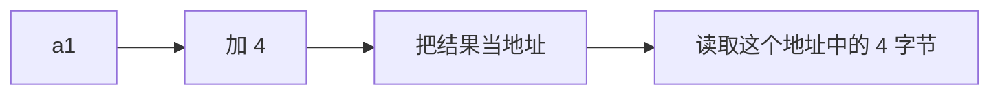

------

**画成内存理解**

假设：

```text
a1 = 0x1000
```

内存：

```text
0x1000  [ 11 11 11 11 ]
0x1004  [ 22 22 22 22 ]
0x1008  [ 33 33 33 33 ]
```

那么：

```c
*(_DWORD *)a1
```

访问：

```text
0x1000
```

而：

```c
*(_DWORD *)(a1 + 4)
```

访问：

```text
0x1004
```

再：

```c
*(_DWORD *)(a1 + 8)
```

访问：

```text
0x1008
```

所以看到：

```c
*(_DWORD *)(a1 + 4)
```

不要把它当成什么神秘高级语法。

直接脑补：**从 a1 指向的一块内存中，取偏移 4 字节的位置。**

------

## 而且很多时候，它本来可能是结构体

IDA：

```c
*(_DWORD *)(a1 + 4)
```

其真实源码可能是：

```c
player->hp
```

例如：

```c
struct Player
{
    int id;       // +0
    int hp;       // +4
    int attack;   // +8
};
```

那么：

```c
Player *player;
```

IDA 不知道 `a1` 是不是 `Player`。

于是只能写：

```c
*(_DWORD *)(a1 + 4)
```

但通过人为的分析发现：

```text
a1 + 0  → 经常存 ID
a1 + 4  → 经常参与生命值计算
a1 + 8  → 经常参与攻击计算
```

你就可以推测：

```c
struct Player
{
    int id;
    int hp;
    int attack;
};
```

然后原来丑陋的：

```c
*(_DWORD *)(a1 + 4)
```

就可以变成：

```c
player->hp
```

**这本身就是逆向工程的一部分。**

所以不需要把整个 C 学到 “很高级”

------

## 第一优先级：指针

其实逆向里的指针可以先抓住一句话：**指针本质上就是一个“地址”，而逆向时最需要关心的是：这个地址指向什么、偏移多少、按什么类型解释。**

------

### 1. 先把 IDA 最恶心的东西拆掉

进入 IDA 以后一定会看到大量的：

```c
*(_DWORD *)(a1 + 4)
```

我们先不管 `_DWORD`，看：

```c
*(a1 + 4)
```

这句话可以理解为：

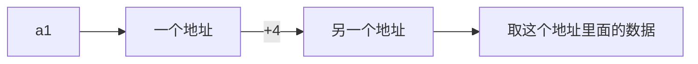

所以，`*(a1 + 4)` 不是 “a1 加 4 之后再乘什么奇怪的东西”

而是**去 a1 指向的内存，偏移 4 字节的位置取数据。**

------

### 2. 为什么是 `+4`？

这里是逆向里特别重要的一点：

假设：

```c
int *p;
```

那么：

```c
p + 1
```

**不是地址 +1 字节。**

而是：

```text
地址 + sizeof(int)
```

因为 `int` 通常 4 字节，所以：`p + 1` = `地址 + 4`。

而：

```c
char *p;
p + 1
```

通常是：`地址 + 1`

因此：

```c
int *p;
p + 1;
```

和：

```c
char *p;
p + 1;
```

地址变化不一样。

------

### 3. IDA 里面经常直接出现 `a1 + 4`

例如：

```c
*(_DWORD *)(a1 + 4)
```

IDA 为什么不写：

```c
*((int *)a1 + 1)
```

而写：

```c
*(_DWORD *)(a1 + 4)
```

因为 IDA 当前**不知道 `a1` 到底是什么类型**。

它只知道：

- a1 是一个值
- 这个值被当成地址使用
- 地址 + 4
- 那里有一个 DWORD

于是只能给你最保守的表示。

------

### 4. 这时候就要开始“猜类型”

比如我们发现：

```c
v2 = *(_DWORD *)(a1 + 4);
v3 = *(_DWORD *)(a1 + 8);
v4 = *(_DWORD *)(a1 + 0xC);
```

这就非常可疑了。可能有一个结构体：

```text
a1
 ↓
┌────────────┐
│ +0         │
├────────────┤
│ +4         │ ← v2
├────────────┤
│ +8         │ ← v3
├────────────┤
│ +C         │ ← v4
└────────────┘
```

这就应该开始怀疑：**a1 其实是一个结构体指针。**

例如原程序可能是：

```c
struct Player
{
    int id;
    int hp;
    int attack;
    int defense;
};
```

那么：

```c
player->hp
```

编译之后就可能变成：

```asm
mov eax, [ecx+4]
```

IDA 不知道它是 `Player *`，于是给你：

```c
*(_DWORD *)(a1 + 4)
```

------

### 5. 逆向里 “指针”

我们可以把它们分成以下几种。

#### ① 普通数据

```c
int x = 100;
```

内存里：

```text
┌─────────────┐
│     100     │
└─────────────┘
```

------

#### ② 指向数据的指针

```c
int *p = &x;
```

```text
p
↓
┌─────────────┐
│   0x1000    │
└─────────────┘
↓
0x1000
┌─────────────┐
│     100     │
└─────────────┘
```

------

#### ③ 指向结构体的指针

```c
Player *p;
```

```text
p
│
│ 0x1000
↓
0x1000
┌─────────────┐ +0
│ id          │
├─────────────┤ +4
│ hp          │
├─────────────┤ +8
│ attack      │
├─────────────┤ +C
│ defense     │
└─────────────┘
```

于是：

```c
p->hp
```

本质就是：

```text
p + 4
```

------

### 6. 这也是为什么逆向特别喜欢“偏移”

题目中经常能看到：

```asm
mov eax, [ecx+4]
mov edx, [ecx+8]
mov ebx, [ecx+0Ch]
```

这时候不要机械地看成三个汇编，应该马上脑补：

```text
ECX
 ↓
┌─────────────┐
│ +0          │
├─────────────┤
│ +4          │ ← eax
├─────────────┤
│ +8          │ ← edx
├─────────────┤
│ +C          │ ← ebx
└─────────────┘
```

然后问：**这是不是某个对象？**

这就是逆向非常重要的 “数据结构恢复”。

------

### 7. 更重要的是：指针不一定指向“数据”

它还可以指向**代码**，也就是函数指针。

例如：

```c
int (*func)(int);
```

这是函数指针，`func` 存的不是：

```text
100
```

而是：

```text
0x401000
```

- 普通的指针：`int *p;` 里存的是数字的地址（比如 `0x1000`），CPU去那里取数据。
- **函数指针**：`int (*func)(int);` 里存的也是地址（比如 `0x401000`），但CPU去那里**不是取数据，而是取指令（机器码）并执行**。

然后：

```c
func(123);
```

CPU 就会跑到：`0x401000` 处去执行。

逆向时可能会看到：

```asm
mov eax, [ecx+10h]   ; 从 ecx+10h 这个位置，取出一个4字节的数（地址）
call eax             ; 跳转到这个地址去执行
```

这个东西就很值得警觉：

```text
ECX + 0x10
      ↓
取出一个地址
      ↓
放到 EAX
      ↓
call EAX
```

这就是**对象里的函数指针**。

如果是 C++，甚至可能进一步涉及到 `vtable`。

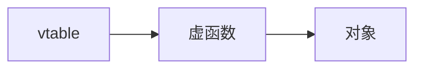

这就是为什么**指针是逆向的核心**。

------

### 8. 以后会经常遇到：指针套指针

例如：

```c
int **p;
```

这是什么意思？

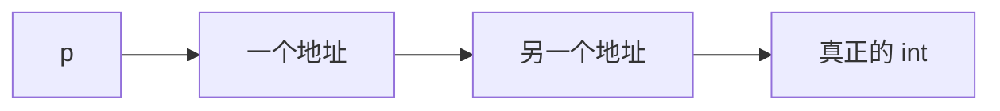

比如：

```text
p = 0x1000

0x1000:
┌──────────┐
│ 0x2000   │
└──────────┘

0x2000:
┌──────────┐
│   123    │
└──────────┘
```

那么 `*p` 得到 `0x2000`；而 `**p` 得到 `123`。

所以如果 IDA 给你：

```c
**(_DWORD **)(a1 + 8)
```

别直接昏过去。😅

拆成：

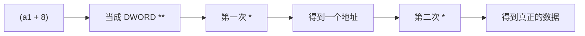

就是这么回事。

------

### 9. 指针 + 偏移 + 解引用，是逆向最常见组合

以后可以把这种代码机械地拆。

例如：

```c
*(_DWORD *)(*(_DWORD *)(a1 + 8) + 0x14)
```

看起来就很 ☠️☠️☠️

但别怕，从里往外一步一步拆。**`*` 就是"去这个地址取值"**

**第一步：最里面**

```c
a1 + 8
```

- `a1` 是个地址（比如 `0x1000`）
- 加上 `8` → `0x1008`
- 这一步**只是算地址，没取值**

**第二步：第一次取值**

```c
*(_DWORD *)(a1 + 8)
```

- 去 `0x1008` 这个地址，读 **4 字节**
- 假设读到 `0x2000`
- 注意：`0x2000` 本身也是个**地址**（指向另一个地方）

**第三步：加偏移**

```c
*(_DWORD *)(a1 + 8) + 0x14
```

也就是：

```c
0x2000 + 0x14
```

**第四步：第二次取值**

再取：

```c
*(_DWORD *)(0x2014)
```

- 去 `0x2014` 这个地址，再读 **4 字节**
- 这才是**最终想要的数据**

最终：

```text
内存地址        存的内容
─────────────────────────────
0x1000  (a1)    ??? 
0x1008  (a1+8)  0x2000  ← 第一次取出来的是个地址
...
0x2000          0x???? 
0x2014  (0x2000+0x14)  12345  ← 最终取到的数据
```

**拆成 C 代码（等价写法）拆成 C 代码（等价写法）**

```c
// 原表达式
*(_DWORD *)(*(_DWORD *)(a1 + 8) + 0x14)

// 拆开写，更清楚
int step1 = a1 + 8;           // 算地址
int step2 = *(int*)step1;     // 第一次读取：得到 0x2000
int step3 = step2 + 0x14;     // 加偏移：得到 0x2014
int result = *(int*)step3;    // 第二次读取：最终数据
```

**以后看到这种东西，就从最里面往外拆。**

------

### 10. 最后还有一个特别重要的坑：32 位和 64 位

```asm
eax
ebx
ecx
esp
ebp
```

这是 32 位体系常见的寄存器。

所以：

```text
DWORD = 4 字节
指针 = 4 字节
```

但如果是 64 位：

```asm
rax
rbx
rcx
rsp
rbp
```

那么：

```text
DWORD = 4 字节
QWORD = 8 字节
指针 = 8 字节
```

所以看到：

```c
*(_QWORD *)(a1 + 8)
```

就应该想到：读取 `a1 + 8` 处的 **8 字节**数据。

如果看到：

```c
*(_DWORD *)(a1 + 8)
```

则是读取 **4 字节**。

这个在分析 64 位程序时尤其重要。

下一步最适合接着讲的其实就是 **“结构体在逆向里怎么看”** ——因为指针一旦和 `+4、+8、+0x10、+0x24` 结合起来，基本就进入 IDA 日常了。

------

## 第二优先级：结构体

**结构体其实是 “指针之后最值得学的东西”**，因为在 IDA 里会看到大量的：

```c
*(_DWORD *)(a1 + 4)
*(_DWORD *)(a1 + 8)
*(_QWORD *)(a1 + 0x10)
```

很大一部分，本质上都是**IDA 不知道这是一个结构体，所以只能把 “结构体成员访问” 写成 “基址 + 偏移”。**

你掌握了这个之后，IDA 伪 C 会好看很多。

------

### 1. 先别急着看 IDA，先理解结构体在内存里长什么样

假设 C 代码：

```c
struct Player
{
    int hp;
    int attack;
    int defense;
};
```

一个 `Player` 对象放进内存以后，不存在什么：

```text
hp
attack
defense
```

这种“标签”。

内存实际上只是：

```text
地址        内容
-------------------
0x1000      hp
0x1004      attack
0x1008      defense
```

也就是说：

```text
Player*
  ↓
0x1000
┌──────────────┐
│ hp           │ +0x00
├──────────────┤
│ attack       │ +0x04
├──────────────┤
│ defense      │ +0x08
└──────────────┘
```

所以：

```c
player->hp
```

底层就是：

```text
player + 0x00
```

而：

```c
player->attack
```

就是：

```text
player + 0x04
player->defense
```

就是：

```text
player + 0x08
```

这就是**结构体偏移**。

------

### 2. 这时候再回来看 IDA

假设 IDA 给你：

```c
int __cdecl sub_401000(int a1)
{
    v2 = *(_DWORD *)(a1 + 4);
    v3 = *(_DWORD *)(a1 + 8);
    v4 = *(_DWORD *)(a1 + 0xC);

    return v2 + v3 + v4;
}
```

第一眼 😵‍💫

但此刻现在应该马上画出来：

```text
a1
 ↓
┌────────────────┐
│ +0x00          │
├────────────────┤
│ +0x04 → v2     │
├────────────────┤
│ +0x08 → v3     │
├────────────────┤
│ +0x0C → v4     │
└────────────────┘
```

这已经非常像：

```c
struct Something
{
    int unknown_0;
    int field_4;
    int field_8;
    int field_C;
};
```

也就是说，**a1 很可能不是一个普通整数，而是一个结构体指针。**

------

### 3. 怎么判断一个东西是不是结构体？

这是重点。

因为我们不可能看到 `a1 + 4` 就直接说 “这肯定是结构体”。

因为它也可能只是：

```c
array[i]
```

或者是：

```c
缓冲区 + 偏移
```

所以需要观察**多个使用点**。

------

#### 特征 1：同一个指针出现大量固定偏移

例如：

```c
*(_DWORD *)(a1 + 4)
*(_DWORD *)(a1 + 8)
*(_DWORD *)(a1 + 0xC)
*(_DWORD *)(a1 + 0x10)
*(_DWORD *)(a1 + 0x14)
```

这就非常可疑。

因为：

```text
+4
+8
+C
+10
+14
```

间隔非常规整。

很可能是：

```text
一个对象
│
├── +04 成员
├── +08 成员
├── +0C 成员
├── +10 成员
└── +14 成员
```

------

#### 特征 2：这个地址被很多函数共同使用

比如：

```c
sub_401000(player);
sub_402000(player);
sub_403000(player);
sub_404000(player);
```

然后点进去发现（都放一起了）：

```c
// 函数1
void sub_401000(void* player) {
    int hp = *(int*)(player + 4);   // 读偏移4
}

// 函数2
void sub_402000(void* player) {
    int mp = *(int*)(player + 8);   // 读偏移8
}

// 函数3
void sub_403000(void* player) {
    int atk = *(int*)(player + 0xC); // 读偏移12
}

// 函数4
void sub_404000(void* player) {
    int def = *(int*)(player + 0x10); // 读偏移16
}
```

这时候基本可以开始建立结构体模型。

```c
struct Player {
    int hp;          // 偏移 0x04
    int mp;          // 偏移 0x08
    int attack;      // 偏移 0x0C
    int defense;     // 偏移 0x10
};
```

------

#### 特征 3：一个偏移被反复当成同一种东西

比如：

```c
v1 = *(_DWORD *)(a1 + 0x10);  // 某个数值
```

后面：

```c
v2 = *(_DWORD *)(a1 + 0x10);  // 复制
```

又：

```c
*(_DWORD *)(a1 + 0x10) = v3;  // 赋值
```

而且这个东西经常：

```c
++v1;  // 变化
```

或者：

```c
if (v1 > 100)  // 超过100就报警
```

再：

```c
*(_DWORD *)(a1+0x10) = 0  // 清零
```

那么 `a1 + 0x10` 很可能就是某个整数成员 `int count;`

------

#### 特征 4：某个偏移被当成指针

这个更加有意思。

比如，假设内存长这样：

```text
地址          存的内容（4字节）
─────────────────────────────
0x1000  (a1)  0x2000   ← a1指向这里
0x1004        0x0000
0x1008        0x3000   ← 注意！这里存的是 0x3000（一个地址）
0x100C        0x0000
...
0x3000  (v2)  0x1234   ← v2指向这里
0x3004        0x5678   ← v2+4 的位置
```

则（注意：`a` 是传入参数，`v` 是局部参数，`dword_` 是全局变量）：

```c
v2 = *(_DWORD *)(a1 + 8);
v3 = *(_DWORD *)(v2 + 4);
```

这意味着 `a1 + 8` 这个成员本身可能就是 `Something *child;`（未知指向类型的指针）

也就是说：

```c
struct Parent
{
    ...
    Something *child; // +8
};
```

然后：

```c
child->xxx
```

于是就又访问了：`child + 4`

------

### 4. 特征 4 升级一下就是逆向里非常重要的 “结构体嵌套”

例如：

```c
struct Weapon
{
    int damage;
    int ammo;
};

struct Player
{
    int hp;
    Weapon *weapon;
};
```

假设：

```text
Player = 0x1000
```

内存：

```text
0x1000
┌──────────────┐
│ hp           │ +0
├──────────────┤
│ weapon ptr   │ +4
└──────────────┘
       ↓
    0x2000
┌──────────────┐
│ damage       │ +0
├──────────────┤
│ ammo         │ +4
└──────────────┘
```

IDA 可能会给：

```c
v1 = *(_DWORD *)(a1 + 4);
v2 = *(_DWORD *)(v1 + 4);
```

所以最终可能是：

```c
player->weapon->ammo
```

这就是为什么逆向里**指针和结构体必须一起学**。

------

### 5. 还有一个非常重要的东西：结构体大小

假设：

```c
struct Player
{
    int hp;       // 4
    int attack;   // 4
    int defense;  // 4
};
```

那么：

```text
sizeof(Player) = 12
```

如果：

```c
Player players[10];
```

那么：

```text
players[0] → +0
players[1] → +0xC
players[2] → +0x18
players[3] → +0x24
```

所以如果在汇编看到：

```asm
mov eax, [ecx+0Ch]
```

有两种可能：

```text
① ecx 是某个对象
   +0xC 是它的成员

② ecx 是数组元素
   +0xC 是下一个元素
```

**不能只看一个 `+0xC` 就下结论。**这就是为什么逆向需要结合上下文。

------

### 6. 特别重要：`+4` 不一定意味着“第二个成员”

这是初学者特别容易犯的错误。

比如：

```c
struct A
{
    char a;	// 占1字节
    int b;	// 占4字节
};
```

可能想：

```text
a → +0
b → +1
```

实际上可能不是。因为存在**内存对齐 / Padding**。

例如常见情况下：

```text
+0    char a
+1    padding
+2    padding
+3    padding
+4    int b
```

所以 `sizeof(A)` 可能会是 8，而不是 1 + 4 = 5。

因此逆向看到：

```text
+4
+8
+C
```

的时候，也要考虑：**是不是结构体对齐造成的偏移？**

------

### 7、IDA 其实可以帮你把这些东西恢复出来

这就是非常实用的一步。

假设 IDA 给你：

```c
v1 = *(_DWORD *)(a1 + 4);
v2 = *(_DWORD *)(a1 + 8);
v3 = *(_DWORD *)(a1 + 0xC);
```

我们可以自己创建结构体（空白处鼠标右键添加，不同版本会有差异，具体需按英文翻译）：

```c
struct Player
{
    int unknown_0;
    int hp;
    int attack;
    int defense;
};
```

然后告诉 IDA：`a1` 是 `Player *`。（光标放在 `_DWORD` 处，按 Y 弹出修改类型窗口，输入指针类型 `Player *`）

那么伪 C 就有机会变成：

```c
v1 = a1->hp;
v2 = a1->attack;
v3 = a1->defense;
```

这就是 IDA 中非常核心的：**类型恢复（type recovery）**

------

### 8、再进一步，甚至可以 “猜出成员是什么”

比如分析代码时看到：

```c
v1 = *(_DWORD *)(a1 + 4);

if (v1 <= 0)
    return 0;
```

然后：

```c
v2 = *(_DWORD *)(a1 + 4);
v2 -= damage;
*(_DWORD *)(a1 + 4) = v2;
```

那么这个 `a1+4` 基本可以怀疑是血量：hp

因为它：

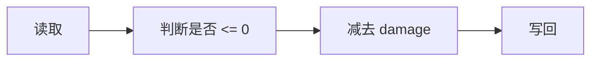

这明显符合：

```c
player->hp -= damage;
```

------

### 9、如果看到字符串，就更好猜了

比如：

```c
printf("%s", *(char **)(a1 + 8));
```

那么：

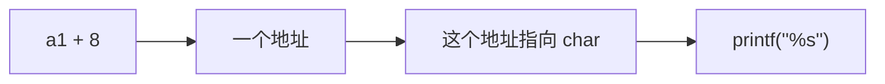

很可能：

```c
struct Player
{
    ...
    char *name;
};
```

**逆向其实是在通过 “使用方式” 反推数据类型。**

不是程序告诉攻击者：

```c
char *name;
```

------

这就是逆向真正有意思的地方

假设我们拿到一个完全没有源码的程序。

IDA 给出：

```c
v3 = *(_DWORD *)(a1 + 4);
v4 = *(_DWORD *)(a1 + 8);
v5 = *(_DWORD *)(a1 + 0xC);
```

一开始只有：

```text
a1 = ?
+4 = ?
+8 = ?
+C = ?
```

然后通过整个程序不断观察（动态调试）：

```text
+4 被减伤害
→ hp

+8 被加金币
→ gold

+C 被传给 %s
→ name？
```

最终：

```c
struct Player
{
    int unknown_0;
    int hp;
    int gold;
    char *name;
};
```

这时候你实际上已经从**机器码**恢复出了**程序员当初设计的数据结构的一部分。**

这就是逆向。

以后看到：

```c
a1 + 0xXX
```

按这个顺序问：

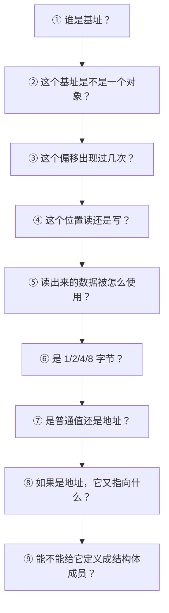

例如：

```c
*(_DWORD *)(a1 + 0x18)
```

要从 IDA 初步的分析变成最终的：

```text
a1 → 某个对象
0x18 → 对象成员偏移
DWORD → 4 字节
这个成员经常存整数
这个整数被拿去和 100 比较
所以可能是 count / hp / level / ...
```

做 CTF/逆向题，**不要看到结构体就急着猜名字**。

第一阶段只写：

```text
+0x00 → 4 bytes → ?
+0x04 → 4 bytes → ?
+0x08 → 8 bytes → ?
+0x10 → 4 bytes → ?
+0x14 → pointer → ?
```

然后随着分析增加信息：

```text
+0x04 → int → 经常增减 → count
+0x08 → pointer → 字符串 → name
+0x10 → int → 比较 0 → enabled
```

最后才变成：

```c
struct Player
{
    int id;
    int count;
    char *name;
    int enabled;
};
```

**这比一开始凭感觉给成员乱起名字可靠得多。**

**逆向不要求你先成为 C 大佬；反而是你在逆向过程中，会被迫逐渐学会指针、结构体、函数指针、内存布局、C++ 对象。**

**下一块非常值得接的是 `this` 指针 + C++ 类 + vtable。** 因为以后在 IDA 里碰到 `a1`、`a2` 这种东西时，经常会发现：**这个 `a1` 根本不是什么普通参数，它其实就是一个 C++ 对象的 `this` 指针。** 这会直接把前面学的 “结构体 + 偏移” 全部串起来。

------

## 第三优先级：`this` 指针 + C++ 类 + vtable + 虚函数

这几个东西一旦搞懂，在 IDA 里看到的：

```cpp
a1
a1 + 4
a1 + 8
*(_DWORD *)a1
*(_DWORD *)(a1 + 8)
```

会突然串成一个完整的概念：**“哦，这不是一堆乱七八糟的指针，这是一个 C++ 对象。”**

而且它和我们刚才讲的结构体是直接接上的。

------

### 1、`this` 就是“对象自己的地址”。

在 C++ 中：

```cpp
class Player {
public:
    int hp;
    void Damage(int x) {
        hp -= x;  // 这里的 hp，本质是 this->hp
    }
};
```

当程序员在写 `hp -= x` 的时候，编译器在背后偷偷把它替换成了 `this->hp -= x`

所以 `this` 就是编译器塞给我们的一个**隐藏参数**，指向调用这个函数的那个对象。我们不需要声明它，编译器自动帮我们加上。

------

### 2、C++ 对象本质上是一块内存

比如：

```cpp
class Player // 定义一个 Player 类
{
public:
    int hp;      // 成员变量1
    int attack;  // 成员变量2

    void Damage(int x) // 成员函数
    {
        hp -= x;
    }
};
```

假设创建一个 `Player` 对象：

```cpp
Player player; // 假设 player 的起始地址是 0x1000
```

在内存里，本质上就是：

```text
地址       内容
─────────────────────
0x1000     hp          (4字节)
0x1004     attack      (4字节)
```

这和我们刚才讲的结构体几乎一模一样。

所以：

```cpp
player.hp
```

本质就是 player 地址 + 0，而 `player.attack` 就是 `player地址 + 4`。

------

### 3、成员函数

这是关键：

```cpp
player.Damage(10);
```

🧐 表面看起来就像是 Player 有一个 Damage 函数，但 CPU 并没有什么 “Player 对象专属函数”。CPU只知道：一段代码的地址 + 一些参数

所以编译器实际上会把：

```cpp
player.Damage(10);
```

理解成类似：

```cpp
Damage(&player, 10);
```

注意这里的 `&player` 就是 `this` 指针。

------

### 4、`this` 是什么？

还用这个举例：

```cpp
class Player{
    int hp;
    void Damage(int x){
        hp -= x; // this->hp
    }
};
```

里面的 `this` 就是**当前这个 Player 对象的地址。**

比如：

```text
Player A
地址 0x1000
hp = 100

Player B
地址 0x2000
hp = 50
```

调用：

```cpp
A.Damage(10);
```

实际上相当于：

```text
this = 0x1000
x = 10
```

同理，调用：

```cpp
B.Damage(10);
```

则：

```text
this = 0x2000
x = 10
```

**函数代码可以是同一份**，区别只在于 this 指向谁。

------

### 5、这就是为什么 IDA 里经常看到一个神秘的 `a1`

例如看到：

```c
void __thiscall sub_401000(int a1, int x)
{
    *(_DWORD *)(a1 + 4) -= x;
}
```

可能会疑惑，`a1` 是什么？🤔

IDA 用 `__thiscall` 告诉你：**这是一个 C++ 成员函数**，它的第一个参数 `a1` 就是 **`this` 指针**（对象地址）。

| 代码                  | 翻译                                                 |
| :-------------------- | :--------------------------------------------------- |
| `__thiscall`          | “我是 C++ 的成员函数，调用时对象地址放 `ecx`”        |
| `int a1`              | “这个 `a1` 是 `this` 指针，是调用者传进来的对象地址” |
| `int x`               | “这是函数的普通参数”                                 |
| `*(_DWORD *)(a1 + 4)` | “从 `this` 地址往后数 4 个字节，那个位置是 `hp`”     |
| `-= x`                | “把 `hp` 减去 `x`”                                   |

结合刚才的知识：a1 → 对象地址 → +4 → 某个成员

所以这段代码的真实身份就是：

```cpp
void Player::Damage(int x)
{
    hp -= x;
}
```

所以 `*(_DWORD *)(a1 + 4)` 基本确定是 `this->hp`

------

### 6、这时候会发现：IDA 的 `a1` 很可疑

如果一个函数：

```c
sub_401000(a1, 10);
```

进去之后疯狂出现：

```c
a1 + 4
a1 + 8
a1 + 0xC
a1 + 0x10
```

而且这些位置像对象成员，这时就应该怀疑：**a1 是不是 `this`？**

尤其是 IDA 如果显示：

```asm
__thiscall
```

那更值得怀疑。

------

### 7、但是 x64 又有变化

这里以后一定会碰到。32 位 Windows 下，C++ 成员函数常见：`__thiscall`

`this` 通常通过特定方式传递，而 Windows x64 下，调用约定统一得多，常见情况下：

```text
RCX → this
RDX → 第一个普通参数
R8  → 第二个普通参数
R9  → 第三个普通参数
```

在看到：

```asm
mov eax, [rcx+8]
```

如果这是一个 C++ 成员函数，那么：RCX → this → +8 → 某个成员

这在 C++ 逆向里非常常见。

------

### 8、现在进入真正的大魔王：vtable

如果 C++ 类里面没有虚函数：

```cpp
class Player
{
    int hp;
    void Damage(int x);
};
```

事情还比较简单。

但如果：

```cpp
class Animal
{
public:
    virtual void Speak();
};
```

事情开始变化。因为有 `virtual` 的存在，这就意味着：**这个函数可以被子类覆盖，运行时决定到底调用哪个版本。**

例如：

```cpp
class Animal
{
public:
    virtual void Speak();
};

class Dog : public Animal
{
public:
    void Speak() override; // 狗叫
};

class Cat : public Animal
{
public:
    void Speak() override; // 猫叫
};
```

然后：

```cpp
Animal* a = new Dog();
a->Speak();   // 到底调用谁？
```

程序怎么知道应该调用 `Dog::Speak()` 而不是 `Animal::Speak()` 呢？

这就要靠 **vtable（虚函数表）**

------

### 9、vtable 可以先理解成“函数地址表”

比如：

```text
Animal vtable

+0x00 → Animal::Speak
```

Dog：

```text
Dog vtable

+0x00 → Dog::Speak
```

Cat：

```text
Cat vtable

+0x00 → Cat::Speak
```

于是对象里会有一个指针：

```text
Dog对象
┌────────────────────┐
│ vtable pointer     │ +0x00
├────────────────────┤
│ others             │ +0x08
├────────────────────┤
│ ...                │
└────────────────────┘
```

这个第一项 `+0x00` 经常就是 **vptr（虚函数表指针）**

------

**于是 IDA 里会出现一种非常经典的代码**

例如：

```asm
mov rax, [rcx]       ; 取对象的 vptr
call qword ptr [rax] ; 从 vtable 里取函数地址，再调用
```

拆开：

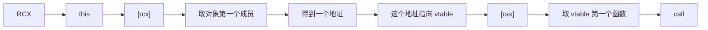

画出来：

```text
         RCX
          │
          ↓
      ┌─────────┐
      │ vptr    │ +0
      ├─────────┤
      │ member  │ +8
      └─────────┘
          │
          ↓
       vtable
      ┌───────────────┐
+0    │ Dog::Speak    │
      ├───────────────┤
+8    │ Dog::Attack   │
      ├───────────────┤
+10   │ Dog::Move     │
      └───────────────┘
```

于是：

```asm
call qword ptr [rax]
```

实际上就是：

```cpp
this->Speak();
```

这就是以后看到 C++ 逆向时非常重要的一类代码。

------

**为什么要这么设计？**

因为：

```cpp
Animal *a = new Dog;
a->Speak();
```

编译器不能在编译时简单地决定一定调用 Animal::Speak 因为 `a` 实际上可能是 Dog、Cat、Wolf 等。

这就是所谓**动态派发 / 多态**

------

### 10、所以看到 “函数指针”，别马上认为是普通函数指针

例如：

```asm
mov rax, [rcx]
mov rax, [rax+10h]
call rax
```

这就很值得注意。

流程：

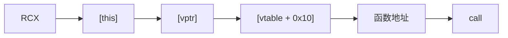

这很可能是 `this->某个虚函数();` 而非 `普通函数();`。

------

### 11、这时候，结构体、指针、this、vtable 全串起来了

从前面的：

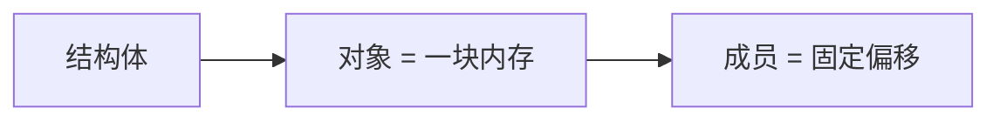

加上：

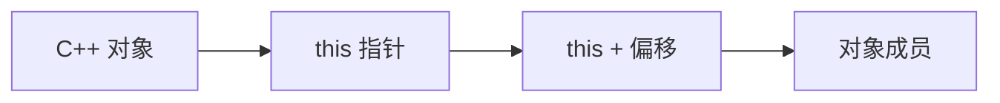

再加：

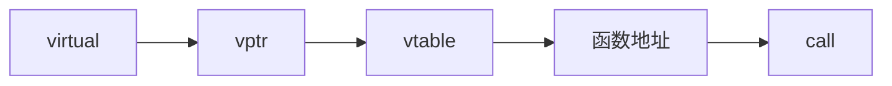

于是一个 C++ 对象可以画成：

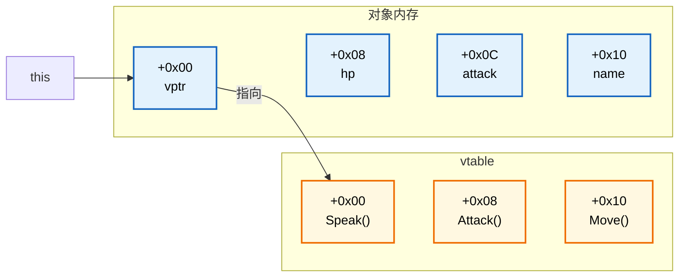

这张图会在以后的 IDA 里会见到无数变体。

------

### 12、例子：一个非常典型的 IDA 伪 C

例如：

```c
void __fastcall sub_140001000(__int64 a1)
{
    v1 = *(_QWORD *)a1;
    (*(void (__fastcall **)(__int64))(v1 + 16))(a1);
}
```

在 C++ 逆向里，如果一个函数第一个参数是指针，而且后面用它访问成员、调用函数，那它**极大概率就是 `this`**。

第一句：

```c
v1 = *(_QWORD *)a1
```

意思：取 this 指向的第一个 8 字节

所以 `v1` 很可能是 `this->vptr`。

然后第二句：

```c
(*(void (__fastcall **)(__int64))(v1 + 16))(a1);
```

这句看起来吓人，我们一层一层剥 🧐。首先是 `v1 + 16`，意思是 `vtable + 0x10`（结构体）。

再看 `*(void (__fastcall **)(__int64))`。这是一个类型转换。

- 返回值 `void`
- 调用约定 `__fastcall`
- 参数是一个 `__int64`
- 前面还有一个 `*`：指向函数指针的指针。

也就是说：这是一个指针，它指向的位置存放着一个函数指针。

然后 `(*(函数指针))(a1)`，意思是调用这个虚函数，并把 a1，也就是 this，传进去

所以整体非常可能是：

```cpp
this->某个虚函数();
```

这就是**逆向时把 IDA 的鬼画符还原成人类看懂的代码**。

这段伪 C 对应的 x64 汇编通常长这样：

```asm
mov rax, [rcx]        ; rax = this->vptr
mov rax, [rax+10h]    ; rax = vtable[0x10]
call rax              ; 调用这个函数，rcx 仍然是 this
```

------

### 13、这里还有一个非常重要的 “逆向技巧”

当在怀疑 `a1 = this` 时，不要只看一个函数。

去看：

- **看交叉引用**？（看谁调用了它）
- **看调用图**（在 IDA 里打开调用图（Call Graph），看这个函数在整体中的位置，对 `a1` 这类参数进行猜测分析）
- **追踪参数**（进入其调用的函数进行分析并确认）
- **对比多个函数**（如果多个函数都用同一个参数，并且访问相同的偏移，那它们很可能操作同一个对象）
- **创建结构体**（一旦确定偏移和类型，就在 IDA 里创建结构体，把参数类型改成类似 `Player*`）
- **重命名**（把 `sub_401000` 重命名成 `Player_SetHp` 之类，把 `a1` 重命名成 `this`）
- **验证**（改完之后，看伪代码是否变得合理。如果合理，说明假设正确；如果不合理，再调整）

**证据越多，结论越可靠。**

**千万别把 “第一个成员是 vtable” 当成绝对规则**

这是逆向中特别需要注意的。

不能看到：

```asm
mov rax, [rcx]
```

就宣布：“这是 vtable！”

可能只是：

```cpp
struct A
{
    SomeStruct *ptr;
};
```

也可能是第一个成员就是一个普通指针

所以正确思路永远是 “大胆假设，小心求证”。

**看这里现在其实已经开始进入 “C++ 逆向” 的门了**

到目前为止，你学的东西可以这样串：

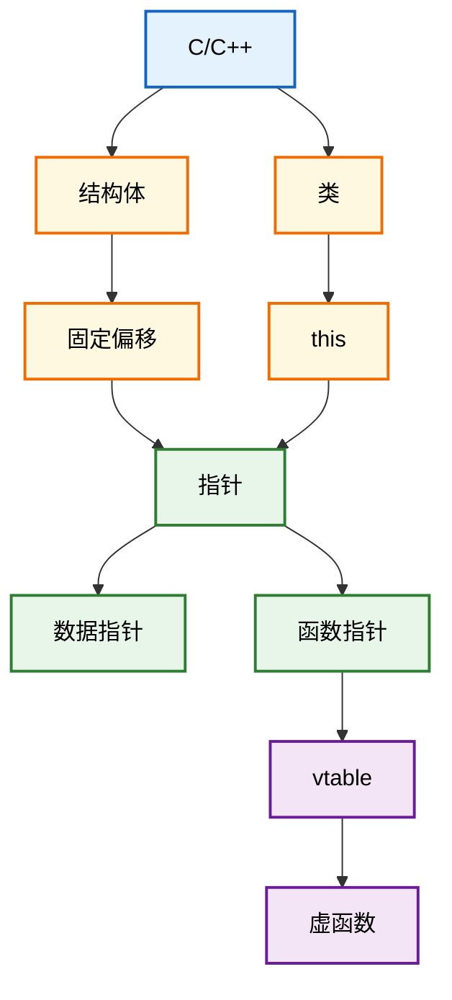

所以前面觉得：“IDA 这 `*(_DWORD *)(a1 + 4)` 到底是什么鬼？”

现在应该逐渐变成：“这大概就是 `this + 4` 的成员访问。”

而看到：

```asm
mov rax, [rcx]
mov rax, [rax+20h]
call rax
```

你应该开始想到：“RCX 可能是 this，`[RCX]` 可能是 vptr，`[vptr+20h]` 可能是某个虚函数。”

**这就是从“看汇编”进入“读 C++ 程序”的一个非常大的坎。**

------

**顺带说一下刚才提到的 “数组和指针”**

它当然也重要，而且其实和结构体一样是**偏移计算**：

```cpp
arr[i]
```

本质上就是：

```text
arr + i × sizeof(element)
```

所以逆向里：

```asm
mov eax, [rcx + rdx*4]
```

你应该马上想到：

```cpp
rcx[rdx]
```

而：

```asm
mov rax, [rcx + rdx*8]
```

则很可能是某个 8 字节元素数组[rdx]

所以如果按照**逆向学习优先级**，学习的顺序应该按：

**指针 → 结构体 → 数组/指针运算 → `this` → C++ 类 → vtable → 函数指针**

这样走。

其中 **`this + C++ 类 + vtable` 是后面分析游戏、Windows 程序、C++ CrackMe 时非常非常常见的一套东西。**

------

## 第四优先级：数组和指针的关系


*我没想到这篇文章居然写了一个月才写这些，先这些吧。下次更新时间未知，这一段时间很忙。*


------

如果你在阅读时发现了任何错误，请评论或发邮件告诉我，因为错误是学习和发展的一部分！