## 前言

无论是 PWN 还是 逆向工程，看完本篇文章都会有巨大收益。

C 语言是基础应该都学过，但是 IDA 分析出的往往都是书本课程之外的 C 语言。初级逆向手根本看不懂 IDA 给出的伪 C。并不代表这最大的问题不是 “不会逆向”，而是：**逆向工程已经强迫把我们带到了比我们当前 C 基础更高的一层。**

所以，《逆向 之  C/C++ 进阶》来了。

我们会看：

```c
if (a == b)
for (...)
while (...)
return x;
```

但是突然 IDA 给你：

```c
*(_DWORD *)(a1 + 4) = 0;
```

或者：

```c
v3 = (__int64 (__fastcall *)(__int64, int))v2;
```

再或者一大堆：

```c
Manager
Controller
Context
Handler
Object
CreateInstance
```

就直接懵。

学习完本篇文章，会从一个逆向初级手一跃飞升为逆向老手的存在。

------

但这里有一个很重要的事情，这些东西并不一定是 “高级 C 语法”。很多时候只是 **IDA 不知道原始类型，只能用一种丑陋的方式表示内存操作。**

## `*(_DWORD *)`

先拿这个开刀

例如：

```c
*(_DWORD *)a1
```

其实拆开看就行。

**`_DWORD`**

表示：一个 4 字节的数据。

大致相当于：

```c
unsigned int
```

**`( _DWORD * )a1`**

表示：把 a1 强行当成：指向 DWORD 的指针。

也就是：

```c
DWORD *p = (DWORD *)a1;
```

------

**最前面的 `*`**

表示：解引用。

所以：

```c
*(_DWORD *)a1
```

实际上就是：

```c
*(DWORD *)a1
```

换成人话：把 `a1` 当成一个地址，然后取这个地址里的 4 个字节。

- 比如：a1 = 0x1000;
- 那么：`*(_DWORD *)a1`
- 就是：读取 0x1000 地址 → 读取 4 字节

如果是：

```c
*(_DWORD *)(a1 + 4)
```

就是：

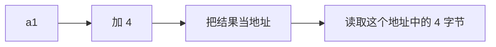
```mermaid
graph LR

A[a1]
A --> B[加 4]
B --> C[把结果当地址]
C --> D[读取这个地址中的 4 字节]
```

------

**画成内存理解**

假设：

```text
a1 = 0x1000
```

内存：

```text
0x1000  [ 11 11 11 11 ]
0x1004  [ 22 22 22 22 ]
0x1008  [ 33 33 33 33 ]
```

那么：

```c
*(_DWORD *)a1
```

访问：

```text
0x1000
```

而：

```c
*(_DWORD *)(a1 + 4)
```

访问：

```text
0x1004
```

再：

```c
*(_DWORD *)(a1 + 8)
```

访问：

```text
0x1008
```

所以看到：

```c
*(_DWORD *)(a1 + 4)
```

不要把它当成什么神秘高级语法。

直接脑补：**从 a1 指向的一块内存中，取偏移 4 字节的位置。**

------

## 很多时候，它本来可能是结构体

IDA：

```c
*(_DWORD *)(a1 + 4)
```

其真实源码可能是：

```c
player->hp
```

例如：

```c
struct Player
{
    int id;       // +0
    int hp;       // +4
    int attack;   // +8
};
```

那么：

```c
Player *player;
```

IDA 不知道 `a1` 是不是 `Player`。

于是只能写：

```c
*(_DWORD *)(a1 + 4)
```

但通过人为的分析发现：

```text
a1 + 0  → 经常存 ID
a1 + 4  → 经常参与生命值计算
a1 + 8  → 经常参与攻击计算
```

你就可以推测：

```c
struct Player
{
    int id;
    int hp;
    int attack;
};
```

然后原来丑陋的：

```c
*(_DWORD *)(a1 + 4)
```

就可以变成：

```c
player->hp
```

**这本身就是逆向工程的一部分。**

所以不需要把整个 C 学到 “很高级”

------

## 第一优先级：指针

其实逆向里的指针可以先抓住一句话：**指针本质上就是一个“地址”，而逆向时最需要关心的是：这个地址指向什么、偏移多少、按什么类型解释。**

------

### 1. 先把 IDA 最恶心的东西拆掉

进入 IDA 以后一定会看到大量的：

```c
*(_DWORD *)(a1 + 4)
```

我们先不管 `_DWORD`，看：

```c
*(a1 + 4)
```

这句话可以理解为：

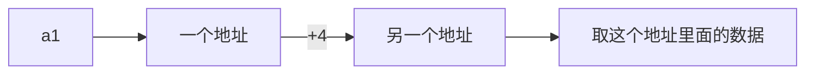
```mermaid
graph LR

A[a1]
A --> B[一个地址]
B --> |+4| C[另一个地址]
C --> D[取这个地址里面的数据]
```

所以，`*(a1 + 4)` 不是 “a1 加 4 之后再乘什么奇怪的东西”

而是**去 a1 指向的内存，偏移 4 字节的位置取数据。**

------

### 2. 什么是 `+4`？

这里是逆向里特别重要的一点：

假设：

```c
int *p;
```

那么：

```c
p + 1
```

**不是地址 +1 字节。**

而是：

```text
地址 + sizeof(int)
```

因为 `int` 通常 4 字节，所以：`p + 1` = `地址 + 4`。

而：

```c
char *p;
p + 1
```

通常是：`地址 + 1`

因此：

```c
int *p;
p + 1;
```

和：

```c
char *p;
p + 1;
```

地址变化不一样。

------

### 3. IDA 里的 `a1 + 4`

例如：

```c
*(_DWORD *)(a1 + 4)
```

IDA 为什么不写：

```c
*((int *)a1 + 1)
```

而写：

```c
*(_DWORD *)(a1 + 4)
```

因为 IDA 当前**不知道 `a1` 到底是什么类型**。

它只知道：

- a1 是一个值
- 这个值被当成地址使用
- 地址 + 4
- 那里有一个 DWORD

于是只能给你最保守的表示。

------

### 4. 猜类型

比如我们发现：

```c
v2 = *(_DWORD *)(a1 + 4);
v3 = *(_DWORD *)(a1 + 8);
v4 = *(_DWORD *)(a1 + 0xC);
```

这就非常可疑了。可能有一个结构体：

```text
a1
 ↓
┌────────────┐
│ +0         │
├────────────┤
│ +4         │ ← v2
├────────────┤
│ +8         │ ← v3
├────────────┤
│ +C         │ ← v4
└────────────┘
```

这就应该开始怀疑：**a1 其实是一个结构体指针。**

例如原程序可能是：

```c
struct Player
{
    int id;
    int hp;
    int attack;
    int defense;
};
```

那么：

```c
player->hp
```

编译之后就可能变成：

```asm
mov eax, [ecx+4]
```

IDA 不知道它是 `Player *`，于是给你：

```c
*(_DWORD *)(a1 + 4)
```

------

### 5. 逆向里 “指针”

我们可以把它们分成以下几种。

#### ① 普通数据

```c
int x = 100;
```

内存里：

```text
┌─────────────┐
│     100     │
└─────────────┘
```

------

#### ② 指向数据的指针

```c
int *p = &x;
```

```text
p
↓
┌─────────────┐
│   0x1000    │
└─────────────┘
↓
0x1000
┌─────────────┐
│     100     │
└─────────────┘
```

------

#### ③ 指向结构体的指针

```c
Player *p;
```

```text
p
│
│ 0x1000
↓
0x1000
┌─────────────┐ +0
│ id          │
├─────────────┤ +4
│ hp          │
├─────────────┤ +8
│ attack      │
├─────────────┤ +C
│ defense     │
└─────────────┘
```

于是：

```c
p->hp
```

本质就是：

```text
p + 4
```

------

### 6. 逆向中的 “偏移”

题目中经常能看到：

```asm
mov eax, [ecx+4]
mov edx, [ecx+8]
mov ebx, [ecx+0Ch]
```

这时候不要机械地看成三个汇编，应该马上脑补：

```text
ECX
 ↓
┌─────────────┐
│ +0          │
├─────────────┤
│ +4          │ ← eax
├─────────────┤
│ +8          │ ← edx
├─────────────┤
│ +C          │ ← ebx
└─────────────┘
```

然后问：**这是不是某个对象？**

这就是逆向非常重要的 “数据结构恢复”。

------

### 7. 指针不一定指向 “数据”

它还可以指向**代码**，也就是函数指针。

例如：

```c
int (*func)(int);
```

这是函数指针，`func` 存的不是：

```text
100
```

而是：

```text
0x401000
```

- 普通的指针：`int *p;` 里存的是数字的地址（比如 `0x1000`），CPU去那里取数据。
- **函数指针**：`int (*func)(int);` 里存的也是地址（比如 `0x401000`），但CPU去那里**不是取数据，而是取指令（机器码）并执行**。

然后：

```c
func(123);
```

CPU 就会跑到：`0x401000` 处去执行。

逆向时可能会看到：

```asm
mov eax, [ecx+10h]   ; 从 ecx+10h 这个位置，取出一个4字节的数（地址）
call eax             ; 跳转到这个地址去执行
```

这个东西就很值得警觉：

```text
ECX + 0x10
      ↓
取出一个地址
      ↓
放到 EAX
      ↓
call EAX
```

这就是**对象里的函数指针**。

如果是 C++，甚至可能进一步涉及到 `vtable`。

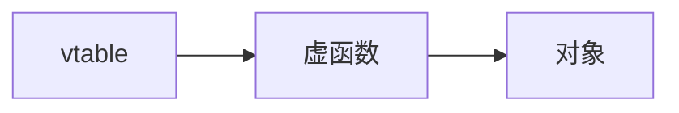
```mermaid
graph LR

A[vtable]
A --> B[虚函数]
B --> C[对象]
```

这就是为什么**指针是逆向的核心**。

------

### 8. 指向指针的指针

例如：

```c
int **p;
```

C 语言基础也会有这种东西。

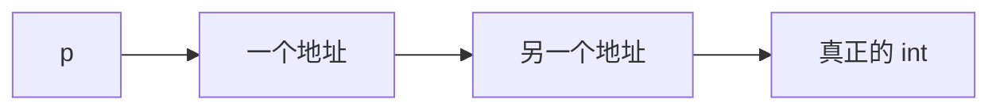
```mermaid
graph LR

A[p]
A --> B[一个地址]
B --> C[另一个地址]
C --> D[真正的 int]
```

比如：

```text
p = 0x1000

0x1000:
┌──────────┐
│ 0x2000   │
└──────────┘

0x2000:
┌──────────┐
│   123    │
└──────────┘
```

那么 `*p` 得到 `0x2000`；而 `**p` 得到 `123`。

所以如果 IDA 给你：

```c
**(_DWORD **)(a1 + 8)
```

别直接昏过去。😅

拆成：

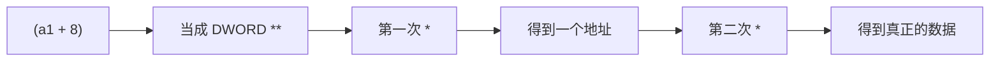
```mermaid
graph LR

A["(a1 + 8)"]
A --> B[当成 DWORD **]
B --> C[第一次 *]
C --> D[得到一个地址]
D --> E[第二次 *]
E --> F[得到真正的数据]
```

就是这么回事。

------

### 9. 指针 + 偏移 + 解引用，是逆向最常见组合

以后可以把这种代码机械地拆。

例如：

```c
*(_DWORD *)(*(_DWORD *)(a1 + 8) + 0x14)
```

看起来就很 ☠️☠️☠️

但别怕，从里往外一步一步拆。**`*` 就是"去这个地址取值"**

**第一步：最里面**

```c
a1 + 8
```

- `a1` 是个地址（比如 `0x1000`）
- 加上 `8` → `0x1008`
- 这一步**只是算地址，没取值**

**第二步：第一次取值**

```c
*(_DWORD *)(a1 + 8)
```

- 去 `0x1008` 这个地址，读 **4 字节**
- 假设读到 `0x2000`
- 注意：`0x2000` 本身也是个**地址**（指向另一个地方）

**第三步：加偏移**

```c
*(_DWORD *)(a1 + 8) + 0x14
```

也就是：

```c
0x2000 + 0x14
```

**第四步：第二次取值**

再取：

```c
*(_DWORD *)(0x2014)
```

- 去 `0x2014` 这个地址，再读 **4 字节**
- 这才是**最终想要的数据**

最终：

```text
内存地址        存的内容
─────────────────────────────
0x1000  (a1)    ??? 
0x1008  (a1+8)  0x2000  ← 第一次取出来的是个地址
...
0x2000          0x???? 
0x2014  (0x2000+0x14)  12345  ← 最终取到的数据
```

**拆成 C 代码（等价写法）拆成 C 代码（等价写法）**

```c
// 原表达式
*(_DWORD *)(*(_DWORD *)(a1 + 8) + 0x14)

// 拆开写，更清楚
int step1 = a1 + 8;           // 算地址
int step2 = *(int*)step1;     // 第一次读取：得到 0x2000
int step3 = step2 + 0x14;     // 加偏移：得到 0x2014
int result = *(int*)step3;    // 第二次读取：最终数据
```

**以后看到这种东西，就从最里面往外拆。**

------

### 10. 一个特别重要的坑：32 位和 64 位

```asm
eax
ebx
ecx
esp
ebp
```

这是 32 位体系常见的寄存器。

所以：

```text
DWORD = 4 字节
指针 = 4 字节
```

但如果是 64 位：

```asm
rax
rbx
rcx
rsp
rbp
```

那么：

```text
DWORD = 4 字节
QWORD = 8 字节
指针 = 8 字节
```

所以看到：

```c
*(_QWORD *)(a1 + 8)
```

就应该想到：读取 `a1 + 8` 处的 **8 字节**数据。

如果看到：

```c
*(_DWORD *)(a1 + 8)
```

则是读取 **4 字节**。

这个在分析 64 位程序时尤其重要。

下一步最适合接着讲的其实就是 **“结构体在逆向里怎么看”** ——因为指针一旦和 `+4、+8、+0x10、+0x24` 结合起来，基本就进入 IDA 日常了。

------

## 第二优先级：结构体

**结构体其实是 “指针之后最值得学的东西”**，因为在 IDA 里会看到大量的：

```c
*(_DWORD *)(a1 + 4)
*(_DWORD *)(a1 + 8)
*(_QWORD *)(a1 + 0x10)
```

很大一部分，本质上都是**IDA 不知道这是一个结构体，所以只能把 “结构体成员访问” 写成 “基址 + 偏移”。**

你掌握了这个之后，IDA 伪 C 会好看很多。

------

### 1. 先理解结构体在内存里长什么样

假设 C 代码：

```c
struct Player
{
    int hp;
    int attack;
    int defense;
};
```

一个 `Player` 对象放进内存以后，不存在什么：

```text
hp
attack
defense
```

这种“标签”。

内存实际上只是：

```text
地址        内容
-------------------
0x1000      hp
0x1004      attack
0x1008      defense
```

也就是说：

```text
Player*
  ↓
0x1000
┌──────────────┐
│ hp           │ +0x00
├──────────────┤
│ attack       │ +0x04
├──────────────┤
│ defense      │ +0x08
└──────────────┘
```

所以：

```c
player->hp
```

底层就是：

```text
player + 0x00
```

而：

```c
player->attack
```

就是：

```text
player + 0x04
player->defense
```

就是：

```text
player + 0x08
```

这就是**结构体偏移**。

------

### 2. 这时候再回来看 IDA

假设 IDA 给你：

```c
int __cdecl sub_401000(int a1)
{
    v2 = *(_DWORD *)(a1 + 4);
    v3 = *(_DWORD *)(a1 + 8);
    v4 = *(_DWORD *)(a1 + 0xC);

    return v2 + v3 + v4;
}
```

第一眼 😵‍💫

但此刻现在应该马上画出来：

```text
a1
 ↓
┌────────────────┐
│ +0x00          │
├────────────────┤
│ +0x04 → v2     │
├────────────────┤
│ +0x08 → v3     │
├────────────────┤
│ +0x0C → v4     │
└────────────────┘
```

这已经非常像：

```c
struct Something
{
    int unknown_0;
    int field_4;
    int field_8;
    int field_C;
};
```

也就是说，**a1 很可能不是一个普通整数，而是一个结构体指针。**

------

### 3. 怎么判断一个东西是不是结构体？

这是重点。

因为我们不可能看到 `a1 + 4` 就直接说 “这肯定是结构体”。

因为它也可能只是：

```c
array[i]
```

或者是：

```c
缓冲区 + 偏移
```

所以需要观察**多个使用点**。

------

#### 特征 1：同一个指针出现大量固定偏移

例如：

```c
*(_DWORD *)(a1 + 4)
*(_DWORD *)(a1 + 8)
*(_DWORD *)(a1 + 0xC)
*(_DWORD *)(a1 + 0x10)
*(_DWORD *)(a1 + 0x14)
```

这就非常可疑。

因为：

```text
+4
+8
+C
+10
+14
```

间隔非常规整。

很可能是：

```text
一个对象
│
├── +04 成员
├── +08 成员
├── +0C 成员
├── +10 成员
└── +14 成员
```

------

#### 特征 2：这个地址被很多函数共同使用

比如：

```c
sub_401000(player);
sub_402000(player);
sub_403000(player);
sub_404000(player);
```

然后点进去发现（都放一起了）：

```c
// 函数1
void sub_401000(void* player) {
    int hp = *(int*)(player + 4);   // 读偏移4
}

// 函数2
void sub_402000(void* player) {
    int mp = *(int*)(player + 8);   // 读偏移8
}

// 函数3
void sub_403000(void* player) {
    int atk = *(int*)(player + 0xC); // 读偏移12
}

// 函数4
void sub_404000(void* player) {
    int def = *(int*)(player + 0x10); // 读偏移16
}
```

这时候基本可以开始建立结构体模型。

```c
struct Player {
    int hp;          // 偏移 0x04
    int mp;          // 偏移 0x08
    int attack;      // 偏移 0x0C
    int defense;     // 偏移 0x10
};
```

------

#### 特征 3：一个偏移被反复当成同一种东西

比如：

```c
v1 = *(_DWORD *)(a1 + 0x10);  // 某个数值
```

后面：

```c
v2 = *(_DWORD *)(a1 + 0x10);  // 复制
```

又：

```c
*(_DWORD *)(a1 + 0x10) = v3;  // 赋值
```

而且这个东西经常：

```c
++v1;  // 变化
```

或者：

```c
if (v1 > 100)  // 超过100就报警
```

再：

```c
*(_DWORD *)(a1+0x10) = 0  // 清零
```

那么 `a1 + 0x10` 很可能就是某个整数成员 `int count;`

------

#### 特征 4：某个偏移被当成指针

这个更加有意思。

比如，假设内存长这样：

```text
地址          存的内容（4字节）
─────────────────────────────
0x1000  (a1)  0x2000   ← a1指向这里
0x1004        0x0000
0x1008        0x3000   ← 注意！这里存的是 0x3000（一个地址）
0x100C        0x0000
...
0x3000  (v2)  0x1234   ← v2指向这里
0x3004        0x5678   ← v2+4 的位置
```

则（注意：`a` 是传入参数，`v` 是局部参数，`dword_` 是全局变量）：

```c
v2 = *(_DWORD *)(a1 + 8);
v3 = *(_DWORD *)(v2 + 4);
```

这意味着 `a1 + 8` 这个成员本身可能就是 `Something *child;`（未知指向类型的指针）

也就是说：

```c
struct Parent
{
    ...
    Something *child; // +8
};
```

然后：

```c
child->xxx
```

于是就又访问了：`child + 4`

------

### 4. 升级一下就是逆向里非常重要的 “结构体嵌套”

例如：

```c
struct Weapon
{
    int damage;
    int ammo;
};

struct Player
{
    int hp;
    Weapon *weapon;
};
```

假设：

```text
Player = 0x1000
```

内存：

```text
0x1000
┌──────────────┐
│ hp           │ +0
├──────────────┤
│ weapon ptr   │ +4
└──────────────┘
       ↓
    0x2000
┌──────────────┐
│ damage       │ +0
├──────────────┤
│ ammo         │ +4
└──────────────┘
```

IDA 可能会给：

```c
v1 = *(_DWORD *)(a1 + 4);
v2 = *(_DWORD *)(v1 + 4);
```

所以最终可能是：

```c
player->weapon->ammo
```

这就是为什么逆向里**指针和结构体必须一起学**。

------

### 5. 结构体大小

假设：

```c
struct Player
{
    int hp;       // 4
    int attack;   // 4
    int defense;  // 4
};
```

那么：

```text
sizeof(Player) = 12
```

如果：

```c
Player players[10];
```

那么：

```text
players[0] → +0
players[1] → +0xC
players[2] → +0x18
players[3] → +0x24
```

所以如果在汇编看到：

```asm
mov eax, [ecx+0Ch]
```

有两种可能：

```text
① ecx 是某个对象
   +0xC 是它的成员

② ecx 是数组元素
   +0xC 是下一个元素
```

**不能只看一个 `+0xC` 就下结论。**这就是为什么逆向需要结合上下文。

------

### 6. 特别重要：`+4` 不一定意味着“第二个成员”

这是初学者特别容易犯的错误。

比如：

```c
struct A
{
    char a;	// 占1字节
    int b;	// 占4字节
};
```

可能想：

```text
a → +0
b → +1
```

实际上可能不是。因为存在**内存对齐 / Padding**。

例如常见情况下：

```text
+0    char a
+1    padding
+2    padding
+3    padding
+4    int b
```

所以 `sizeof(A)` 可能会是 8，而不是 1 + 4 = 5。

因此逆向看到：

```text
+4
+8
+C
```

的时候，也要考虑：**是不是结构体对齐造成的偏移？**

------

### 7、结构体恢复

这就是非常实用的一步。

假设 IDA 给你：

```c
v1 = *(_DWORD *)(a1 + 4);
v2 = *(_DWORD *)(a1 + 8);
v3 = *(_DWORD *)(a1 + 0xC);
```

我们可以自己创建结构体（空白处鼠标右键添加，不同版本会有差异，具体需按英文翻译）：

```c
struct Player
{
    int unknown_0;
    int hp;
    int attack;
    int defense;
};
```

然后告诉 IDA：`a1` 是 `Player *`。（光标放在 `_DWORD` 处，按 Y 弹出修改类型窗口，输入指针类型 `Player *`）

那么伪 C 就有机会变成：

```c
v1 = a1->hp;
v2 = a1->attack;
v3 = a1->defense;
```

这就是 IDA 中非常核心的：**类型恢复（type recovery）**

------

### 8、猜出成员是什么

比如分析代码时看到：

```c
v1 = *(_DWORD *)(a1 + 4);

if (v1 <= 0)
    return 0;
```

然后：

```c
v2 = *(_DWORD *)(a1 + 4);
v2 -= damage;
*(_DWORD *)(a1 + 4) = v2;
```

那么这个 `a1+4` 基本可以怀疑是血量：hp

因为它：

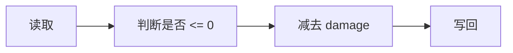
```mermaid
graph LR

A[读取]
A --> B[判断是否 <= 0]
B --> C[减去 damage]
C --> D[写回]
```

这明显符合：

```c
player->hp -= damage;
```

------

### 9、如果看到字符串，就更好猜了

比如：

```c
printf("%s", *(char **)(a1 + 8));
```

那么：

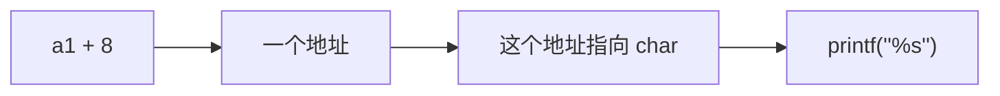
```mermaid
graph LR

A[a1 + 8]
A --> B[一个地址]
B --> C[这个地址指向 char]
C --> D["printf(''%s'')"]
```

很可能：

```c
struct Player
{
    ...
    char *name;
};
```

**逆向其实是在通过 “使用方式” 反推数据类型。**

不是程序告诉攻击者：

```c
char *name;
```

------

这就是逆向真正有意思的地方

假设我们拿到一个完全没有源码的程序。

IDA 给出：

```c
v3 = *(_DWORD *)(a1 + 4);
v4 = *(_DWORD *)(a1 + 8);
v5 = *(_DWORD *)(a1 + 0xC);
```

一开始只有：

```text
a1 = ?
+4 = ?
+8 = ?
+C = ?
```

然后通过整个程序不断观察（动态调试）：

```text
+4 被减伤害
→ hp

+8 被加金币
→ gold

+C 被传给 %s
→ name？
```

最终：

```c
struct Player
{
    int unknown_0;
    int hp;
    int gold;
    char *name;
};
```

这时候你实际上已经从**机器码**恢复出了**程序员当初设计的数据结构的一部分。**

这就是逆向。

以后看到：

```c
a1 + 0xXX
```

按这个顺序问：

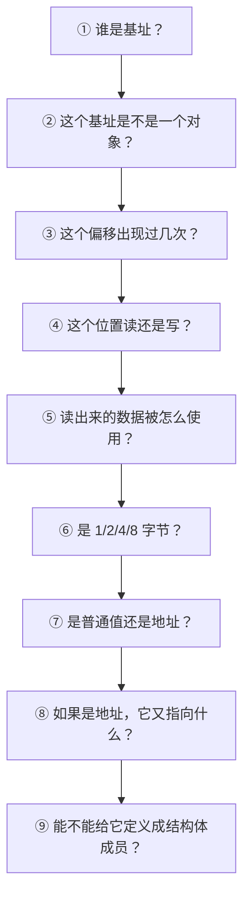
```mermaid
graph TD

A[① 谁是基址？]
A --> B[② 这个基址是不是一个对象？]
B --> C[③ 这个偏移出现过几次？]
C --> D[④ 这个位置读还是写？]
D --> E[⑤ 读出来的数据被怎么使用？]
E --> F[⑥ 是 1/2/4/8 字节？]
F --> G[⑦ 是普通值还是地址？]
G --> H[⑧ 如果是地址，它又指向什么？]
H --> I[⑨ 能不能给它定义成结构体成员？]
```

例如：

```c
*(_DWORD *)(a1 + 0x18)
```

要从 IDA 初步的分析变成最终的：

```text
a1 → 某个对象
0x18 → 对象成员偏移
DWORD → 4 字节
这个成员经常存整数
这个整数被拿去和 100 比较
所以可能是 count / hp / level / ...
```

做 CTF/逆向题，**不要看到结构体就急着猜名字**。

第一阶段只写：

```text
+0x00 → 4 bytes → ?
+0x04 → 4 bytes → ?
+0x08 → 8 bytes → ?
+0x10 → 4 bytes → ?
+0x14 → pointer → ?
```

然后随着分析增加信息：

```text
+0x04 → int → 经常增减 → count
+0x08 → pointer → 字符串 → name
+0x10 → int → 比较 0 → enabled
```

最后才变成：

```c
struct Player
{
    int id;
    int count;
    char *name;
    int enabled;
};
```

**这比一开始凭感觉给成员乱起名字可靠得多。**

**逆向不要求你先成为 C 大佬；反而是你在逆向过程中，会被迫逐渐学会指针、结构体、函数指针、内存布局、C++ 对象。**

**下一块非常值得接的是 `this` 指针 + C++ 类 + vtable。** 因为以后在 IDA 里碰到 `a1`、`a2` 这种东西时，经常会发现：**这个 `a1` 根本不是什么普通参数，它其实就是一个 C++ 对象的 `this` 指针。** 这会直接把前面学的 “结构体 + 偏移” 全部串起来。

------

## 第三优先级：`this` 指针 + C++ 类 + vtable + 虚函数

这几个东西一旦搞懂，在 IDA 里看到的：

```cpp
a1
a1 + 4
a1 + 8
*(_DWORD *)a1
*(_DWORD *)(a1 + 8)
```

会突然串成一个完整的概念：**“哦，这不是一堆乱七八糟的指针，这是一个 C++ 对象。”**

而且它和我们刚才讲的结构体是直接接上的。

------

### 1. `this` 就是“对象自己的地址”。

在 C++ 中：

```cpp
class Player {
public:
    int hp;
    void Damage(int x) {
        hp -= x;  // 这里的 hp，本质是 this->hp
    }
};
```

当程序员在写 `hp -= x` 的时候，编译器在背后偷偷把它替换成了 `this->hp -= x`

所以 `this` 就是编译器塞给我们的一个**隐藏参数**，指向调用这个函数的那个对象。我们不需要声明它，编译器自动帮我们加上。

------

### 2. C++ 对象本质上是一块内存

比如：

```cpp
class Player // 定义一个 Player 类
{
public:
    int hp;      // 成员变量1
    int attack;  // 成员变量2

    void Damage(int x) // 成员函数
    {
        hp -= x;
    }
};
```

假设创建一个 `Player` 对象：

```cpp
Player player; // 假设 player 的起始地址是 0x1000
```

在内存里，本质上就是：

```text
地址       内容
─────────────────────
0x1000     hp          (4字节)
0x1004     attack      (4字节)
```

这和我们刚才讲的结构体几乎一模一样。

所以：

```cpp
player.hp
```

本质就是 player 地址 + 0，而 `player.attack` 就是 `player地址 + 4`。

------

### 3. 成员函数

这是关键：

```cpp
player.Damage(10);
```

🧐 表面看起来就像是 Player 有一个 Damage 函数，但 CPU 并没有什么 “Player 对象专属函数”。CPU只知道：一段代码的地址 + 一些参数

所以编译器实际上会把：

```cpp
player.Damage(10);
```

理解成类似：

```cpp
Damage(&player, 10);
```

注意这里的 `&player` 就是 `this` 指针。

------

### 4. `this` 是什么？

还用这个举例：

```cpp
class Player{
    int hp;
    void Damage(int x){
        hp -= x; // this->hp
    }
};
```

里面的 `this` 就是**当前这个 Player 对象的地址。**

比如：

```text
Player A
地址 0x1000
hp = 100

Player B
地址 0x2000
hp = 50
```

调用：

```cpp
A.Damage(10);
```

实际上相当于：

```text
this = 0x1000
x = 10
```

同理，调用：

```cpp
B.Damage(10);
```

则：

```text
this = 0x2000
x = 10
```

**函数代码可以是同一份**，区别只在于 this 指向谁。

------

### 5.  IDA 里经常看到的神秘的 `a1`

例如看到：

```c
void __thiscall sub_401000(int a1, int x)
{
    *(_DWORD *)(a1 + 4) -= x;
}
```

可能会疑惑，`a1` 是什么？🤔

IDA 用 `__thiscall` 告诉你：**这是一个 C++ 成员函数**，它的第一个参数 `a1` 就是 **`this` 指针**（对象地址）。

| 代码                  | 翻译                                                 |
| :-------------------- | :--------------------------------------------------- |
| `__thiscall`          | “我是 C++ 的成员函数，调用时对象地址放 `ecx`”        |
| `int a1`              | “这个 `a1` 是 `this` 指针，是调用者传进来的对象地址” |
| `int x`               | “这是函数的普通参数”                                 |
| `*(_DWORD *)(a1 + 4)` | “从 `this` 地址往后数 4 个字节，那个位置是 `hp`”     |
| `-= x`                | “把 `hp` 减去 `x`”                                   |

结合刚才的知识：a1 → 对象地址 → +4 → 某个成员

所以这段代码的真实身份就是：

```cpp
void Player::Damage(int x)
{
    hp -= x;
}
```

所以 `*(_DWORD *)(a1 + 4)` 基本确定是 `this->hp`

------

### 6. IDA 的 `a1` 很可疑

如果一个函数：

```c
sub_401000(a1, 10);
```

进去之后疯狂出现：

```c
a1 + 4
a1 + 8
a1 + 0xC
a1 + 0x10
```

而且这些位置像对象成员，这时就应该怀疑：**a1 是不是 `this`？**

尤其是 IDA 如果显示：

```asm
__thiscall
```

那更值得怀疑。

------

### 7. x64 与 x86 不一样

这里以后一定会碰到。32 位 Windows 下，C++ 成员函数常见：`__thiscall`

`this` 通常通过特定方式传递，而 Windows x64 下，调用约定统一得多，常见情况下：

```text
RCX → this
RDX → 第一个普通参数
R8  → 第二个普通参数
R9  → 第三个普通参数
```

在看到：

```asm
mov eax, [rcx+8]
```

如果这是一个 C++ 成员函数，那么：RCX → this → +8 → 某个成员

这在 C++ 逆向里非常常见。

------

### 8. 真正的难点：vtable

如果 C++ 类里面没有虚函数：

```cpp
class Player
{
    int hp;
    void Damage(int x);
};
```

事情还比较简单。

但如果：

```cpp
class Animal
{
public:
    virtual void Speak();
};
```

事情开始变化。因为有 `virtual` 的存在，这就意味着：**这个函数可以被子类覆盖，运行时决定到底调用哪个版本。**

例如：

```cpp
class Animal
{
public:
    virtual void Speak();
};

class Dog : public Animal
{
public:
    void Speak() override; // 狗叫
};

class Cat : public Animal
{
public:
    void Speak() override; // 猫叫
};
```

然后：

```cpp
Animal* a = new Dog();
a->Speak();   // 到底调用谁？
```

程序怎么知道应该调用 `Dog::Speak()` 而不是 `Animal::Speak()` 呢？

这就要靠 **vtable（虚函数表）**

------

### 9. vtable “函数地址表”

比如：

```text
Animal vtable

+0x00 → Animal::Speak
```

Dog：

```text
Dog vtable

+0x00 → Dog::Speak
```

Cat：

```text
Cat vtable

+0x00 → Cat::Speak
```

于是对象里会有一个指针：

```text
Dog对象
┌────────────────────┐
│ vtable pointer     │ +0x00
├────────────────────┤
│ others             │ +0x08
├────────────────────┤
│ ...                │
└────────────────────┘
```

这个第一项 `+0x00` 经常就是 **vptr（虚函数表指针）**

------

**于是 IDA 里会出现一种非常经典的代码**

例如：

```asm
mov rax, [rcx]       ; 取对象的 vptr
call qword ptr [rax] ; 从 vtable 里取函数地址，再调用
```

拆开：

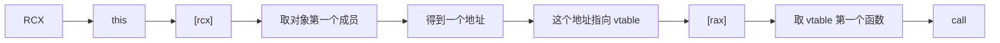
```mermaid
flowchart LR
    A[RCX] --> B[this]
    B --> C["[rcx]"]
    C --> D[取对象第一个成员]
    D --> E[得到一个地址]
    E --> F[这个地址指向 vtable]
    F --> G["[rax]"]
    G --> H[取 vtable 第一个函数]
    H --> I[call]
```

画出来：

```text
         RCX
          │
          ↓
      ┌─────────┐
      │ vptr    │ +0
      ├─────────┤
      │ member  │ +8
      └─────────┘
          │
          ↓
       vtable
      ┌───────────────┐
+0    │ Dog::Speak    │
      ├───────────────┤
+8    │ Dog::Attack   │
      ├───────────────┤
+10   │ Dog::Move     │
      └───────────────┘
```

于是：

```asm
call qword ptr [rax]
```

实际上就是：

```cpp
this->Speak();
```

这就是以后看到 C++ 逆向时非常重要的一类代码。

------

**为什么要这么设计？**

因为：

```cpp
Animal *a = new Dog;
a->Speak();
```

编译器不能在编译时简单地决定一定调用 Animal::Speak 因为 `a` 实际上可能是 Dog、Cat、Wolf 等。

这就是所谓**动态派发 / 多态**

------

### 10. “函数指针” 并非普通函数指针

例如：

```asm
mov rax, [rcx]
mov rax, [rax+10h]
call rax
```

这就很值得注意。

流程：

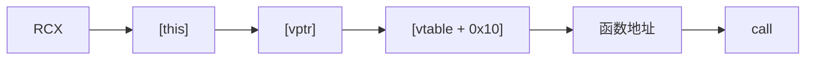
```mermaid
flowchart LR
    A[RCX] --> B["[this]"]
    B --> C["[vptr]"]
    C --> D["[vtable + 0x10]"]
    D --> E[函数地址]
    E --> F[call]
```

这很可能是 `this->某个虚函数();` 而非 `普通函数();`。

------

### 11. 结构体、指针、this、vtable 的结合体

从前面的：

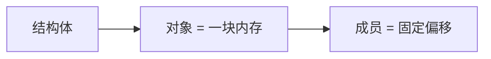
```mermaid
flowchart LR
    B[结构体] --> C[对象 = 一块内存]
    C --> D[成员 = 固定偏移]
```

加上：

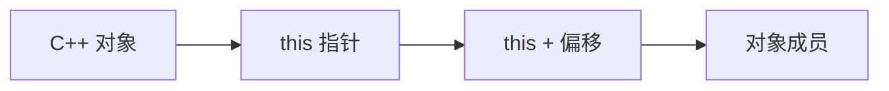
```mermaid
flowchart LR
    B[C++ 对象] --> C[this 指针]
    C --> D[this + 偏移]
    D --> E[对象成员]
```

再加：

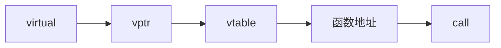
```mermaid
flowchart LR
    B[virtual] --> C[vptr]
    C --> D[vtable]
    D --> E[函数地址]
    E --> F[call]
```

于是一个 C++ 对象可以画成：

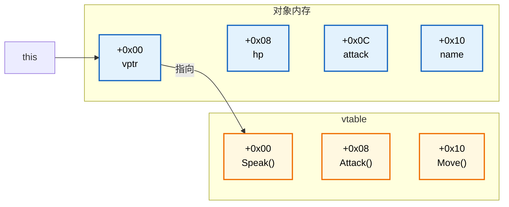
```mermaid
flowchart LR
    this["this"] --> vptr

    subgraph obj["对象内存"]
        direction TB
        vptr["+0x00<br/>vptr"]
        hp["+0x08<br/>hp"]
        attack["+0x0C<br/>attack"]
        name["+0x10<br/>name"]
        vptr ~~~ hp ~~~ attack ~~~ name
    end

    subgraph vt["vtable"]
        direction TB
        speak["+0x00<br/>Speak()"]
        atk["+0x08<br/>Attack()"]
        move["+0x10<br/>Move()"]
        speak ~~~ atk ~~~ move
    end

    vptr -->|指向| speak

    classDef objMem fill:#e3f2fd,stroke:#1565c0,stroke-width:2px,color:#000;
    classDef vtMem fill:#fff8e1,stroke:#ef6c00,stroke-width:2px,color:#000;
    class vptr,hp,attack,name objMem;
    class speak,atk,move vtMem;
```

这张图会在以后的 IDA 里会见到无数变体。

------

### 12. 例子：一个非常典型的 IDA 伪 C

例如：

```c
void __fastcall sub_140001000(__int64 a1)
{
    v1 = *(_QWORD *)a1;
    (*(void (__fastcall **)(__int64))(v1 + 16))(a1);
}
```

在 C++ 逆向里，如果一个函数第一个参数是指针，而且后面用它访问成员、调用函数，那它**极大概率就是 `this`**。

第一句：

```c
v1 = *(_QWORD *)a1
```

意思：取 this 指向的第一个 8 字节

所以 `v1` 很可能是 `this->vptr`。

然后第二句：

```c
(*(void (__fastcall **)(__int64))(v1 + 16))(a1);
```

这句看起来吓人，我们一层一层剥 🧐。首先是 `v1 + 16`，意思是 `vtable + 0x10`（结构体）。

再看 `*(void (__fastcall **)(__int64))`。这是一个类型转换。

- 返回值 `void`
- 调用约定 `__fastcall`
- 参数是一个 `__int64`
- 前面还有一个 `*`：指向函数指针的指针。

也就是说：这是一个指针，它指向的位置存放着一个函数指针。

然后 `(*(函数指针))(a1)`，意思是调用这个虚函数，并把 a1，也就是 this，传进去

所以整体非常可能是：

```cpp
this->某个虚函数();
```

这就是**逆向时把 IDA 的鬼画符还原成人类看懂的代码**。

这段伪 C 对应的 x64 汇编通常长这样：

```asm
mov rax, [rcx]        ; rax = this->vptr
mov rax, [rax+10h]    ; rax = vtable[0x10]
call rax              ; 调用这个函数，rcx 仍然是 this
```

------

### 13. 这里还有一个非常重要的 “逆向技巧”

当在怀疑 `a1 = this` 时，不要只看一个函数。

去看：

- **看交叉引用**？（看谁调用了它）
- **看调用图**（在 IDA 里打开调用图（Call Graph），看这个函数在整体中的位置，对 `a1` 这类参数进行猜测分析）
- **追踪参数**（进入其调用的函数进行分析并确认）
- **对比多个函数**（如果多个函数都用同一个参数，并且访问相同的偏移，那它们很可能操作同一个对象）
- **创建结构体**（一旦确定偏移和类型，就在 IDA 里创建结构体，把参数类型改成类似 `Player*`）
- **重命名**（把 `sub_401000` 重命名成 `Player_SetHp` 之类，把 `a1` 重命名成 `this`）
- **验证**（改完之后，看伪代码是否变得合理。如果合理，说明假设正确；如果不合理，再调整）

**证据越多，结论越可靠。**

**千万别把 “第一个成员是 vtable” 当成绝对规则**

这是逆向中特别需要注意的。

不能看到：

```asm
mov rax, [rcx]
```

就宣布：“这是 vtable！”

可能只是：

```cpp
struct A
{
    SomeStruct *ptr;
};
```

也可能是第一个成员就是一个普通指针

所以正确思路永远是 “大胆假设，小心求证”。

**看这里现在其实已经开始进入 “C++ 逆向” 的门了**

到目前为止，你学的东西可以这样串：

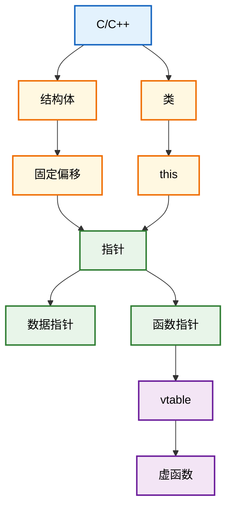
```mermaid
flowchart TB
    C["C/C++"] --> S["结构体"]
    C --> K["类"]

    S --> O["固定偏移"]
    K --> T["this"]

    O --> P["指针"]
    T --> P

    P --> DP["数据指针"]
    P --> FP["函数指针"]

    FP --> VT["vtable"]
    VT --> VF["虚函数"]

    classDef cpp fill:#e3f2fd,stroke:#1565c0,stroke-width:2px,color:#000;
    classDef mid fill:#fff8e1,stroke:#ef6c00,stroke-width:2px,color:#000;
    classDef ptr fill:#e8f5e9,stroke:#2e7d32,stroke-width:2px,color:#000;
    classDef vt fill:#f3e5f5,stroke:#6a1b9a,stroke-width:2px,color:#000;

    class C cpp;
    class S,K,O,T mid;
    class P,DP,FP ptr;
    class VT,VF vt;
```

所以前面觉得：“IDA 这 `*(_DWORD *)(a1 + 4)` 到底是什么鬼？”

现在应该逐渐变成：“这大概就是 `this + 4` 的成员访问。”

而看到：

```asm
mov rax, [rcx]
mov rax, [rax+20h]
call rax
```

你应该开始想到：“RCX 可能是 this，`[RCX]` 可能是 vptr，`[vptr+20h]` 可能是某个虚函数。”

**这就是从“看汇编”进入“读 C++ 程序”的一个非常大的坎。**

------

**顺带说一下刚才提到的 “数组和指针”**

它当然也重要，而且其实和结构体一样是**偏移计算**：

```cpp
arr[i]
```

本质上就是：

```text
arr + i × sizeof(element)
```

所以逆向里：

```asm
mov eax, [rcx + rdx*4]
```

你应该马上想到：

```cpp
rcx[rdx]
```

而：

```asm
mov rax, [rcx + rdx*8]
```

则很可能是某个 8 字节元素数组[rdx]

所以如果按照**逆向学习优先级**，学习的顺序应该按：

**指针 → 结构体 → 数组/指针运算 → `this` → C++ 类 → vtable → 函数指针**

这样走。

其中 **`this + C++ 类 + vtable` 是后面分析游戏、Windows 程序、C++ CrackMe 时非常非常常见的一套东西。**

------

## 第四优先级：数组和指针的关系

这一块其实会把前面的东西再串一次。尤其是在 IDA 里：

```asm
mov eax, [ecx+edx*4]
```

或者：

```c
*(_DWORD *)(a1 + 4 * i)
```

就需要想到：**这很可能不是“结构体成员”，而是在访问数组。**

------

### 1. 数组到底是什么

C 语言基础中，数组就是：

```c
int arr[5];
```

结构：

```text
arr
 ↓
┌──────┬──────┬──────┬──────┬──────┐
│ arr0 │ arr1 │ arr2 │ arr3 │ arr4 │
└──────┴──────┴──────┴──────┴──────┘
  +0     +4     +8     +C     +10
```

因为一个 `int` 通常是 **4 字节**。

假设数组起始地址：

```text
arr = 0x1000
```

那么：

```text
arr[0] → 0x1000
arr[1] → 0x1004
arr[2] → 0x1008
arr[3] → 0x100C
arr[4] → 0x1010
```

这里已经出现了我们前面学过的：**基地址 + 偏移**

------

### 2. 为什么 `arr[i]` 能和指针扯上关系？

这是 C 语言非常重要的一条规则。`arr[i]` 本质上可以理解为：

```c
*(arr + i)
```

也就是说，数组下标 → 指针运算 → 偏移 → 解引用

例如：

```c
arr[2]
```

相当于：

```c
*(arr + 2)
```

但是这里有个非常重要的地方：`arr + 2` 不是地址单纯加 2 个字节。因为 `arr` 是 `int *` 的意义下进行运算。

所以：

```text
arr + 2
= 地址 + 2 × sizeof(int)
= 地址 + 2 × 4
= 地址 + 8
```

假设 IDA：

```c
v3 = *(_DWORD *)(a1 + 4 * i);
```

无非就是把 `a1[i]` 的值赋给 `v3`。

**这就是逆向里特别常见的东西**

------

### 3. 这里有一个非常容易混淆的地方

你可能会问 🧐：“刚才不是说 `int *p + 1` 会自动加 4 吗？那为什么 IDA 又写 `a1 + 4 * i`？”

因为这里要看 `a1` 在 IDA 眼里到底是什么类型。

如果：

```c
int *p;
```

那么：

```c
p + i
```

已经会按照 `int` 的大小进行缩放：

```text
p + i = 地址 + i × 4
```

但是 IDA 有时候不知道 `a1` 是 `int *`，它可能只知道 `a1` 是一个地址。于是它直接把实际机器码里的 `base + index * 4` 表现成：

```c
*(_DWORD *)(a1 + 4 * i)
```

所以在逆向里经常会看到：

```text
高级 C：
arr[i]

IDA：
*(_DWORD *)(a1 + 4 * i)

汇编：
mov eax, [base + index*4]
```

其实三者可能是在描述**同一个东西**。

------

### 4. 汇编是怎么实现数组访问的

例如：

```c
int x = arr[i];
```

假设：

```text
arr 地址 → EAX
i         → ECX
```

32 位情况下可能出现：

```asm
mov edx, [eax + ecx*4]
```

拆开：

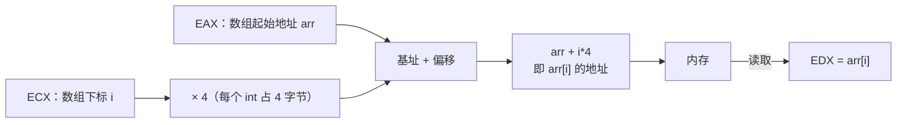
```mermaid
flowchart LR
    EAX["EAX：数组起始地址 arr"]
    ECX["ECX：数组下标 i"]
    MUL["× 4（每个 int 占 4 字节）"]
    ADD["基址 + 偏移"]
    ADDR["arr + i*4<br/>即 arr[i] 的地址"]
    MEM["内存"]
    EDX["EDX = arr[i]"]

    EAX --> ADD
    ECX --> MUL
    MUL --> ADD
    ADD --> ADDR
    ADDR --> MEM
    MEM -->|读取| EDX
```

所以：

```asm
mov edx, [eax + ecx*4]
```

脑子里应该直接翻译成：

```c
edx = arr[i];
```

------

### 5. 这就是 x86/x64 里非常漂亮的 “缩放索引”

**缩放索引是 CPU 硬件内置的地址计算功能，支持 `*1`、`*2`、`*4`、`*8` 四种缩放。它把数组访问的 “基址 + 下标 × 元素大小” 直接压进一条指令，不需要独立的乘法。逆向时看到 `[base + index*4]` 或 `*8`，基本就是数组访问。**

后期特别容易遇到：

```asm
[rax + rcx*4]
[rax + rcx*8]
[rax + rcx*2]
```

这些 `*4`、`*8` 不一定是真的做了一条乘法指令，它是 CPU 地址计算形式的一部分。

比如：

```asm
[rax + rcx*4]
```

就是：地址 = RAX + RCX × 4（`arr + i × sizeof(int)`）

如果：

```text
RAX = 数组首地址
RCX = i
4   = sizeof(int)
```

在汇编里非常常见地长成：

```asm
[base + index*element_size]
```

------

### 6. 不同数组元素大小会产生不同的倍率

比如：

#### `char`

```c
char arr[10];
```

一个元素 1 字节

所以：

```asm
[base + index*1]
```

通常直接就是：

```asm
[base + index]
```

------

#### `int`

```c
int arr[10];
```

通常是 4 字节。

所以：

```asm
[base + index*4]
```

------

#### 64 位指针数组

例如：

```c
char *arr[10];
```

在 64 位程序里，一个指针通常是 8 字节

所以：

```asm
[base + index*8]
```

这时候再看到：

```asm
mov rax, [rcx + rdx*8]
```

就可以怀疑：

```c
rax = arr[rdx];
```

而且这个数组很可能是**某种指针数组**

------

### 7. 数组 + 结构体，就更有意思了

假设：

```c
struct Player
{
    int hp;
    int attack;
    int defense;
};

Player players[10];
```

每个 `Player`：

```text
4 + 4 + 4 = 12 字节
```

所以（十六进制）：

```text
players[0] → +0x00
players[1] → +0x0C
players[2] → +0x18
players[3] → +0x24
```

于是：

```c
players[i].hp
```

本质上要做：数组起始地址 + i × sizeof(Player) + hp 在结构体中的偏移。

也就是 `base + i*0xC + 0`。

如果访问：

```c
players[i].attack
```

则相当于访问：`base + i*0xC + 4`。

所以 IDA 里可能出现这种鬼东西

```c
v3 = *(_DWORD *)(a1 + 12 * i + 4)
```

就很可能就是：

```c
players[i].attack
```

这就是 **数组 + 结构体 + 指针 + 偏移** 四个东西一起出现。

------

### 8. 二维数组

例如：

```c
int map[3][4];
```

可以理解为：

```text
map
 ↓
├───────────────────┤
│ [0] 4*sizeof(int) │
├───────────────────┤
│ [1] 4*sizeof(int) │
├───────────────────┤
│ [2] 4*sizeof(int) │
├───────────────────┤
```

因为一行有 4 × 4 = 16 字节，所以 `map[i][j]` 最终地址大概是 `base + i*16 + j*4`。

所以汇编里如果看到：

```asm
mov eax, [base + ecx*16 + edx*4]
```

就可以高度怀疑 `map[ecx][edx]`。

当然具体还要结合上下文确认。

------

### 9. 数组和指针最容易踩的一个坑：`&arr`

基础 C 里可能已经学过，但逆向时最好再强调一次。

```c
int arr[5];
```

这里的 `arr` 在很多表达式里会退化成：

```c
&arr[0]
```

所以 `arr + 1` 指向 `arr[1]`。但 `&arr + 1` 并不是指向 `arr[1]`。它是**整个数组之后的位置。**

因为 `&arr` 的类型是 `int (*)[5]`，也就是 “指向整个 5 元素 `int` 数组的指针”。

所以 `arr + 1` 是跨过了 1 个 `int` ，而 `&arr + 1` 跨过 5 个 `int`！

这个在一般 C 编程里比较少碰，但逆向分析复杂指针时偶尔会遇到。

------

### 10. 数组指针 和 指针数组 也别搞混

这两个名字特别烦 😂。

#### 指针数组

```c
int *arr[5];
```

意思是有 5 个元素，每个元素都是 `int *`。

内存：

```text
┌────────┬────────┬────────┬────────┬────────┐
│ int *  │ int *  │ int *  │ int *  │ int *  │
└────────┴────────┴────────┴────────┴────────┘
```

64 位下通常一个元素 8 字节。

------

#### 数组指针

```c
int (*p)[5];
```

意思是 `p` 是一个指针，指向一个包含 5 个 `int` 的数组。

这两个在 IDA 中看起来可能都很吓人，但含义完全不同。

------

### 11. 逆向里怎么判断 “这是数组”？

和结构体一样，不要看到 `*4` 就直接宣布：“数组！” 这依然需要找证据。

#### 特征一：有循环

比如：

```c
for (i = 0; i < 10; ++i)
{
    v = *(_DWORD *)(a1 + 4 * i);
}
```

这几乎就是：

```c
for (i = 0; i < 10; i++)
    v = arr[i];
```

------

#### 特征二：存在 `index * 固定大小`

*index 是数组下标的意思*

比如：

```asm
[rax + rcx*4]
```

或者：

```asm
[rax + rcx*8]
```

非常值得怀疑数组/表。

------

#### 特征三：下标不断变化

例如：

```text
i++
```

然后访问：

```text
base + i*4
```

这就很像遍历数组。

------

#### 特征四：连续访问

比如：

```text
+0
+4
+8
+C
+10
```

既可能是 结构体，也可能是 数组。

区别就在于：结构体是固定的不同字段；数组是同一个元素类型 + 不断变化的索引

这个区别非常重要

例如：

```asm
mov eax, [ecx+4]
mov edx, [ecx+8]
mov ebx, [ecx+0Ch]
```

可能是：

```c
struct Player
{
    int hp;
    int attack;
    int defense;
};
```

这是 **固定偏移 → 结构体成员**

但如果：

```asm
mov eax, [ecx+edx*4]
```

`edx` 这里不断变化：

```text
0
1
2
3
4
...
```

那么就更像 **动态偏移 → 数组下标**

------

### 12. 查表

比如：

```c
result = table[x];
```

汇编可能：

```asm
mov eax, [table + ecx*4]
```

这时候它不一定是普通数组。

可能是：

```text
查找表
状态表
跳转表
CRC 表
加密常量表
字符映射表
```

例如：

```c
result = SBox[x];
```

你看到：

```asm
mov eax, [SBox + ecx*4]
```

就应该想到：**这是“根据 x 查表”，而不是普通的遍历数组。**

这个在逆向算法、CTF、加密题里尤其常见。

------

比如：《攻防世界》的基础题的 reverse_re1 这道题中。

**S 盒本质上就是一张 256 字节的表**，它里面装的是 **0 到 255 的一个排列**。初始化时会有一个典型的代码：

```c
for (int i = 0; i < 256; i++)
    S[i] = i;
```

然后 KSA 阶段用密钥把这张表打乱，**使S 盒从 `[0,1,2,...,255]` 变成了一个看起来随机的排列。**

```c
j = 0;
for (i = 0; i < 256; i++) {
    j = (j + S[i] + key[i % keylen]) % 256;
    swap(S[i], S[j]);
}
```

最后在 PRGA 阶段查打乱后的 S 盒。

但总体来看，**无论是查表还是 S 盒，本质还是数组。**

------

### 13. 总结

现在你已经可以看到：

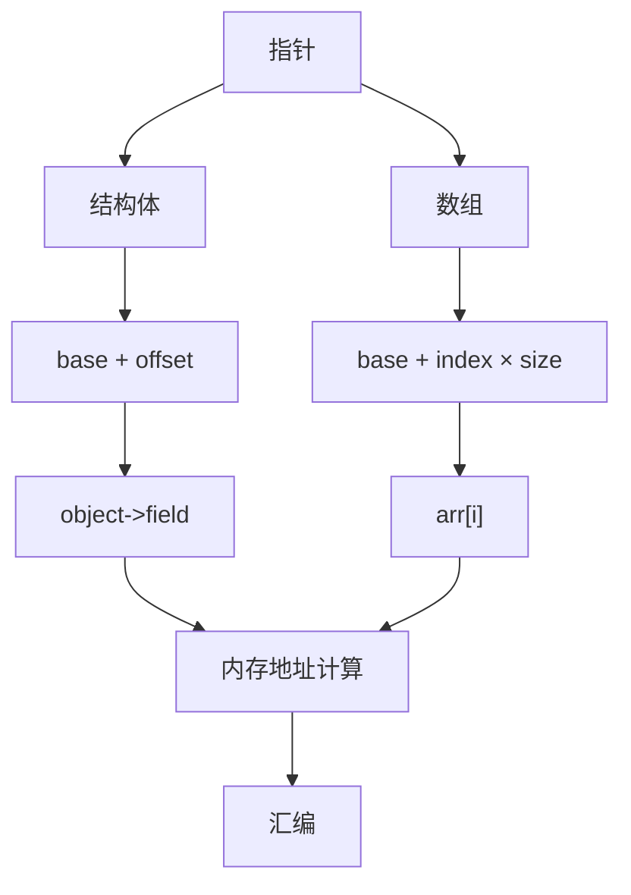
```mermaid
flowchart TD
    P["指针"]
    S["结构体"]
    A["数组"]
    BO["base + offset"]
    BI["base + index × size"]
    OF["object->field"]
    AR["arr[i]"]
    MEM["内存地址计算"]
    ASM["汇编"]

    P --> S
    P --> A
    S --> BO
    A --> BI
    BO --> OF
    BI --> AR
    OF --> MEM
    AR --> MEM
    MEM --> ASM
```

比如：

```asm
mov eax, [ecx + edx*4 + 8]
```

不要再把它看成 `ecx`、`edx`、`*4`、`+8` 一堆乱七八糟的东西。

它可能对应：

```c
array[edx].some_field
```

如果：

```text
sizeof(element) = 4
```

则可能是：

```c
array[edx + 2]
```

所以**真正的逆向能力不是记住某一条对应关系，而是看到地址计算后，能够反推出数据结构。**

------

**一张表速览** 😎

| IDA/汇编现象             | 第一反应                   |
| ------------------------ | -------------------------- |
| `[eax+4]`                | 某个基址 + 固定偏移        |
| `[eax+8]`、`[eax+C]`     | 可能是结构体成员           |
| `[eax+ecx*4]`            | 可能是 `int` 数组          |
| `[eax+ecx*8]`            | 可能是 8 字节元素/指针数组 |
| `i++` + `base+i*size`    | 很像数组遍历               |
| `base + i*size + offset` | 很像 `array[i].member`     |
| `[table + index*4]`      | 可能是查表                 |
| `[rcx]` 后 `call`        | 可能涉及函数指针/vtable    |
| `this + 固定偏移`        | C++ 对象成员               |

下一步如果继续按这个优先级往下走，会进入 **“函数调用、参数传递与返回值”**：也就是弄明白 `call` 到底把什么东西传进去了、参数为什么有时在 `RCX/RDX`，有时又在栈上，以及 IDA 为什么能把它还原成 `sub_xxx(a1, a2, a3)`。这会把之前一直碰到的 “栈 + 寄存器 + C 函数” 彻底串起来。

------

## 第五优先级：函数指针

到了这里，就需要接触 **“数据的地址可以放在指针里，那么函数的地址也可以放在指针里。”**

函数指针是直接保存地址的。所以 `*p` 就是去 `p` 保存的地址，把那里的数据拿出来。

比如：

```c
void hello()
{
    printf("Hello\n");
}
```

这个函数在程序运行的时候，也会存在于某个内存地址。

假设：

```text
hello
↓
0x401000
```

那么就可以让一个指针保存：

```text
0x401000
```

这个指针指向的不是一个变量，而是一个**函数**。

所以叫：**函数指针（Function Pointer）**

------

### 1. 最简单的函数指针

先看：

```c
void hello()
{
    printf("Hello\n");
}

void (*p)() = hello;
```

这一行：

```c
void (*p)() = hello;
```

可以拆开看：

```text
void       → 函数返回 void
(*p)       → p 是一个指针
()         → 指向的函数没有参数
```

所以：

```c
void (*p)()
```

意思就是：`p` 是一个指向“无参数、返回 void 的函数”的指针。

然后：

```c
p();
```

就相当于：

```c
hello();
```

也就是说：

```text
p
│ 0x401000
▼
┌─────────────┐
│ hello()     │
│             │
│ printf...   │
└─────────────┘
```

调用：

```c
p();
```

实际上就是**去 p 保存的那个地址执行代码。**

------

### 2. 函数指针与逆向

因为在 IDA 里面很可能看到这种东西：

```c
v1 = *(_DWORD *)a1;
v1(a1);
```

或者：

```c
(*(void (__thiscall **)(int))(*(_DWORD *)a1 + 4))(a1);
```

看到这种东西不要慌，它很可能就是**从某个地址取出一个函数地址，然后调用它。**尤其前面刚学过 **vtable**。

这俩东西其实直接连起来了：

```text
C++对象
   │
   ▼
this
   │
   ▼
vptr
   │
   ▼
vtable
   │
   ├── 函数地址 A
   ├── 函数地址 B
   ├── 函数地址 C
   └── 函数地址 D
           │
           ▼
        函数指针
           │
           ▼
          call
```

所以现在学的函数指针，实际上是在给前面的 **vtable** 补最后一块拼图。

------

### 3. 为什么 `call` 可以调用一个“地址”？

这是逆向里非常重要的一个概念。普通函数 `hello();` 在编译之后可能类似：

```asm
call 401000		;跳到 `0x401000` 执行函数。
```

但是如果是函数指针 `p();` 的情况，就如下而论。

先假设：`EAX = 0x401000`。那么汇编可能变成：

```asm
call eax
```

意思就是**把 EAX 里面保存的地址当成代码地址，然后调用它。**

所以，`call 401000` 和 `call eax` 有一个很重要的区别：

```text
call 401000
     ↑
     直接写死的函数地址

call eax
     ↑
     函数地址放在寄存器里
```

后者就是非常典型的**间接调用（indirect call）**。

而函数指针就是产生这种东西的重要来源。

------

### 4. 一个较接近 IDA 的例子

假设 C 代码：

```c
int add(int a, int b)
{
    return a + b;
}

int main()
{
    int (*p)(int, int);
    p = add;
    return p(10, 20);
}
```

这里：

```c
int (*p)(int, int);
```

意思是：`p` 是一个函数指针，指向 “接收两个 int、返回一个 int” 的函数。

```c
p = add;
```

把 `add` 的地址交给 `p`。

```c
p(10, 20);
```

相当于：`add(10, 20);`

------

### 5. 逆向时可能会看到什么？

```asm
mov eax, [ebp-4]
push 20
push 10
call eax
```

依据现在的水平可以开始产生这样的推理：

```text
[ebp-4]
   ↓
取出一个值
   ↓
EAX
   ↓
后面直接 call eax
   ↓
这个值很可能是一个函数地址
   ↓
[ebp-4] 很可能是函数指针
```

这就是逆向思维：**不是看到一个变量就马上知道它是什么，而是根据它后面的使用方式，像推理小说一样推理出它的类型。**

------

### 6. 函数指针和普通指针的区别

这个一定要区分。

#### 普通指针

```c
int *p;
```

表示：`p` 指向一个 `int` 数据。

所以，`*p` 得到的是 `int` 类型的数据

------

#### 函数指针

```c
int (*p)(long, char);
```

表示：`p` 指向一个函数。

这个函数：

```text
参数：long, char
返回值：int
```

```c
int (*p)(int, int);
```

这种反人类设计确实容易蒙。一个非常实用的读法是**从变量名 `p` 往外读。**

```c
p
↓
(*p)				// p 是一个指针，指向一个函数
↓
(*p)(int, int)		// 这个函数有两个 int 参数
↓
int (*p)(int, int)	// 返回 int
```

------

### 7. 函数指针会出现在 C++ 的 vtable

```cpp
class Player
{
public:
    virtual void Attack();
    virtual void Defend();
};
```

假设某个对象：

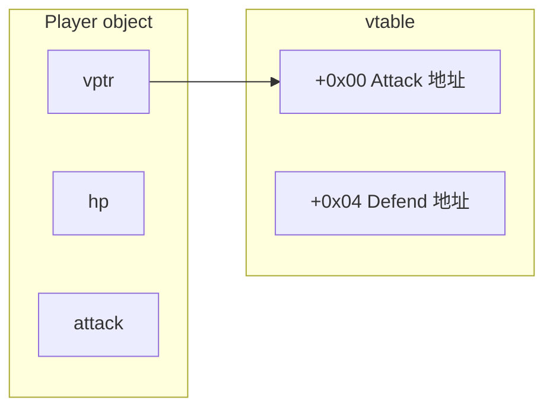
```mermaid
flowchart LR
    subgraph PlayerObject["Player object"]
        direction TB
        vptr["vptr"]
        hp["hp"]
        attack["attack"]
    end

    subgraph VTable["vtable"]
        direction TB
        offset0["+0x00  Attack 地址"]
        offset4["+0x04  Defend 地址"]
    end

    vptr --> offset0
```

这里需要注意一下。`vtable` 里面放的本质上就是**一堆函数地址**，而函数地址本质上就可以被看成**函数指针。**

所以现在学函数指针，以后再看 `vtable` 就不会觉得 “卧槽这表里怎么全是奇怪的地址？”

------

**上面的代码是 C++ 语法。写的是 “声明两个虚函数”，但完全没有写任何函数指针。**

编译器看到 `virtual`，就知道：“这两个函数可能被继承、被重写，运行时才能确定调哪个。所以我得建一张表，把它们的地址存起来。”

于是编译器自动生成了一张 `vtable`：

```text
Player 的 vtable
+0x00  →  &Player::Attack    （Attack 函数的地址）
+0x04  →  &Player::Defend    （Defend 函数的地址）
```

从概念上，上面的 C++ 代码转更底层的 C 代码大致是：

```c
// 编译器自动生成的结构
void (*Player_vtable[2])() = {
    &Player::Attack,   // +0x00
    &Player::Defend    // +0x04
};
```

因为要支持多态，所以 `vtable` 底层就是**函数指针数组**

------

这里再重新整合一下 **虚函数**、**vtable**、**vptr** 这三样东西，很容易弄混。🤯

| 概念       | 是什么                      | 在哪                     |
| :--------- | :-------------------------- | :----------------------- |
| **虚函数** | 用 `virtual` 声明的成员函数 | 代码段（真正的函数代码） |
| **vtable** | 存虚函数地址的数组          | 编译器生成，每个类一份   |
| **vptr**   | 指向 vtable 的指针          | 每个对象里都有一个       |

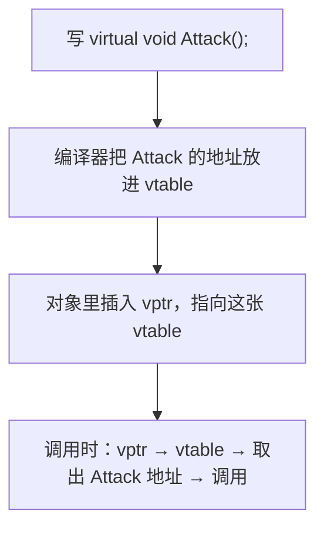
```mermaid
flowchart TD
A["写 virtual void Attack();"] --> B[编译器把 Attack 的地址放进 vtable]
B --> C[对象里插入 vptr，指向这张 vtable]
C --> D[调用时：vptr → vtable → 取出 Attack 地址 → 调用]
```

------

### 8. 逆向里最值得记住的三个东西

#### ① `call eax`

```asm
call eax
```

`eax` 就很有可能是某个地址：`eax = 0x401000`（函数地址存在寄存器里，通过寄存器调用）

------

#### ② `[eax]` 后面再 `call`

例如：

```asm
mov edx, [eax]
call edx
```

意思可能是先把函数地址存在内存里，先读出来，再调用。

------

#### ③ `[对象] → 函数地址 → call`

比如：

```asm
mov eax, [ecx]	; ecx 是 this，[ecx] 取 vptr
call [eax+8]	; 从 vtable+8 取函数地址，调用
```

这种就值得高度注意：

```text
ECX
 ↓
对象 / this
 ↓
[ECX]
 ↓
vptr
 ↓
vtable
 ↓
vtable + 8
 ↓
某个虚函数地址
 ↓
call
```

本质上， 这就是 **C++ 虚函数调用**，`this → vptr → vtable → 函数指针 → call`。

------

所以**第五优先级函数指针学完之后**，你看 IDA 里的很多 “奇怪的 `call`” 就会开始有解释了。

下一步很适合接着学 **函数调用约定 / 参数是怎么传进去的**。这会把：

```c
sub_401000(a1, a2, a3)
```

和：

```asm
mov rcx, ...
mov rdx, ...
mov r8, ...
call sub_401000
```

彻底连起来。

------

## 第六优先级：函数调用约定 + 参数传递

先理解一个最核心的问题：

假设我们有：

```c
int add(int a, int b)
{
    return a + b;
}
```

然后：

```c
add(10, 20);
```

CPU 最终肯定得把 `10` 和 `20` 交给 `add()`。

但是问题来了：**10 放哪里？20 放哪里？**CPU 可没有一个 “自动知道这是第一个参数” 的机制。

所以程序必须遵守一种约定：**在调用函数之前，把参数按照规定放到指定的位置。**

这个 “规定” 就是：**Calling Convention（函数调用约定）**

------

### 1. 最简单的理解

可以把调用函数想象成寄快递：

```text
调用者
  │
  │  参数1
  │  参数2
  │  参数3
  ▼
按照规定的“投递位置”放好
  │
  ▼
被调用函数
```

不同的调用约定，就像不同的快递规则：

```text
规则A：
参数全部放栈上

规则B：
前几个参数放寄存器，剩下的放栈

规则C：
this 放特殊位置，其余参数再按照另一套规则
```

所以逆向的时候，**看到参数在哪里，就可以反推函数采用了什么调用约定。**

------

比如 IDA 给你：

```c
sub_401000(a1, a2, a3);
```

你知道它有 `a1`、`a2`、`a3` 三个参数，但如果汇编是：

```asm
mov ecx, 1
mov edx, 2
mov r8d, 3
call sub_401000
```

就可以对应：

```text
ECX  → a1 = 1
EDX  → a2 = 2
R8D  → a3 = 3
```

于是：

```c
sub_401000(1, 2, 3);
```

就和汇编联系起来了。

------

### 3. 最常见的几种

现在不用一次全背。先认识名字：

```text
__cdecl
__stdcall
__fastcall
__thiscall
```

------

#### `__cdecl`

这是 C/C++ 里很经典的一种。

例如：

```c
int add(int a, int b)
{
    return a + b;
}
```

可能被表示成：

```c
int __cdecl add(int a, int b);
```

先粗略理解成 参数主要通过栈传递。

```asm
push 20        ; 先压第二个参数
push 10        ; 再压第一个参数
call add
add esp, 8     ; 调用者清栈（2个参数 × 4字节）
```

```text
栈
┌─────────┐
│   20    │ ← b
├─────────┤
│   10    │ ← a
├─────────┤
│ 返回地址 │
└─────────┘
```

然后函数进去以后，从栈上取参数：`[ebp+8]` 是 `a`，`[ebp+12]` 是 `b`。

------

#### `__stdcall`

它和 `__cdecl` 很像，其参数也是主要通过栈传。

但有一个非常重要的区别，就是**谁负责清理参数所在的栈空间**。这就是调用约定存在的意义之一。

简单理解：

```text
__cdecl
调用者清理 / 代码在 main 函数里执行

__stdcall
被调用函数清理 / 代码在其他函数里，main 函数调用它
```

汇编：

```asm
push 20
push 10
call add
                ; ← 没有 add esp！被调用者自己清
```

这个 `8` 就可能和清理两个 `int` 参数有关：2 × 4 bytes = 8。当然，具体还要结合上下文判断，不能看到 `ret 8` 就百分百断言。

------

#### `__fastcall`

这个就开始和寄存器联系起来了。它的思想很简单，**能用寄存器传参数，就尽量用寄存器。**其他约定（`__cdecl`、`__stdcall`）参数都走**栈**，速度慢（内存操作）。`__fastcall` 说：**前两个参数直接塞寄存器里，剩下的才走栈。**

这里需要注意一下：32 位 x86 只有 `ecx` 和 `edx` 这两个 “空闲” 的通用寄存器可以干这个活。

于是：

```c
func(10, 20, 30);
```

可能类似：

```asm
mov ecx, 10    ; 第1个参数
mov edx, 20    ; 第2个参数
push 30        ; 第3个参数走栈
call func
; 注意：没有 add esp！被调用者清栈
```

这就是为什么你以后看到：

```asm
mov ecx, xxx
mov edx, xxx
call sub_xxx
```

不要马上认为 “ECX 和 EDX 是这个函数内部的变量。” 它们**很可能是在准备参数**。

------

#### `__thiscall`

`__thiscall` 是 **C++ 成员函数专用**的调用约定。核心就一条：**`this` 指针放在 `ecx` 里，其余参数照常走栈。**

现在回到你刚才看到的：

```c
void (__thiscall *)(int)
```

为什么会出现 `__thiscall`？

因为它通常和：

```cpp
class Player
{
public:
    void Attack(int damage);
};
```

这种**C++成员函数**有关。

假设：

```cpp
Player p;
p.Attack(10);
```

函数实际上需要：

```text
this = &p
damage = 10
```

也就是：

```asm
mov ecx, &p     ; this 放 ecx
push 10         ; 参数放栈
call Attack
; 没有 add esp！被调用者清栈
```

所以 `this` 本质上也是一个参数，只不过它是 **C++ 成员函数隐藏的参数。**

------

*加速更新中......*

------

如果你在阅读时发现了任何错误，请评论或发邮件告诉我，因为错误是学习和发展的一部分！